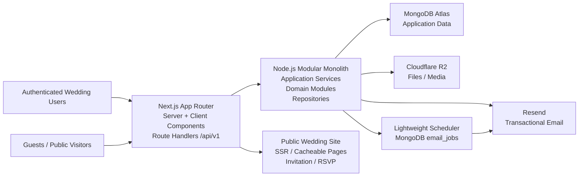
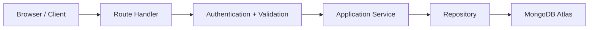
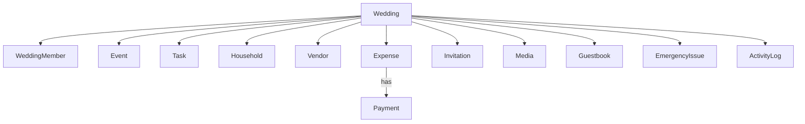
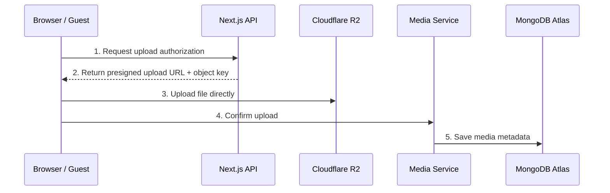

# Make My Marriage

## System Design Architecture

**Version:** 1.0

<table>
<colgroup>
<col style="width: 100%" />
</colgroup>
<thead>
<tr class="header">
<th><strong>Architecture baseline<br />
</strong>Modular monolith • Next.js App Router • Node.js REST API • MongoDB Atlas • Cloudflare R2 • Resend</th>
</tr>
</thead>
<tbody>
</tbody>
</table>

Prepared from the approved PRD and architecture decisions  
19 September 2026

# 1. Document Control

| **Field**           | **Value**                                                  |
|---------------------|------------------------------------------------------------|
| Document            | Make My Marriage - System Design Architecture              |
| Version             | 1.0                                                        |
| Status              | Architecture baseline for V1 implementation                |
| Product             | Consumer SaaS for Indian Hindu wedding planning            |
| Primary platform    | Responsive web application                                 |
| Architecture style  | Modular monolith                                           |
| Backend strategy    | Node.js through Next.js Route Handlers, REST under /api/v1 |
| Primary database    | MongoDB Atlas                                              |
| Object storage      | Cloudflare R2                                              |
| Transactional email | Resend                                                     |
| Observability       | Basic structured application logs only                     |

<table>
<colgroup>
<col style="width: 100%" />
</colgroup>
<thead>
<tr class="header">
<th><strong>Document purpose<br />
</strong>Define the technical architecture, major components, module boundaries, request flows, data ownership, security model, and V1 operational strategy. It intentionally avoids implementation-level class design and pixel-level UI specifications.</th>
</tr>
</thead>
<tbody>
</tbody>
</table>

# 2. Contents

- 3\. Executive Summary

- 4\. Architecture Goals and Constraints

- 5\. Locked Technology Decisions

- 6\. System Context and High-Level Architecture

- 7\. Next.js Application Architecture

- 8\. Modular Monolith and Domain Modules

- 9\. Backend API Strategy

- 10\. Authentication and Session Management

- 11\. Authorization, Permissions, and Tenant Isolation

- 12\. MongoDB Atlas Data Architecture

- 13\. Location and Venue Model

- 14\. Cloudflare R2 File and Media Architecture

- 15\. Email and Lightweight Background Jobs

- 16\. Rendering, Caching, and Public Wedding Websites

- 17\. Notifications and Activity History

- 18\. Logging and Operational Visibility

- 19\. Security Architecture

- 20\. Validation, Error Handling, and API Conventions

- 21\. Data Consistency and Concurrency

- 22\. Performance and Scalability Strategy

- 23\. Deployment and Environment Strategy

- 24\. Testing Strategy

- 25\. Backup, Recovery, and Data Lifecycle

- 26\. API Surface Overview

- 27\. Critical End-to-End Flows

- 28\. Open Decisions / Deferred Choices

- 29\. Final Summary / Recommended Design Sequence

- 30\. Implementation Readiness Checklist

# 3. Executive Summary

Make My Marriage will be implemented as a modular monolith in a single primary Next.js codebase. Next.js App Router provides the web application, public wedding pages, and REST Route Handlers. The server runtime is Node.js. Business logic is organized into domain modules and application services instead of being embedded in React components or route files.

MongoDB Atlas stores structured application data. Cloudflare R2 stores user-uploaded files and media. Resend handles transactional email. A lightweight MongoDB-backed email job collection and scheduler replaces Redis or a message broker for V1. Authentication is implemented directly in the API using email/password and server-side sessions; email verification is intentionally not required during V1 signup or wedding invitation acceptance.



*Figure 1 - V1 high-level architecture*

<table>
<colgroup>
<col style="width: 100%" />
</colgroup>
<thead>
<tr class="header">
<th><strong>Core architectural principle<br />
</strong>Keep V1 operationally simple while creating clean boundaries that allow individual modules or infrastructure concerns to be extracted later only if real scale or product needs justify it.</th>
</tr>
</thead>
<tbody>
</tbody>
</table>

# 4. Architecture Goals and Constraints

## 4.1 Goals

- Support the complete V1 PRD without introducing microservice complexity.

- Provide a clean HTTP API boundary so future clients can reuse backend capabilities.

- Guarantee strict wedding-level tenant isolation and permission checks on the server.

- Keep public wedding pages fast and shareable while keeping authenticated dashboards fresh and permission-aware.

- Handle large media uploads without routing file bytes through the application server.

- Make common operations observable through basic structured logs without adding external monitoring infrastructure.

- Make the codebase easy to split by business domain and test independently.

## 4.2 Constraints / V1 simplifications

- No microservices.

- No separate Express/NestJS backend service.

- No Redis, Kafka, RabbitMQ, or SQS for V1 email processing.

- No external observability vendor in V1.

- No signup email verification.

- No guest accounts.

- No AI services.

- No native mobile app in V1.

- No vendor marketplace or vendor portal.

# 5. Locked Technology Decisions

| **Concern**    | **Decision**                    | **Rationale / intent**                                                                  |
|----------------|---------------------------------|-----------------------------------------------------------------------------------------|
| Architecture   | Modular monolith                | Simple deployment; strong module boundaries; extract later only when justified.         |
| Web framework  | Next.js App Router + TypeScript | One framework for marketing, authenticated app, public wedding site, and API endpoints. |
| Server runtime | Node.js                         | Required backend runtime; broad ecosystem and Mongo/R2/Resend SDK support.              |
| API            | REST /api/v1 via Route Handlers | Stable backend contract for web now and future clients later.                           |
| Database       | MongoDB Atlas                   | Managed cluster and flexible document model.                                            |
| Authentication | Custom API auth                 | Simple email/password + database-backed sessions; no third-party auth platform.         |
| File storage   | Cloudflare R2                   | Object storage for images, video, audio, PDFs, invoices, contracts, etc.                |
| Email          | Resend                          | Lightweight transactional email provider.                                               |
| Email jobs     | MongoDB outbox + small batches  | Avoid Redis/message broker complexity in V1.                                            |
| Logging        | Structured stdout/stderr        | No Sentry/Datadog/New Relic initially.                                                  |
| Localization   | English + Hindi baseline        | Architecture remains extensible for regional languages.                                 |

# 6. System Context and High-Level Architecture

## 6.1 Primary actors

- Authenticated wedding users: Admins, Managers, and Organisers.

- Guests: use invitation links, RSVP, restricted gallery access, uploads, guestbook, and livestream without creating an account.

- Platform administrators: internal Make My Marriage staff using a separate platform admin surface.

- External providers: MongoDB Atlas, Cloudflare R2, Resend, and a future maps/payment provider.

## 6.2 Trust boundaries

The browser is untrusted. All authorization, tenant checks, input validation, and permission checks must be repeated on the server. Public invitation tokens and file access URLs are capabilities and must be short-lived or revocable where applicable.

# 7. Next.js Application Architecture

## 7.1 Route areas

src/app/  
(marketing)/ \# public marketing + pricing  
(auth)/ \# signup/login/reset  
app/weddings/\[weddingId\]/  
\# authenticated wedding workspace  
w/\[slug\]/ \# public wedding website  
invite/\[token\]/ \# team invitation acceptance  
api/v1/ \# canonical REST API  
api/internal/jobs/ \# protected scheduler endpoints

Route groups may be used to apply different layouts without changing public URLs. The authenticated workspace should have a shared wedding layout containing navigation, wedding switcher, notifications, and profile controls.

## 7.2 Server Components versus Client Components

Use Server Components by default for read-heavy pages and initial data access. Use Client Components only for browser interactivity such as dialogs, drag/drop, complex form state, upload progress, rich tables, or local filtering.

<table>
<colgroup>
<col style="width: 100%" />
</colgroup>
<thead>
<tr class="header">
<th><strong>Rule<br />
</strong>Server Components may call application query services directly. They should not contain raw MongoDB queries or domain rules. Client Components must not access MongoDB directly.</th>
</tr>
</thead>
<tbody>
</tbody>
</table>

## 7.3 Server Actions

Server Actions may be used selectively for localized UI workflows, but they are not the canonical backend contract. Core business capabilities are represented in application services and REST API endpoints so future mobile or external clients do not depend on React-specific invocation semantics.

## 7.4 Internal service reuse

Browser/client -> REST Route Handler -> Application Service -> Repository -> MongoDB  
Server Component -----------------------> Application Service -> Repository -> MongoDB

A Server Component should not make an HTTP call back into the same application merely to reuse the API. Both API handlers and server-rendered pages reuse the same service layer.

# 8. Modular Monolith and Domain Modules

The codebase is organized primarily by business domain, not by giant global controller/service/model folders. Each module owns its validation, application services, repository interfaces, domain types, and permission rules.

src/  
modules/  
auth/  
users/  
weddings/  
team/  
permissions/  
events/  
tasks/  
guests/  
invitations/  
vendors/  
expenses/  
documents/  
wedding-site/  
gallery/  
guestbook/  
emergency/  
notifications/  
billing/  
platform-admin/  
shared/  
database/  
validation/  
errors/  
logging/  
storage/  
email/  
security/

## 8.1 Module responsibility table

| **Module**           | **Owns**                                                   |
|----------------------|------------------------------------------------------------|
| auth                 | Signup, login, logout, sessions, password reset.           |
| weddings             | Wedding lifecycle, profile, primary date/location, status. |
| team / permissions   | Membership, roles, event scope, functional permissions.    |
| events               | Wedding ceremonies, venue/location, assigned organisers.   |
| tasks                | Tasks, subtasks, dependencies, comments, reminders.        |
| guests / invitations | Households, members, RSVP, guest-access tokens.            |
| vendors              | Vendor records and related documents.                      |
| expenses             | Expenses, payment instalments, paid-by, simple approval.   |
| wedding-site         | Theme/configuration, publication, public sections.         |
| gallery / guestbook  | Albums, media metadata, moderation, guest wishes.          |
| emergency            | Contacts and simple issues/escalations.                    |
| notifications        | In-app notifications and reminder generation.              |
| platform-admin       | Internal support/admin capabilities.                       |

# 9. Backend API Strategy



*Figure 2 - Canonical backend request flow. Route Handlers stay thin; business rules live in services, and database access is isolated in repositories.*

## 9.1 API conventions

- Base prefix: /api/v1.

- Use resource-oriented REST endpoints.

- Use JSON request/response bodies except direct R2 file uploads.

- Keep Route Handlers thin: parse -> authenticate -> validate -> authorize -> call service -> map result.

- Use explicit HTTP status codes and stable application error codes.

**Success**

```json
{ "success": true, "data": { ... } }
```

**Failure**

```json
{
  "success": false,
  "error": {
    "code": "WEDDING_NOT_FOUND",
    "message": "Wedding not found"
  }
}
```

## 9.2 Versioning

V1 endpoints remain under /api/v1. Breaking changes should introduce a new version or preserve backwards compatibility. Internal Next.js service calls are not considered a public API and may evolve more freely.

# 10. Authentication and Session Management

## 10.1 V1 signup/login policy

- Email + password only.

- No email verification during account creation.

- Successful signup creates an account and signs the user in immediately.

- After signup, user can Create Wedding or Join Wedding.

- Wedding-member invite acceptance does not require email verification.

- Keep emailVerifiedAt nullable in the user model for future use.

## 10.2 Password security

Passwords are never stored or logged. Store only a modern password hash (Argon2id recommended) with library-managed salt and parameters. Password policy should prioritize reasonable length over overly complex composition rules.

## 10.3 Session design

Use opaque database-backed sessions. Generate a cryptographically random session token, store only a hash/reference server-side, and place the raw token in a Secure, HttpOnly, SameSite cookie. Sessions are revocable and have an expiry time.

sessions  
\_id  
userId  
tokenHash  
expiresAt  
lastUsedAt  
createdAt  
revokedAt?

## 10.4 Password reset

Forgot-password creates a single-use, short-lived reset token, stores only its hash, and queues a Resend email. On successful reset, the token is invalidated. Existing sessions should be revoked by default after a password change/reset unless product requirements later specify otherwise.

## 10.5 Team invitation acceptance

Invitations use random capability tokens stored hashed. The invite is bound to the invited email address. A user may sign up or log in after opening the link, but the account email must match the invitation email before acceptance. This is an identity binding rule, not a separate verification step.

# 11. Authorization, Permissions, and Tenant Isolation

One wedding is the primary tenant/workspace boundary. Tenant isolation is enforced on the backend for every wedding-owned operation.

## 11.1 Authorization sequence

Authenticated?  
-> member of wedding?  
-> role permits operation?  
-> functional permission enabled?  
-> event scope permits target event?  
-> execute

## 11.2 Roles

| **Role**  | **Baseline behavior**                                                      |
|-----------|----------------------------------------------------------------------------|
| ADMIN     | Full wedding access plus team/permission management.                       |
| MANAGER   | Same primary UI; allowed functions determined by permissions.              |
| ORGANISER | Same primary UI; may be limited by functional permissions and event scope. |

## 11.3 Functional permissions

Initial permission switches include guest management, vendor management, finance, gallery, website, guestbook, and emergency management. Event scope is orthogonal: a user may have access to all events or only selected event IDs.

<table>
<colgroup>
<col style="width: 100%" />
</colgroup>
<thead>
<tr class="header">
<th><strong>Security rule<br />
</strong>UI hiding is not authorization. Every API/service operation must verify wedding membership and relevant permission/event scope before reading or mutating data.</th>
</tr>
</thead>
<tbody>
</tbody>
</table>

# 12. MongoDB Atlas Data Architecture

The database uses separate collections for independently growing aggregates instead of embedding all wedding data in one document. Most tenant-owned records carry weddingId for security filtering, indexing, and operational clarity.



*Figure 3 - Core wedding data relationships. Most tenant-owned collections carry `weddingId`; Payment is modeled as an Expense child/aggregate.*

## 12.1 Primary collections

| **Collection**                        | **Purpose / notes**                                                                         |
|---------------------------------------|---------------------------------------------------------------------------------------------|
| users                                 | Global user identity/profile.                                                               |
| sessions                              | Revocable authentication sessions.                                                          |
| weddings                              | Wedding profile, status, primary date/location.                                             |
| wedding_members                       | User-to-wedding role, permissions, event scope.                                             |
| events                                | Ceremonies and venue details.                                                               |
| tasks                                 | Tasks/subtasks/dependencies; comments may be embedded or separate based on expected volume. |
| guest_households                      | Household-level guest records and RSVP summary.                                             |
| vendors                               | Selected vendor records.                                                                    |
| expenses                              | Expense aggregate and payment instalments.                                                  |
| invitations                           | Team invitations and/or separate guest access invitations/tokens.                           |
| documents                             | Document metadata and R2 keys.                                                              |
| wedding_sites                         | Theme, section config, publication settings.                                                |
| albums / media                        | Gallery album and file metadata.                                                            |
| guestbook_entries                     | Text/voice/video guest wishes and moderation status.                                        |
| emergency_contacts / emergency_issues | Emergency directory and simple issues.                                                      |
| notifications                         | In-app notifications.                                                                       |
| activity_logs                         | User-visible and/or security-relevant change history.                                       |
| email_jobs                            | Transactional email outbox.                                                                 |
| subscriptions                         | Future plan/entitlement state.                                                              |

## 12.2 Embedding versus references

- Embed small, tightly bound subdocuments that are read/updated with their aggregate (e.g., a limited list of expense payment instalments).

- Reference independently growing entities such as tasks, households, media, and vendors.

- Do not embed hundreds of guests or tasks inside the wedding document.

- Use immutable IDs for relationships; store denormalized display fields only when justified by read performance and clearly owned.

## 12.3 Index strategy

tasks: (weddingId, status), (weddingId, assignedTo), (weddingId, eventId), (weddingId, dueDate)  
guest_households: (weddingId, rsvpStatus), (weddingId, side)  
vendors: (weddingId, category)  
expenses: (weddingId, eventId), (weddingId, status)  
wedding_members: unique(weddingId, userId)  
weddings: unique(slug) when public slug is assigned

Final indexes must be validated against real query patterns and Atlas query plans. Avoid creating large numbers of speculative indexes.

## 12.4 Mongo client management

Reuse a process-level MongoClient/connection pool. Do not open and close a new database connection per request.

# 13. Location and Venue Model

A single city string is insufficient. Wedding-level location may be broad, while each event can have its own precise venue. Store both human-readable address data and geographic coordinates.

```text
Location {
  name,
  addressLine1, addressLine2?, locality?,
  city, state, postalCode?, country,
  latitude?, longitude?,
  mapUrl?, placeId?
}
```

The model remains maps-provider neutral. A future Google Maps, Mapbox, or other provider can populate placeId/address/coordinates without changing the core event model.

# 14. Cloudflare R2 File and Media Architecture

R2 stores all user-uploaded binary content: photos, videos, voice wishes, PDFs, invoices, contracts, receipts, event covers, and wedding website assets. MongoDB stores metadata and authorization state only.



*Figure 4 - Direct-to-R2 upload flow*

## 14.1 Upload workflow

1.  Client requests an upload authorization from the API.

2.  API authenticates the caller, verifies wedding permissions, and validates requested MIME type/size/category.

3.  API returns a short-lived presigned R2 upload URL and expected object key.

4.  Browser uploads file bytes directly to R2.

5.  Client confirms completion; API verifies expected object metadata as appropriate and stores MongoDB metadata.

6.  Guest uploads start in PENDING moderation status where required.

## 14.2 Visibility

Public website assets may be served through a public/cached path. Contracts, invoices, pending uploads, restricted galleries, and private guestbook media must remain private and be exposed using authorized short-lived access URLs or an equivalent protected delivery mechanism.

## 14.3 Object key strategy

weddings/{weddingId}/website/{assetId}/{filename}  
weddings/{weddingId}/gallery/{albumId}/{mediaId}/{filename}  
weddings/{weddingId}/documents/{documentId}/{filename}  
weddings/{weddingId}/guestbook/{entryId}/{filename}

Object keys should use internal IDs rather than personally meaningful paths. Do not rely on object-key secrecy as an access-control mechanism.

# 15. Email and Lightweight Background Jobs

## 15.1 Provider and scope

Resend is used for transactional email only: password resets, team invitations, security messages, and selected reminders. Signup verification email is intentionally absent in V1.

## 15.2 MongoDB outbox

email_jobs {  
\_id, type, to, payload,  
status: PENDING \| PROCESSING \| SENT \| FAILED,  
attempts, scheduledAt, lastAttemptAt?, sentAt?,  
lastError?, createdAt, updatedAt  
}

Application requests enqueue email jobs and return without waiting for Resend. A protected scheduler endpoint or small worker process claims due jobs in small batches.

## 15.3 Batch and retry strategy

- Start with batches around 20-50 jobs; exact size is configuration, not business logic.

- Limit concurrency to a small number to avoid provider spikes.

- Use incremental retry delay and a maximum attempt count.

- Use atomic status claiming to prevent two schedulers from sending the same job.

- Retain FAILED jobs for inspection/retry; avoid infinite retries.

<table>
<colgroup>
<col style="width: 100%" />
</colgroup>
<thead>
<tr class="header">
<th><strong>V1 simplicity<br />
</strong>No Redis, BullMQ, Kafka, RabbitMQ, or SQS is required. The outbox design allows a queue technology to replace the dispatcher later without changing business modules.</th>
</tr>
</thead>
<tbody>
</tbody>
</table>

# 16. Rendering, Caching, and Public Wedding Websites

## 16.1 Three rendering profiles

| **Area**                        | **Rendering / caching approach**                                                      |
|---------------------------------|---------------------------------------------------------------------------------------|
| Marketing site                  | Static or heavily cacheable.                                                          |
| Authenticated wedding workspace | Dynamic and permission-aware; prioritize freshness over long-lived caching.           |
| Public wedding website          | Server-rendered and selectively cacheable; invalidate when published content changes. |
| Invitation / RSVP flows         | Dynamic; token-specific and no shared cache of personalized data.                     |
| Platform admin                  | Dynamic and private.                                                                  |

## 16.2 Wedding-site builder rendering

Website customization is configuration-driven, not arbitrary code generation. Store theme, colors, typography, enabled sections, content, and section order. Server-side components render allowed section types from that configuration.

weddingSite {  
theme, palette, typography,  
published,  
sections: \[  
{ type: "hero", enabled: true, order: 1, config: {...} },  
{ type: "story", enabled: true, order: 2, config: {...} }  
\]  
}

SEO indexing behavior for public wedding sites remains a product/privacy setting to finalize. Architecture supports either public-indexable or public-noindex behavior.

# 17. Notifications and Activity History

In-app notifications are persisted so a user can see unread/read state. Reminder generation may be driven by the same lightweight scheduler pattern used for email jobs. Email delivery should be optional by notification type and user preference when introduced.

## 17.1 Activity versus audit

Maintain a distinction between user-facing activity (e.g., "Rahul completed Book DJ") and security-relevant audit events (permission change, member removal, finance change, website publication, sensitive access). They may share infrastructure but have different retention/display rules.

# 18. Logging and Operational Visibility

V1 uses structured application logs written to stdout/stderr and captured by the deployment platform. No external observability product is required.

## 18.1 Recommended log fields

{  
level, timestamp, event, requestId,  
userId?, weddingId?, entityType?, entityId?,  
durationMs?, errorCode?  
}

## 18.2 Never log

- Passwords or password hashes

- Session tokens/cookies

- Invitation or reset raw tokens

- R2/Resend secrets

- Authorization headers

- Full sensitive guest/document payloads unless explicitly sanitized

Every request should receive a requestId that is propagated through route handlers, services, and logs to make debugging possible without an external tracing platform.

# 19. Security Architecture

## 19.1 Security controls

- Server-side authentication and authorization on every protected operation.

- HttpOnly + Secure session cookies in production.

- Argon2id password hashing.

- Cryptographically random, hashed, expiring invitation/reset/session tokens.

- Tenant filtering by weddingId plus membership checks.

- Input validation before business logic.

- Content-type and size restrictions for uploads before issuing R2 URLs.

- Private-by-default handling for contracts, invoices, guest uploads, and restricted galleries.

- CSRF protections appropriate to cookie-authenticated mutation endpoints (SameSite plus explicit anti-CSRF strategy where necessary).

- Rate/cooldown controls on signup, login, forgot-password, invite attempts, and public RSVP/upload endpoints.

- Secrets only from runtime environment/secret store; never checked into source control.

## 19.2 Rate limiting without Redis

V1 should keep rate limiting lightweight. Sensitive account operations can use per-account/per-identifier counters or temporary lock fields in MongoDB, combined with hosting-edge request controls when available. Do not depend on an in-memory counter as the only protection in a horizontally scaled deployment.

## 19.3 Guest capability links

Guest invitation/gallery access links are bearer capabilities. Store token hashes, support expiry/revocation where appropriate, never log raw tokens, and avoid exposing sensitive data beyond the household/wedding access granted by the token.

# 20. Validation, Error Handling, and API Conventions

Use a shared validation layer (Zod is recommended in the TypeScript stack) for request DTOs, environment configuration, and boundary validation. Domain/business validation remains in services even if input shape validation passes.

| **HTTP status** | **Typical meaning**                                |
|-----------------|----------------------------------------------------|
| 200             | Successful read/update.                            |
| 201             | Resource created.                                  |
| 204             | Successful delete/no response body.                |
| 400             | Malformed request.                                 |
| 401             | Not authenticated.                                 |
| 403             | Authenticated but not permitted.                   |
| 404             | Resource not found within accessible tenant scope. |
| 409             | Conflict / duplicate / invalid state transition.   |
| 422             | Well-formed but validation/business input error.   |
| 429             | Rate limited.                                      |
| 500             | Unexpected server failure.                         |

Avoid exposing internal stack traces or database error details to clients. Map internal failures to stable error codes and log the detailed exception server-side with requestId.

# 21. Data Consistency and Concurrency

## 21.1 Atomic operations

Prefer single-document atomic updates when possible. Use MongoDB transactions only where a business operation must update multiple collections atomically and partial completion would violate an invariant.

## 21.2 Candidate transactional workflows

- Accept team invitation -> create wedding membership + mark invitation accepted.

- Delete/remove member -> permission/membership update plus security/audit record where required.

- Critical financial state updates if modeled across multiple documents.

## 21.3 Idempotency

Public or retried operations that may be submitted twice (invitation acceptance, RSVP submission, upload confirmation, email job processing) should be designed idempotently using unique keys/state checks rather than assuming the client sends exactly once.

# 22. Performance and Scalability Strategy

The monolith is designed to scale horizontally at the application tier. Stateful application data remains external in MongoDB/R2. Session state is database-backed, so multiple application instances can serve the same users.

## 22.1 Expected scaling pressure points

| **Area**             | **V1 approach**                             | **Scale-up path**                                  |
|----------------------|---------------------------------------------|----------------------------------------------------|
| Dashboard/API        | Indexes + pagination + server rendering     | Horizontal app instances; targeted cache.          |
| Public wedding pages | Selective caching                           | CDN/cache invalidation strategy.                   |
| Gallery/media        | Direct R2 upload/download                   | Image variants/CDN/transcoding worker later.       |
| Email                | Mongo outbox small batches                  | Dedicated queue/worker if volume requires.         |
| Search               | Mongo indexed filters/text where sufficient | Dedicated search service only if proven necessary. |
| Notifications        | Mongo persistence + polling/revalidation    | Realtime/WebSocket layer later if needed.          |

## 22.2 Pagination

All potentially large lists (guests, tasks, media, activity, documents) must be paginated. Prefer cursor-based pagination where data volume/order semantics justify it; page/limit is acceptable for simple admin lists at V1 scale.

# 23. Deployment and Environment Strategy

The hosting platform is intentionally not locked in this architecture version. Core application design must remain compatible with a standard Next.js Node deployment and should not rely on proprietary hosting behavior for business correctness.

## 23.1 Logical deployment components

Next.js / Node application  
MongoDB Atlas cluster  
Cloudflare R2 bucket(s)  
Resend account/domain  
Scheduler trigger (provider-specific cron or small worker)  
DNS / TLS / domain

## 23.2 Environments

| **Environment**       | **Purpose**                                                     |
|-----------------------|-----------------------------------------------------------------|
| Local                 | Developer machine; local env variables and non-production data. |
| Development / Preview | Integration testing and preview builds.                         |
| Production            | Real customer weddings and production providers.                |

Use separate production credentials/buckets/database or clearly isolated databases/collections from non-production. Production R2/Resend/Mongo credentials must never be available to preview builds by default.

# 24. Testing Strategy

## 24.1 Test layers

| **Layer**           | **Examples**                                                                                      |
|---------------------|---------------------------------------------------------------------------------------------------|
| Unit                | Permission decisions, task rules, payment status calculation, token helpers, location validation. |
| Service integration | Application services against test MongoDB; transaction/idempotency behavior.                      |
| API integration     | Auth, tenant isolation, validation, status/error mapping, invitation flow.                        |
| Component           | Complex client components such as forms, task board, upload UI.                                   |
| End-to-end          | Signup -> create wedding -> invite member -> tasks -> guests -> website -> RSVP.            |
| Security regression | Cross-wedding ID access, permission bypass attempts, expired/revoked token behavior.              |

<table>
<colgroup>
<col style="width: 100%" />
</colgroup>
<thead>
<tr class="header">
<th><strong>High-priority test<br />
</strong>Every tenant-owned endpoint should have at least one automated test proving that a valid user from Wedding A cannot read or mutate Wedding B data.</th>
</tr>
</thead>
<tbody>
</tbody>
</table>

# 25. Backup, Recovery, and Data Lifecycle

Use MongoDB Atlas managed backup capabilities appropriate to the selected production tier. R2 object lifecycle and retention rules should be configured separately for originals, temporary/pending files, and deleted/archived wedding content.

- Archiving a wedding should not immediately delete data.

- Destructive deletion should be deliberate and eventually support a grace/retention policy.

- R2 objects must be deleted when their metadata/resource is permanently deleted to avoid orphaned storage.

- Failed upload sessions and unconfirmed objects should be cleaned by a scheduled maintenance task.

- Email/audit logs should have explicit retention policies once compliance/product requirements are defined.

# 26. API Surface Overview

This is a high-level endpoint catalog, not the final OpenAPI specification.

| **Area**      | **Representative endpoints**                                                                                 |
|---------------|--------------------------------------------------------------------------------------------------------------|
| Auth          | POST /auth/signup; /auth/login; /auth/logout; /auth/forgot-password; /auth/reset-password; GET /auth/session |
| Weddings      | GET/POST /weddings; GET/PATCH /weddings/:weddingId                                                           |
| Team          | GET/POST /weddings/:id/members; PATCH/DELETE /members/:memberId; POST /invitations                           |
| Events        | GET/POST /weddings/:id/events; PATCH/DELETE /events/:eventId                                                 |
| Tasks         | GET/POST /weddings/:id/tasks; GET/PATCH/DELETE /tasks/:taskId; comments/subtasks endpoints as needed         |
| Guests        | GET/POST /weddings/:id/households; PATCH /households/:id; guest invitation/RSVP endpoints                    |
| Vendors       | GET/POST /weddings/:id/vendors; PATCH/DELETE /vendors/:vendorId                                              |
| Expenses      | GET/POST /weddings/:id/expenses; PATCH /expenses/:id; payment operations                                     |
| Files         | POST /weddings/:id/uploads/authorize; POST /uploads/:id/confirm; protected download authorization            |
| Wedding site  | GET/PATCH /weddings/:id/site; POST /site/publish; public GET /public/weddings/:slug                          |
| Gallery       | Albums, media listing, moderation, guest upload authorization                                                |
| Guestbook     | Public submission; internal moderation.                                                                      |
| Emergency     | Contacts and issues.                                                                                         |
| Notifications | List/read/mark-read.                                                                                         |
| Internal jobs | Protected email-dispatch/reminder/cleanup endpoints.                                                         |

# 27. Critical End-to-End Flows

## 27.1 Signup -> create wedding

User submits signup  
-> validate email/password  
-> create user  
-> create session + cookie  
-> redirect to onboarding  
-> create wedding  
-> create ADMIN wedding_member  
-> optional checklist/event setup  
-> dashboard

## 27.2 Team invitation

Admin invites email  
-> create hashed invitation token  
-> enqueue email_jobs  
-> scheduler sends via Resend  
-> invitee opens link  
-> login/signup (no verification)  
-> account email must match invite  
-> atomically create membership + accept invite  
-> wedding dashboard

## 27.3 Guest RSVP

Household invitation/access token  
-> guest opens public token page  
-> API validates token + wedding status  
-> guest submits Attending / Not Attending + count  
-> idempotent household RSVP update  
-> activity/notification generated

## 27.4 Expense with instalments

Create expense  
-> add payment instalments (amount, dueDate, paidBy, status)  
-> service validates payment totals/rules  
-> dashboard aggregates total paid/outstanding  
-> scheduler may generate due reminders

## 27.5 Guest media upload

Guest access token  
-> request upload authorization  
-> validate gallery permission, type, size  
-> presigned R2 URL  
-> direct upload  
-> confirm metadata  
-> PENDING moderation  
-> organiser approves/rejects

# 28. Open Decisions / Deferred Choices

The following choices are deliberately not locked and do not block the core architecture:

- Hosting provider for Next.js/Node runtime (e.g., Vercel versus container-based hosting).

- Production MongoDB Atlas region/tier; India-region deployment is a likely preference but not locked here.

- Maps/geocoding provider for venue selection and coordinate population.

- Payment/subscription provider for Premium plans.

- Exact public wedding-site search-engine indexing default (index vs noindex).

- Exact free/premium storage and feature limits.

- Whether R2 uses one bucket with strict prefixes/policies or separate public/private buckets.

- Image optimization/transcoding pipeline beyond standard web display needs.

- Future real-time collaboration technology if polling/revalidation becomes insufficient.

# 29. Final Summary / Recommended Design Sequence

With this system architecture frozen, the recommended design sequence is:

> **1. Database Design**

- Collections

- Relationships

- Embedding vs referencing

- Indexes

- Constraints

- Tokens

- Sessions

- Email jobs

> **2. API Design**

- REST endpoints

- Request/response structures

- Authentication rules

- Authorization rules

- Error responses

> **3. Application / Module Design**

- Codebase organization

- Module boundaries

- Services

- Repositories

- Validation

- Shared utilities

> **4. Frontend Architecture**

- Routes

- Layouts

- Server/client component boundaries

- Data fetching

- State management

- Forms

> **5. Security Design**

- Authentication implementation

- Session and cookie security

- Password hashing

- Invitation/reset token security

- Upload authorization

- Rate limiting and abuse protection

- Audit logging

> **6. Deployment Design**

- Environments

- Environment variables

- MongoDB Atlas

- Cloudflare R2

- Resend

- Scheduler / cron mechanism

- Production release workflow

The next logical step is **Database Design**, because that will force us to settle the actual domain relationships before we design the REST APIs.

# 30. Implementation Readiness Checklist

- [ ] Create repository and baseline Next.js App Router TypeScript project.

- [ ] Establish module folder boundaries and import rules.

- [ ] Implement environment validation and shared error model.

- [ ] Create MongoDB Atlas database access package and connection reuse.

- [ ] Implement users, password hashing, sessions, login/signup/logout/reset.

- [ ] Implement wedding + wedding_members tenant model and authorization guard.

- [ ] Implement /api/v1 conventions and response helpers.

- [ ] Implement R2 presigned upload abstraction.

- [ ] Implement Resend provider abstraction + email_jobs dispatcher.

- [ ] Add structured request logging with requestId.

- [ ] Add automated tenant-isolation/security regression tests.

- [ ] Create initial data/index migration/bootstrap scripts.

- [ ] Finalize hosting, maps provider, and public-site indexing before production launch.

<table>
<colgroup>
<col style="width: 100%" />
</colgroup>
<thead>
<tr class="header">
<th><strong>Architecture baseline approved for build planning<br />
</strong>This document defines the V1 technical direction. The next engineering artifacts should be the detailed MongoDB data model/schema, API contract/OpenAPI specification, and module-by-module implementation plan.</th>
</tr>
</thead>
<tbody>
</tbody>
</table>
