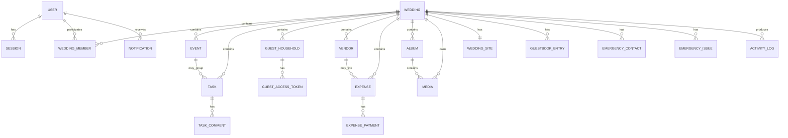
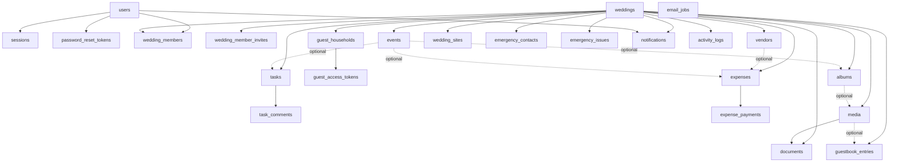

# Make My Marriage

## Database Design Document

**Version:** V1  
**Database:** MongoDB Atlas  
**ODM:** Mongoose  
**Validation:** Zod + Mongoose  
**Primary Tenant:** Wedding  
**Status:** Database Design Baseline

---

# 1. Purpose

This document defines the MongoDB data model for **Make My Marriage**, a collaborative Indian Hindu wedding planning platform.

It covers:

- Collections
- Relationships
- Embedding vs referencing
- Required fields
- Data constraints
- Index strategy
- Authentication/session data
- Secure tokens
- Expense/payment modeling
- Guest RSVP modeling
- Media metadata
- Email jobs
- Activity and notification data
- Data lifecycle
- Migration strategy

This document focuses on **database structure and database rules**. API request/response contracts will be defined separately in the API Design document.

---

# 2. Locked Database Decisions

The following database decisions are considered locked for V1.

1. **MongoDB Atlas** is the primary application database.
4. **Mongoose** is the ODM used for MongoDB schema definitions, models, indexes, and persistence-level validation.
5. **Zod + Mongoose** provide layered validation: Zod at API/application boundaries and Mongoose at the persistence layer.
4. MongoDB native `ObjectId` values are used for internal identifiers.
5. Every wedding-owned business record is tenant-scoped using `weddingId`.
6. Monetary values are stored as **integer paise**.
   - Example: `₹25,000` is stored as `2500000`.
7. Expense instalments/payments are stored in a separate `expense_payments` collection.
8. Tasks have **no hierarchy/subtask relationship in V1**.
   - Every task is independent.
   - There is no `parentTaskId`.
9. RSVP data is embedded directly inside `guest_households`.
10. Guest household members are embedded inside the household document.
11. Files are not stored in MongoDB.
   - File bytes are stored in Cloudflare R2.
   - MongoDB stores file/media metadata.
12. Authentication uses application-managed users and MongoDB-backed sessions.
13. Signup email verification is not required in V1.
14. Wedding invitation acceptance does not require email verification.
15. Security-sensitive raw tokens are never stored directly.
   - Only token hashes are persisted.
16. Email delivery uses a lightweight MongoDB-backed email job/outbox model.
17. No calculated wedding-wide totals are persisted in the `weddings` document in V1.

---

# 3. Database Design Principles

## 3.1 Wedding as Tenant

A wedding is the primary tenant/workspace boundary.

Most business collections must include:

```ts
weddingId: ObjectId
```

Example:

```ts
{
  _id: ObjectId,
  weddingId: ObjectId,
  title: "Book photographer"
}
```

Every repository query for a wedding-owned entity must include `weddingId`.

Preferred:

```ts
tasks.findOne({
  _id: taskId,
  weddingId
})
```

Avoid:

```ts
tasks.findOne({
  _id: taskId
})
```

The purpose is to reduce the risk of cross-wedding data exposure.

## 3.2 Embed Small, Tightly-Owned Data

Embed data when it:

- belongs exclusively to one parent,
- remains small,
- is normally loaded with the parent,
- does not require independent querying.

Examples:

- event venue/address
- wedding member permissions
- guest household members
- RSVP fields
- wedding website section configuration

## 3.3 Reference Independently Growing Data

Use separate collections when data:

- grows independently,
- requires independent indexes,
- has its own lifecycle,
- needs pagination,
- is queried separately.

Examples:

- tasks
- comments
- expenses
- payments
- vendors
- albums
- media
- notifications

## 3.4 Avoid Duplicate Source-of-Truth Fields

Do not store the same authoritative information in multiple places.

Example:

Do not store authoritative vendor payment status in both:

```text
vendors.paymentStatus
```

and:

```text
expense_payments
```

Payment state is derived from expenses/payments.

## 3.5 Avoid Premature Denormalization

Do not store these fields on the wedding document in V1:

```text
totalExpenses
totalPaid
guestCount
completedTaskCount
pendingPaymentCount
```

These values should initially be calculated from their source collections.

If performance later requires it, a separate read-model/summary design can be introduced.

---

# 4. Naming Conventions

## Collections

Use plural snake_case collection names.

Examples:

```text
users
sessions
weddings
wedding_members
wedding_member_invites
guest_households
expense_payments
```

## Fields

Use camelCase fields.

Examples:

```text
weddingId
createdAt
normalizedEmail
totalAmountPaise
```

## Enum Values

Use uppercase strings.

Examples:

```text
ACTIVE
PENDING
APPROVED
ATTENDING
IN_PROGRESS
```

## Dates

Store dates as MongoDB BSON Date values in UTC.

Application-level localization is performed when displaying dates.

---

# 5. Identifier Strategy

Internal IDs use MongoDB `ObjectId`.

Examples:

```text
userId
weddingId
memberId
eventId
taskId
guestHouseholdId
vendorId
expenseId
paymentId
mediaId
```

Public/security-sensitive identifiers use separate values.

Examples:

| Purpose | Identifier |
|---|---|
| Wedding website | `slug` |
| Team invite | random secure token |
| Guest invitation/access | random secure token |
| Password reset | random secure token |
| Session | random secure token |

`ObjectId` values must never be treated as authorization secrets.

---

# 6. Common Audit Fields

Where appropriate, business documents should use:

```ts
{
  createdAt: Date,
  updatedAt: Date,
  createdBy?: ObjectId,
  updatedBy?: ObjectId
}
```

`createdBy` and `updatedBy` refer to platform `users`.

Guest-generated content may instead use guest household references.

---

# 7. Collection Overview

V1 database collections:

```text
users
sessions
password_reset_tokens

weddings
wedding_members
wedding_member_invites

events

tasks
task_comments

guest_households
guest_access_tokens

vendors

expenses
expense_payments

media
documents
albums

wedding_sites

guestbook_entries

emergency_contacts
emergency_issues

notifications
activity_logs

email_jobs
```

---

# 8. High-Level Relationships



---

# 9. `users`

Represents a global Make My Marriage account.

One user may participate in multiple weddings.

## Schema

```ts
interface User {
  _id: ObjectId
  name: string
  email: string
  normalizedEmail: string
  passwordHash: string
  emailVerifiedAt: Date | null
  status: "ACTIVE" | "SUSPENDED"
  preferredLanguage: "en" | "hi"
  createdAt: Date
  updatedAt: Date
}
```

## Rules

- `normalizedEmail` is the canonical equality value.
- V1 does not require `emailVerifiedAt`.
- `emailVerifiedAt` remains nullable for future verification features.
- Passwords are never stored directly.
- Password hash must use a modern password-hashing algorithm such as Argon2id.

## Indexes

```text
UNIQUE(normalizedEmail)
INDEX(status)
```

---

# 10. `sessions`

Stores opaque login sessions.

## Schema

```ts
interface Session {
  _id: ObjectId
  userId: ObjectId
  tokenHash: string
  expiresAt: Date
  createdAt: Date
  lastUsedAt: Date
  revokedAt?: Date
}
```

## Rules

- Browser stores the raw session token in a Secure, HttpOnly cookie.
- MongoDB stores only `tokenHash`.
- Revoked sessions cannot authenticate.
- Expired sessions cannot authenticate.

## Indexes

```text
UNIQUE(tokenHash)
INDEX(userId)
TTL(expiresAt)
```

---

# 11. `password_reset_tokens`

Stores password reset token state.

## Schema

```ts
interface PasswordResetToken {
  _id: ObjectId
  userId: ObjectId
  tokenHash: string
  expiresAt: Date
  usedAt?: Date
  createdAt: Date
}
```

## Rules

- Raw reset token is sent to the user.
- Only its hash is stored.
- Token is single-use.
- Token must be rejected after `expiresAt`.
- Successful password reset should invalidate active reset tokens for the user.
- Existing user sessions may also be revoked after reset.

## Indexes

```text
UNIQUE(tokenHash)
INDEX(userId)
TTL(expiresAt)
```

---

# 12. `weddings`

Top-level tenant/workspace.

## Schema

```ts
interface Wedding {
  _id: ObjectId
  title: string

  bride: {
    name: string
  }

  groom: {
    name: string
  }

  primaryWeddingDate: Date

  generalLocation?: {
    name?: string
    addressLine1?: string
    addressLine2?: string
    locality?: string
    city?: string
    state?: string
    postalCode?: string
    country?: string
    latitude?: number
    longitude?: number
    mapUrl?: string
    placeId?: string
  }

  coverMediaId?: ObjectId

  status:
    | "PLANNING"
    | "COMPLETED"
    | "ARCHIVED"

  preferredLanguage: "en" | "hi"

  createdBy: ObjectId
  createdAt: Date
  updatedAt: Date
}
```

## Rules

- Do not embed events, users, guests, vendors, tasks, or expenses.
- Wedding-level location is general information only.
- Event venues contain the precise event location.

## Indexes

```text
INDEX(createdBy)
INDEX(status)
INDEX(primaryWeddingDate)
```

---

# 13. `wedding_members`

Many-to-many relationship between users and weddings.

## Schema

```ts
interface WeddingMember {
  _id: ObjectId
  weddingId: ObjectId
  userId: ObjectId

  role:
    | "ADMIN"
    | "MANAGER"
    | "ORGANISER"

  permissions: {
    guests: boolean
    vendors: boolean
    finance: boolean
    gallery: boolean
    website: boolean
    guestbook: boolean
    emergency: boolean
  }

  eventScope: {
    allEvents: boolean
    eventIds: ObjectId[]
  }

  status:
    | "ACTIVE"
    | "REMOVED"

  joinedAt: Date
  createdAt: Date
  updatedAt: Date
}
```

## Rules

- Admin has full wedding access plus team-management capability.
- Manager/Organiser access depends on permissions and event scope.
- If `allEvents === true`, `eventIds` should normally be empty.
- If `allEvents === false`, event-specific operations must validate that the target event is included in `eventIds`.
- Every event in `eventIds` must belong to the same `weddingId`.

## Indexes

```text
UNIQUE(weddingId, userId)
INDEX(userId, status)
INDEX(weddingId, role)
```

---

# 14. `wedding_member_invites`

Stores invitations for Admin/Manager/Organiser membership.

## Schema

```ts
interface WeddingMemberInvite {
  _id: ObjectId
  weddingId: ObjectId
  invitedEmail: string
  normalizedEmail: string

  role:
    | "ADMIN"
    | "MANAGER"
    | "ORGANISER"

  permissions: {
    guests: boolean
    vendors: boolean
    finance: boolean
    gallery: boolean
    website: boolean
    guestbook: boolean
    emergency: boolean
  }

  eventScope: {
    allEvents: boolean
    eventIds: ObjectId[]
  }

  tokenHash: string

  status:
    | "PENDING"
    | "ACCEPTED"
    | "EXPIRED"
    | "REVOKED"

  expiresAt: Date
  invitedBy: ObjectId
  acceptedBy?: ObjectId
  acceptedAt?: Date
  createdAt: Date
  updatedAt: Date
}
```

## Rules

- Email verification is not required.
- Accepting account email must match `normalizedEmail`.
- Raw invitation token must never be stored.
- Invitation acceptance should atomically:
  1. validate invite,
  2. create `wedding_members`,
  3. mark invite `ACCEPTED`.

## Indexes

```text
UNIQUE(tokenHash)
INDEX(weddingId, normalizedEmail, status)
INDEX(expiresAt)
```

---

# 15. `events`

Represents Hindu wedding ceremonies and custom events.

## Schema

```ts
interface Event {
  _id: ObjectId
  weddingId: ObjectId
  name: string
  description?: string
  type?: string
  startAt: Date
  endAt?: Date

  venue?: {
    name?: string
    addressLine1?: string
    addressLine2?: string
    locality?: string
    city?: string
    state?: string
    postalCode?: string
    country?: string
    latitude?: number
    longitude?: number
    mapUrl?: string
    placeId?: string
  }

  dressCode?: string
  coverMediaId?: ObjectId
  notes?: string
  createdBy: ObjectId
  updatedBy?: ObjectId
  createdAt: Date
  updatedAt: Date
}
```

## Rules

- `endAt`, if present, must be greater than or equal to `startAt`.
- Latitude must be between `-90` and `90`.
- Longitude must be between `-180` and `180`.
- `coverMediaId`, if present, must reference media from the same wedding.

## Indexes

```text
INDEX(weddingId, startAt)
INDEX(weddingId, name)
```

---

# 16. `tasks`

Stores independent wedding tasks.

**V1 does not support task hierarchy/subtasks.**

## Schema

```ts
interface Task {
  _id: ObjectId
  weddingId: ObjectId
  eventId?: ObjectId
  title: string
  description?: string
  assignedTo?: ObjectId

  priority:
    | "LOW"
    | "MEDIUM"
    | "HIGH"

  status:
    | "TODO"
    | "IN_PROGRESS"
    | "COMPLETED"

  dueAt?: Date
  reminderAt?: Date
  dependencyIds?: ObjectId[]
  completedAt?: Date
  createdBy: ObjectId
  updatedBy?: ObjectId
  createdAt: Date
  updatedAt: Date
}
```

## Rules

- There is no `parentTaskId`.
- Each task is independent and identified by its own `taskId`.
- `eventId`, if present, must belong to the same wedding.
- `assignedTo`, if present, must reference an active member for the same wedding.
- Dependencies must reference tasks belonging to the same wedding.
- A task must not depend on itself.
- Circular dependency prevention should be enforced at application level if dependencies are enabled.
- When status becomes `COMPLETED`, set `completedAt`.
- If a completed task is reopened, clear `completedAt`.

## Indexes

```text
INDEX(weddingId, status)
INDEX(weddingId, assignedTo, status)
INDEX(weddingId, eventId, status)
INDEX(weddingId, dueAt)
INDEX(weddingId, priority)
```

---

# 17. `task_comments`

Comments belong to tasks.

## Schema

```ts
interface TaskComment {
  _id: ObjectId
  weddingId: ObjectId
  taskId: ObjectId
  authorId: ObjectId
  body: string
  attachmentIds?: ObjectId[]
  createdAt: Date
  updatedAt?: Date
}
```

## Rules

- `taskId` must belong to the same wedding.
- `authorId` must be an active member of the wedding.
- Attachment media must belong to the same wedding.

## Indexes

```text
INDEX(weddingId, taskId, createdAt)
INDEX(authorId, createdAt)
```

---

# 18. `guest_households`

Household/family is the primary invitation unit.

RSVP is embedded directly in this collection.

## Schema

```ts
interface GuestHousehold {
  _id: ObjectId
  weddingId: ObjectId
  householdName: string

  primaryContact: {
    name: string
    email?: string
    phone?: string
  }

  side:
    | "BRIDE"
    | "GROOM"
    | "BOTH"

  members: Array<{
    _id: ObjectId
    name: string
  }>

  totalInvited: number

  invitationStatus:
    | "NOT_SENT"
    | "SENT"

  invitationSentAt?: Date

  rsvp: {
    status:
      | "AWAITING"
      | "ATTENDING"
      | "NOT_ATTENDING"
    attendingCount?: number
    respondedAt?: Date
  }

  galleryAccess: boolean
  notes?: string
  createdBy: ObjectId
  updatedBy?: ObjectId
  createdAt: Date
  updatedAt: Date
}
```

## Rules

- All invited guests are invited to all wedding events in V1.
- No event-specific RSVP collection exists in V1.
- `totalInvited >= 1`.
- If RSVP is `ATTENDING`, `attendingCount` must be between `1` and `totalInvited`.
- If RSVP is `NOT_ATTENDING`, `attendingCount` should be `0` or omitted.
- Household members remain embedded.

## Indexes

```text
INDEX(weddingId, rsvp.status)
INDEX(weddingId, side)
INDEX(weddingId, invitationStatus)
INDEX(weddingId, householdName)
```

---

# 19. `guest_access_tokens`

Represents secure guest invitation/access links.

## Schema

```ts
interface GuestAccessToken {
  _id: ObjectId
  weddingId: ObjectId
  householdId: ObjectId
  tokenHash: string
  expiresAt?: Date
  revokedAt?: Date
  lastUsedAt?: Date
  createdAt: Date
}
```

## Rules

- Raw token is only shown/sent externally.
- Only token hash is stored.
- Household must belong to same wedding.
- Revoked token cannot be used.
- Token can be rotated without changing the guest household.

## Indexes

```text
UNIQUE(tokenHash)
INDEX(weddingId, householdId)
INDEX(expiresAt)
```

---

# 20. `vendors`

Stores vendor records selected outside the platform.

## Schema

```ts
interface Vendor {
  _id: ObjectId
  weddingId: ObjectId
  name: string
  category: string
  contactPerson?: string
  phone?: string
  email?: string
  address?: string
  website?: string
  socialUrl?: string
  eventIds?: ObjectId[]
  agreedAmountPaise?: number
  currency: "INR"
  notes?: string
  createdBy: ObjectId
  updatedBy?: ObjectId
  createdAt: Date
  updatedAt: Date
}
```

## Rules

- `agreedAmountPaise`, if present, must be an integer >= 0.
- Vendor payment status is not stored as authoritative data.
- Every `eventId` must belong to same wedding.

## Indexes

```text
INDEX(weddingId, category)
INDEX(weddingId, name)
```

---

# 21. Money Representation

All monetary values are stored as integer paise.

Example:

```text
₹25,000.00
```

is stored as:

```ts
2500000
```

Fields should use names that make the unit explicit.

Examples:

```text
totalAmountPaise
amountPaise
agreedAmountPaise
```

## Rules

- Values must be integers.
- Values must be >= 0 unless a future domain explicitly requires refunds/negative values.
- Currency is initially `INR`.
- Never perform money calculations using floating-point rupee values.

---

# 22. `expenses`

Represents a wedding expense.

## Schema

```ts
interface Expense {
  _id: ObjectId
  weddingId: ObjectId
  eventId?: ObjectId
  vendorId?: ObjectId
  title: string
  category: string
  totalAmountPaise: number
  currency: "INR"

  approvalStatus:
    | "PENDING"
    | "APPROVED"
    | "REJECTED"

  approval?: {
    decidedBy?: ObjectId
    decidedAt?: Date
    note?: string
  }

  notes?: string
  createdBy: ObjectId
  updatedBy?: ObjectId
  createdAt: Date
  updatedAt: Date
}
```

## Rules

- `totalAmountPaise` must be integer >= 0.
- `eventId`, if present, belongs to same wedding.
- `vendorId`, if present, belongs to same wedding.
- Approval is single-step only.
- Payments are not embedded.

## Indexes

```text
INDEX(weddingId, eventId)
INDEX(weddingId, vendorId)
INDEX(weddingId, category)
INDEX(weddingId, approvalStatus)
INDEX(weddingId, createdAt)
```

---

# 23. `expense_payments`

Stores expense instalments/payments separately from the expense document.

## Schema

```ts
interface ExpensePayment {
  _id: ObjectId
  weddingId: ObjectId
  expenseId: ObjectId
  amountPaise: number
  currency: "INR"
  dueAt?: Date

  status:
    | "PENDING"
    | "PAID"

  paidAt?: Date

  paidBy: {
    type:
      | "MEMBER"
      | "OTHER"
    userId?: ObjectId
    name?: string
  }

  paymentMethod?: string
  receiptMediaId?: ObjectId
  notes?: string
  createdBy: ObjectId
  updatedBy?: ObjectId
  createdAt: Date
  updatedAt: Date
}
```

## Effective Status

`OVERDUE` is derived, not stored.

```text
effectiveStatus = OVERDUE
when:
status == PENDING
AND dueAt < current time
```

Canonical stored values remain:

```text
PENDING
PAID
```

## Rules

- `expenseId` must belong to same wedding.
- `amountPaise` must be integer > 0.
- If `status == PAID`, `paidAt` should be populated.
- If payer type is `MEMBER`, `userId` must identify a member of same wedding.
- If payer type is `OTHER`, `name` should be provided.
- Receipt media must belong to same wedding.
- Application service should validate total payment amounts against expense rules.

## Indexes

```text
INDEX(weddingId, expenseId)
INDEX(weddingId, status, dueAt)
INDEX(weddingId, paidAt)
INDEX(weddingId, paidBy.userId)
```

---

# 24. `media`

Stores metadata for files stored in Cloudflare R2.

MongoDB does not store the binary file.

## Schema

```ts
interface Media {
  _id: ObjectId
  weddingId: ObjectId
  albumId?: ObjectId
  objectKey: string
  originalFilename: string
  mimeType: string
  sizeBytes: number

  mediaType:
    | "IMAGE"
    | "VIDEO"
    | "AUDIO"
    | "DOCUMENT"

  visibility:
    | "PUBLIC"
    | "RESTRICTED"
    | "PRIVATE"

  status:
    | "PENDING_UPLOAD"
    | "UPLOADED"
    | "PENDING_APPROVAL"
    | "APPROVED"
    | "REJECTED"

  uploadedByType:
    | "MEMBER"
    | "GUEST"

  uploadedByUserId?: ObjectId
  uploadedByHouseholdId?: ObjectId
  createdAt: Date
  updatedAt: Date
}
```

## Rules

- `objectKey` should be unique.
- `albumId`, if present, belongs to same wedding.
- Member uploads require `uploadedByUserId`.
- Guest uploads require `uploadedByHouseholdId`.
- Guest-uploaded gallery content may start as `PENDING_APPROVAL`.
- R2 object deletion and MongoDB metadata deletion must be coordinated.

## Indexes

```text
UNIQUE(objectKey)
INDEX(weddingId, albumId, createdAt)
INDEX(weddingId, status, createdAt)
INDEX(weddingId, visibility)
INDEX(uploadedByHouseholdId)
```

---

# 25. `documents`

Represents business meaning for uploaded document media.

## Schema

```ts
interface Document {
  _id: ObjectId
  weddingId: ObjectId

  type:
    | "CONTRACT"
    | "INVOICE"
    | "RECEIPT"
    | "QUOTATION"
    | "MENU"
    | "OTHER"

  relatedTo: {
    type:
      | "EVENT"
      | "TASK"
      | "VENDOR"
      | "EXPENSE"
    id: ObjectId
  }

  mediaId: ObjectId
  title?: string
  uploadedBy: ObjectId
  createdAt: Date
}
```

## Rules

- `mediaId` must reference media from same wedding.
- `relatedTo.id` must belong to same wedding.
- Related entity type determines which collection is queried.

## Indexes

```text
INDEX(weddingId, relatedTo.type, relatedTo.id)
INDEX(weddingId, type)
INDEX(mediaId)
```

---

# 26. `albums`

Gallery album metadata.

## Schema

```ts
interface Album {
  _id: ObjectId
  weddingId: ObjectId
  eventId?: ObjectId
  name: string
  description?: string

  visibility:
    | "GUESTS"
    | "PUBLIC"
    | "PRIVATE"

  createdBy: ObjectId
  createdAt: Date
  updatedAt: Date
}
```

## Rules

- Event must belong to same wedding.
- V1 assumes one media item belongs to zero or one album.
- Album visibility does not override a stronger media restriction.

## Indexes

```text
INDEX(weddingId, eventId)
INDEX(weddingId, visibility)
```

---

# 27. `wedding_sites`

One website configuration per wedding.

## Schema

```ts
interface WeddingSite {
  _id: ObjectId
  weddingId: ObjectId
  slug: string

  status:
    | "DRAFT"
    | "PUBLISHED"

  theme: string
  locale: "en" | "hi"

  seo: {
    title?: string
    description?: string
    noIndex: boolean
  }

  style: {
    primaryColor?: string
    secondaryColor?: string
    fontFamily?: string
  }

  sections: Array<{
    id: string
    type: string
    enabled: boolean
    order: number
    config: Record<string, unknown>
  }>

  publishedAt?: Date
  createdAt: Date
  updatedAt: Date
}
```

## Rules

- Exactly one wedding site document per wedding.
- `slug` is globally unique.
- Arbitrary executable code/HTML is not stored.
- Sections are controlled configuration objects.
- `publishedAt` should be populated when first published.

## Indexes

```text
UNIQUE(weddingId)
UNIQUE(slug)
INDEX(status)
```

---

# 28. `guestbook_entries`

Guest wishes.

## Schema

```ts
interface GuestbookEntry {
  _id: ObjectId
  weddingId: ObjectId
  householdId?: ObjectId
  guestName: string

  type:
    | "TEXT"
    | "AUDIO"
    | "VIDEO"

  text?: string
  mediaId?: ObjectId

  status:
    | "PENDING"
    | "APPROVED"
    | "REJECTED"

  createdAt: Date
  moderatedAt?: Date
  moderatedBy?: ObjectId
}
```

## Rules

- Text entries require `text`.
- Audio/video entries require `mediaId`.
- Guest-generated content starts as `PENDING`.
- Media must belong to same wedding.

## Indexes

```text
INDEX(weddingId, status, createdAt)
INDEX(weddingId, householdId)
```

---

# 29. `emergency_contacts`

Stores important wedding contacts.

## Schema

```ts
interface EmergencyContact {
  _id: ObjectId
  weddingId: ObjectId
  eventId?: ObjectId
  name: string
  role: string
  phone?: string
  email?: string
  priority?: number
  notes?: string
  createdBy: ObjectId
  createdAt: Date
  updatedAt: Date
}
```

## Indexes

```text
INDEX(weddingId, eventId)
INDEX(weddingId, priority)
```

---

# 30. `emergency_issues`

Simple issue/escalation tracking.

## Schema

```ts
interface EmergencyIssue {
  _id: ObjectId
  weddingId: ObjectId
  eventId?: ObjectId
  title: string
  description?: string

  priority:
    | "NORMAL"
    | "IMPORTANT"
    | "URGENT"

  assignedTo?: ObjectId
  emergencyContactId?: ObjectId

  status:
    | "OPEN"
    | "RESOLVED"

  resolutionNotes?: string
  createdBy: ObjectId
  createdAt: Date
  resolvedAt?: Date
  resolvedBy?: ObjectId
}
```

## Rules

- Assigned user must belong to same wedding.
- Emergency contact must belong to same wedding.
- Event must belong to same wedding.

## Indexes

```text
INDEX(weddingId, status, priority)
INDEX(weddingId, eventId)
INDEX(weddingId, assignedTo, status)
```

---

# 31. `notifications`

Persistent in-app notifications.

## Schema

```ts
interface Notification {
  _id: ObjectId
  weddingId: ObjectId
  userId: ObjectId
  type: string
  title: string
  message: string
  entityType?: string
  entityId?: ObjectId
  readAt?: Date
  createdAt: Date
}
```

## Rules

- User must be a current/relevant wedding member when notification is created.
- Notification data should remain lightweight.
- Large domain objects should not be copied into notifications.

## Indexes

```text
INDEX(userId, readAt, createdAt)
INDEX(weddingId, userId, createdAt)
```

---

# 32. `activity_logs`

User-facing and audit-relevant wedding activity.

## Schema

```ts
interface ActivityLog {
  _id: ObjectId
  weddingId: ObjectId
  actorUserId?: ObjectId
  action: string
  entityType: string
  entityId?: ObjectId
  metadata?: Record<string, unknown>
  createdAt: Date
}
```

## Example Actions

```text
TASK_CREATED
TASK_COMPLETED
EXPENSE_CREATED
PAYMENT_RECORDED
VENDOR_ADDED
RSVP_UPDATED
MEMBER_INVITED
MEMBER_REMOVED
WEBSITE_PUBLISHED
MEDIA_APPROVED
```

## Rules

Do not store:

- passwords
- password hashes
- session tokens
- invitation tokens
- password reset tokens
- API secrets
- full sensitive request bodies

## Indexes

```text
INDEX(weddingId, createdAt)
INDEX(weddingId, actorUserId, createdAt)
INDEX(weddingId, entityType, entityId)
```

---

# 33. `email_jobs`

MongoDB-backed lightweight email outbox.

## Schema

```ts
interface EmailJob {
  _id: ObjectId
  type: string
  to: string
  templateData: Record<string, unknown>

  status:
    | "PENDING"
    | "PROCESSING"
    | "SENT"
    | "FAILED"

  attempts: number
  scheduledAt: Date
  lockedAt?: Date
  lockOwner?: string
  lastAttemptAt?: Date
  sentAt?: Date
  providerMessageId?: string
  lastError?: string
  createdAt: Date
  updatedAt: Date
}
```

## Processing Model

```text
Create Email Job
      |
      v
   PENDING
      |
      v
Small Batch Scheduler
      |
      v
  PROCESSING
   /       \
success   failure
  |          |
  v          v
 SENT     retry / FAILED
```

## Rules

- Email jobs are processed in small batches.
- No Redis/message broker is required in V1.
- Scheduler must atomically claim jobs before sending.
- `lockedAt` and `lockOwner` reduce duplicate sending risk.
- Retry policy is controlled by application settings.
- Do not store raw authentication secrets inside `templateData`.

## Indexes

```text
INDEX(status, scheduledAt)
INDEX(status, lockedAt)
INDEX(createdAt)
```

---

# 34. Embedding vs Referencing Summary

## Embedded

```text
Wedding.generalLocation
Event.venue
WeddingMember.permissions
WeddingMember.eventScope
GuestHousehold.primaryContact
GuestHousehold.members
GuestHousehold.rsvp
Expense.approval
WeddingSite.seo
WeddingSite.style
WeddingSite.sections
ExpensePayment.paidBy
```

## Referenced / Separate Collections

```text
Users
Sessions
Password reset tokens

Wedding members
Wedding member invites
Events
Tasks
Task comments

Guest households
Guest access tokens

Vendors
Expenses
Expense payments

Media
Documents
Albums

Wedding sites
Guestbook entries

Emergency contacts
Emergency issues

Notifications
Activity logs
Email jobs
```

---

# 35. Cross-Collection Integrity Rules

MongoDB does not provide traditional foreign-key constraints for these relationships.

The application service/repository layer must enforce the following.

## Same-Wedding Validation

All linked records must belong to the same wedding.

Examples:

```text
Task.eventId -> same wedding
Task.assignedTo -> member of same wedding
Expense.eventId -> same wedding
Expense.vendorId -> same wedding
Payment.expenseId -> same wedding
Album.eventId -> same wedding
Media.albumId -> same wedding
Document.relatedTo.id -> same wedding
Guestbook.mediaId -> same wedding
EmergencyIssue.eventId -> same wedding
```

## Member Validation

When a business record references a user as an organiser/assignee/payer:

```text
user must belong to wedding
AND
membership must be valid for the operation
```

## Permission Validation

Database existence alone does not grant access.

Authorization must also validate:

```text
role
functional permission
event scope
```

---

# 36. Transactions

Use MongoDB transactions selectively.

Do not use transactions for every write.

## Recommended Transaction Cases

### Create Wedding

```text
create wedding
create initial ADMIN wedding_member
```

These should either both succeed or both fail.

### Accept Team Invitation

```text
validate invite
create wedding_member
mark invitation ACCEPTED
```

### Other Multi-Document State Changes

Use a transaction when partial completion would leave the domain inconsistent.

## No Transaction Needed

Examples:

```text
update task title
update event dress code
mark notification read
edit vendor phone
```

---

# 37. Index Strategy

Indexes are driven by real query patterns.

Do not index every field.

## Core Index Matrix

| Collection | Index |
|---|---|
| `users` | unique `normalizedEmail` |
| `sessions` | unique `tokenHash` |
| `sessions` | TTL `expiresAt` |
| `sessions` | `userId` |
| `password_reset_tokens` | unique `tokenHash` |
| `password_reset_tokens` | TTL `expiresAt` |
| `wedding_members` | unique `(weddingId, userId)` |
| `wedding_members` | `(userId, status)` |
| `wedding_member_invites` | unique `tokenHash` |
| `wedding_member_invites` | `(weddingId, normalizedEmail, status)` |
| `events` | `(weddingId, startAt)` |
| `tasks` | `(weddingId, status)` |
| `tasks` | `(weddingId, assignedTo, status)` |
| `tasks` | `(weddingId, eventId, status)` |
| `tasks` | `(weddingId, dueAt)` |
| `task_comments` | `(weddingId, taskId, createdAt)` |
| `guest_households` | `(weddingId, rsvp.status)` |
| `guest_households` | `(weddingId, side)` |
| `guest_households` | `(weddingId, invitationStatus)` |
| `guest_access_tokens` | unique `tokenHash` |
| `vendors` | `(weddingId, category)` |
| `expenses` | `(weddingId, eventId)` |
| `expenses` | `(weddingId, vendorId)` |
| `expense_payments` | `(weddingId, expenseId)` |
| `expense_payments` | `(weddingId, status, dueAt)` |
| `media` | unique `objectKey` |
| `media` | `(weddingId, albumId, createdAt)` |
| `media` | `(weddingId, status, createdAt)` |
| `documents` | `(weddingId, relatedTo.type, relatedTo.id)` |
| `albums` | `(weddingId, eventId)` |
| `wedding_sites` | unique `weddingId` |
| `wedding_sites` | unique `slug` |
| `guestbook_entries` | `(weddingId, status, createdAt)` |
| `emergency_issues` | `(weddingId, status, priority)` |
| `notifications` | `(userId, readAt, createdAt)` |
| `activity_logs` | `(weddingId, createdAt)` |
| `email_jobs` | `(status, scheduledAt)` |

---

# 38. Uniqueness Constraints

V1 requires at least these uniqueness rules:

```text
users.normalizedEmail
sessions.tokenHash
password_reset_tokens.tokenHash
(wedding_members.weddingId, wedding_members.userId)
wedding_member_invites.tokenHash
guest_access_tokens.tokenHash
media.objectKey
wedding_sites.weddingId
wedding_sites.slug
```

---

# 39. TTL / Expiration Strategy

TTL indexes are appropriate for data that naturally expires.

Recommended:

```text
sessions.expiresAt
password_reset_tokens.expiresAt
```

For invitations, automatic hard deletion may not always be desirable because the product may want to preserve invitation history.

Therefore:

```text
wedding_member_invites.expiresAt
```

may be used for query logic without necessarily applying an aggressive TTL delete.

The application can mark expired invitations as `EXPIRED`.

---

# 40. Secure Token Strategy

Used for:

```text
sessions
password reset
wedding team invitations
guest access links
```

## Token Generation

Use a cryptographically secure random token.

## Storage

Persist only:

```text
hash(token)
```

## Lookup

When request provides raw token:

```text
hash(requestToken)
```

then query by the hash.

## Raw Token Rule

Raw tokens must never appear in:

```text
application logs
activity_logs
MongoDB documents
error messages
analytics
```

---

# 41. Query Patterns

Database indexes should support the main user workflows.

## Dashboard

Typical reads:

```text
next events
task status counts
overdue tasks
guest RSVP counts
expense total
paid total
pending/overdue payments
recent activity
```

These may initially be implemented with separate targeted queries/aggregations.

## Task List

Example:

```ts
{
  weddingId,
  status,
  assignedTo?,
  eventId?,
  dueAt?
}
```

Sort:

```text
dueAt ASC
createdAt DESC
```

## Guest List

Example:

```ts
{
  weddingId,
  "rsvp.status": "ATTENDING",
  side: "BRIDE"
}
```

## Pending Payments

Canonical query:

```ts
{
  weddingId,
  status: "PENDING",
  dueAt: { $exists: true }
}
```

Then effective state is determined relative to current time.

## Gallery Moderation

Example:

```ts
{
  weddingId,
  status: "PENDING_APPROVAL"
}
```

## Email Dispatcher

Example:

```ts
{
  status: "PENDING",
  scheduledAt: { $lte: now }
}
```

sorted by:

```text
scheduledAt ASC
createdAt ASC
```

with a limited batch.

---

# 42. Pagination

Collections that can grow significantly should use pagination.

Examples:

```text
task_comments
guest_households
media
guestbook_entries
notifications
activity_logs
email_jobs
```

Prefer cursor-based pagination for high-volume chronological collections.

Example cursor:

```text
createdAt + _id
```

Offset pagination may be acceptable for smaller admin lists.

---

# 43. Search Strategy

V1 does not require a separate search engine.

Use MongoDB fields/indexes for basic searches.

Examples:

```text
guest household name
vendor name
task title
event name
expense title
```

Avoid broad regex scans on very large collections.

If product search later becomes sophisticated, Atlas Search can be evaluated separately.

---

# 44. Data Validation

MongoDB is schema-flexible, but the application must remain strongly validated.

V1 uses **layered validation with Zod + Mongoose**.

```text
Request / API Boundary
        ↓
      Zod
        ↓
Application / Domain Rules
        ↓
     Mongoose
        ↓
    MongoDB Atlas
```

### Zod responsibilities

- Validate request bodies, route parameters, and query parameters.
- Produce predictable client-facing validation errors.
- Validate application/service inputs before business logic runs.
- Perform cross-field validation that belongs to the use case.

### Mongoose responsibilities

- Define persistence schemas and models.
- Enforce required fields, enum values, field types, defaults, and schema-level constraints.
- Define MongoDB indexes from version-controlled model definitions.
- Provide persistence-level protection if invalid data reaches the repository layer.

### Domain/service responsibilities

Business invariants involving multiple records or tenant ownership remain in the service/domain layer; Mongoose validation is not a replacement for authorization or same-wedding integrity checks.

Validation examples:

```text
money values are integer paise
latitude/longitude ranges
RSVP attendingCount <= totalInvited
event endAt >= startAt
same-wedding reference checks
allowed enum values
required fields
```

MongoDB collection validators may later be added for especially critical collections.

---

# 45. Data Lifecycle

## Wedding Archive

```text
weddings.status = ARCHIVED
```

Archiving should not immediately delete wedding data.

## Account Suspension

```text
users.status = SUSPENDED
```

Suspended accounts cannot authenticate.

## Member Removal

Prefer:

```text
wedding_members.status = REMOVED
```

for membership history rather than immediate hard deletion.

## Media Deletion

When permanently deleting media:

```text
1. authorize delete
2. delete R2 object
3. delete/update MongoDB metadata
4. remove dependent references where required
```

A cleanup job should detect orphaned/unconfirmed uploads.

---

# 46. R2 Object Key Strategy

Object keys should be deterministic enough for organization but never treated as authorization.

Example:

```text
weddings/{weddingId}/gallery/{mediaId}/original.jpg
```

Other possible prefixes:

```text
weddings/{weddingId}/website/
weddings/{weddingId}/gallery/
weddings/{weddingId}/guest-uploads/
weddings/{weddingId}/documents/
weddings/{weddingId}/guestbook/
```

Authorization is handled by the application/presigned access, not by guessing-resistant paths alone.

---

# 47. Email Job Concurrency

The small-batch dispatcher must avoid sending the same email twice concurrently.

Recommended claiming strategy:

1. Query eligible pending jobs.
2. Atomically update/claim each job:
   - `status = PROCESSING`
   - `lockedAt = now`
   - `lockOwner = workerId`
3. Send through Resend.
4. Mark `SENT` or schedule retry.
5. Recover stale `PROCESSING` jobs whose lock exceeds a safe timeout.

No Redis is required for V1.

---

# 48. Migration Strategy

MongoDB still requires controlled migrations. Mongoose model changes do **not** replace explicit production migration scripts for existing data.

Suggested project structure:

```text
scripts/
  migrations/
    001-create-core-indexes.ts
    002-add-normalized-email.ts
    003-add-media-visibility.ts
```

Migration requirements:

- repeatable where possible,
- safe to run in production,
- version-controlled,
- logged,
- tested against staging data.

Avoid relying on:

```text
"MongoDB is schemaless, so migrations are unnecessary."
```

---

# 49. Bootstrap / Seed Data

Initial bootstrap scripts may create:

- MongoDB indexes
- default Hindu wedding checklist template data
- supported languages
- default expense categories
- default vendor categories
- default wedding event suggestions

Reference/template data should be version-controlled.

---

# 50. Default Reference Values

## Task Priority

```text
LOW
MEDIUM
HIGH
```

## Task Status

```text
TODO
IN_PROGRESS
COMPLETED
```

## Wedding Member Role

```text
ADMIN
MANAGER
ORGANISER
```

## Wedding Status

```text
PLANNING
COMPLETED
ARCHIVED
```

## Guest Side

```text
BRIDE
GROOM
BOTH
```

## RSVP

```text
AWAITING
ATTENDING
NOT_ATTENDING
```

## Expense Approval

```text
PENDING
APPROVED
REJECTED
```

## Payment

Stored:

```text
PENDING
PAID
```

Derived:

```text
OVERDUE
```

## Content Moderation

```text
PENDING
APPROVED
REJECTED
```

---

# 51. Data Integrity Checklist

Before any write operation involving linked entities:

```text
[ ] authenticated user is valid
[ ] wedding exists
[ ] user belongs to wedding
[ ] permission is granted
[ ] event scope allows operation
[ ] referenced IDs exist
[ ] referenced IDs belong to same wedding
[ ] monetary fields are integer paise
[ ] enum values are valid
[ ] unique constraints are respected
[ ] secure tokens are hashed before persistence
```

---

# 52. Recommended Repository Query Rule

All wedding-scoped repositories should make tenant context explicit.

Preferred repository shape:

```ts
taskRepository.findById({
  weddingId,
  taskId
})
```

rather than:

```ts
taskRepository.findById(taskId)
```

This makes accidental unscoped lookups harder to introduce.

---

# 53. Database Security Considerations

- MongoDB credentials remain server-side only.
- Browser never connects directly to MongoDB Atlas.
- Production database users use minimum required permissions.
- Separate credentials should be used for environments.
- Secrets must not be committed to source control.
- Raw auth/invite/reset tokens must not be logged.
- Cross-wedding IDs supplied by clients must be treated as untrusted input.
- Authorization must be revalidated on every protected write/read.
- Sensitive private documents are represented by metadata only; R2 access is separately authorized.

---

# 54. Environment Separation

Use separate databases or isolated database environments for:

```text
development
staging
production
```

Example:

```text
make_my_marriage_dev
make_my_marriage_staging
make_my_marriage_prod
```

Production data must never be casually copied into local development.

---

# 55. Backup and Recovery

MongoDB Atlas backup strategy should be configured for production according to the selected Atlas tier.

Application design should assume:

- accidental writes are possible,
- deployments can fail,
- migrations may require rollback planning,
- wedding data has high sentimental value,
- media metadata and R2 objects must remain consistent.

Backup policy will be finalized during Deployment Design.

---

# 56. Deferred Database Features

Not included in V1:

```text
event-specific RSVP collection
guest-level RSVP
room allocation
transport records
seat allocation
vendor marketplace data
AI embeddings/vector search
real-time presence data
professional planner CRM hierarchy
multi-currency accounting
ledger/double-entry accounting
expense settlement engine
task hierarchy/subtasks
complex approval-chain collections
```

---

# 57. Final Collection List

```text
users
sessions
password_reset_tokens

weddings
wedding_members
wedding_member_invites

events

tasks
task_comments

guest_households
guest_access_tokens

vendors

expenses
expense_payments

media
documents
albums

wedding_sites

guestbook_entries

emergency_contacts
emergency_issues

notifications
activity_logs

email_jobs
```

---

# 58. Final Database Relationship Summary



---

# 59. Database Design Approval Baseline

This database design is ready to act as the baseline for API Design with the following locked assumptions:

- MongoDB Atlas is the source of structured application data.
- Mongoose is the MongoDB ODM for schemas, models, indexes, and persistence validation.
- Zod validates API/application inputs before domain and persistence operations.
- Cloudflare R2 is the source of file bytes.
- MongoDB `ObjectId` is used internally.
- Wedding is the tenant/workspace boundary.
- Every wedding-owned query is scoped by `weddingId`.
- Money is stored as integer paise.
- Expense payments are separate documents.
- RSVP is embedded in guest households.
- Household members are embedded.
- Tasks are independent V1 entities with no parent/subtask hierarchy.
- Session, invite, guest-access, and password-reset tokens are stored hashed.
- Email jobs use MongoDB as the lightweight outbox/queue.
- Dashboard totals are derived rather than duplicated.
- Same-wedding reference integrity is enforced by the application.
- Multi-document transactions are used selectively for domain-atomic workflows.

---

# 60. Next Design Step

With database boundaries frozen, the next recommended design step is:

## API Design

That document should define:

- REST endpoint catalog
- API versioning
- request schemas
- response envelopes
- authentication requirements
- authorization requirements
- wedding tenant scoping
- pagination
- filtering
- validation errors
- domain error codes
- idempotency rules
- file upload endpoints
- invite/guest public endpoints
- email-triggering workflows
