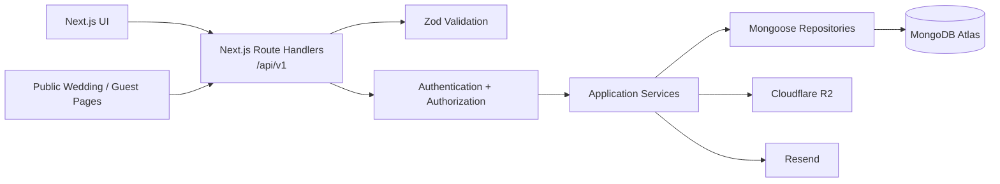

# Make My Marriage

## API Design Document

**Version:** V1  
**API Style:** REST  
**Framework:** Next.js Route Handlers  
**Runtime:** Node.js  
**Base Path:** `/api/v1`  
**Database:** MongoDB Atlas  
**ODM:** Mongoose  
**Validation:** Zod + Mongoose  
**Authentication:** Custom Session-Based Authentication  
**Primary Tenant:** Wedding  
**Status:** API Design Baseline  

---

# 1. Purpose

This document defines the V1 REST API design for **Make My Marriage**.

It translates the approved Product Requirements, System Design, and Database Design into stable HTTP contracts for:

- authentication,
- wedding workspaces,
- members and permissions,
- events,
- tasks,
- guests,
- invitations,
- vendors,
- expenses and payments,
- documents and media,
- wedding websites,
- galleries,
- guestbook,
- emergency management,
- notifications,
- activity logs,
- internal email jobs.

This document focuses on the **API boundary**. Business implementation details belong in services/repositories, while database collection details belong in the Database Design document.

---

# 2. API Design Goals

The V1 API should be:

- simple,
- predictable,
- REST-oriented,
- strongly validated,
- wedding-tenant scoped,
- secure by default,
- reusable by future clients,
- independent of React component implementation,
- easy to version,
- easy to test.

The API should remain suitable for future native mobile apps, external integrations, and internal platform tools.

---

# 3. API Architecture



Route Handlers are thin adapters. They should not contain large amounts of business logic.

Recommended flow:

```text
Request
  ↓
Parse
  ↓
Validate
  ↓
Authenticate
  ↓
Authorize
  ↓
Application Service
  ↓
Repository / External Provider
  ↓
Map Result
  ↓
HTTP Response
```

---

# 4. Base URL and Versioning

All product APIs use:

```text
/api/v1
```

Example:

```text
GET /api/v1/weddings/:weddingId/tasks
```

Future breaking API versions may use:

```text
/api/v2
```

V1 endpoints should not silently introduce breaking request/response changes.

---

# 5. Resource Naming

Use plural lowercase nouns.

Good:

```text
/weddings
/events
/tasks
/guests
/vendors
/expenses
/payments
/media
```

Avoid action-oriented endpoint names when REST semantics already express the operation.

Preferred:

```text
PATCH /tasks/:taskId
```

instead of:

```text
POST /tasks/updateTask
```

Actions that represent explicit domain transitions may use action subpaths.

Examples:

```text
POST /wedding-member-invites/:inviteId/revoke
POST /media/:mediaId/approve
POST /wedding-site/publish
```

---

# 6. HTTP Methods

| Method | Meaning |
|---|---|
| `GET` | Retrieve resource(s) |
| `POST` | Create resource or trigger explicit action |
| `PATCH` | Partial update |
| `PUT` | Full replacement only when explicitly appropriate |
| `DELETE` | Delete/remove resource |

V1 should prefer `PATCH` over `PUT` for normal updates.

---

# 7. Standard Success Response

## Single Resource

```json
{
  "success": true,
  "data": {
    "id": "..."
  }
}
```

## Collection

```json
{
  "success": true,
  "data": [],
  "meta": {
    "nextCursor": null,
    "hasMore": false
  }
}
```

## No Response Body Required

Use:

```text
204 No Content
```

where appropriate.

---

# 8. Standard Error Response

All API errors should use:

```json
{
  "success": false,
  "error": {
    "code": "TASK_NOT_FOUND",
    "message": "Task not found",
    "details": null,
    "requestId": "req_..."
  }
}
```

For validation errors:

```json
{
  "success": false,
  "error": {
    "code": "VALIDATION_ERROR",
    "message": "Request validation failed",
    "details": {
      "fields": {
        "title": ["Title is required"]
      }
    },
    "requestId": "req_..."
  }
}
```

---

# 9. HTTP Status Codes

| Status | Usage |
|---|---|
| `200` | Successful read/update |
| `201` | Resource created |
| `204` | Successful operation with no response body |
| `400` | Invalid request |
| `401` | Authentication required/invalid session |
| `403` | Authenticated but not authorized |
| `404` | Resource not found |
| `409` | Conflict / duplicate / state conflict |
| `422` | Semantically invalid request where appropriate |
| `429` | Rate limit exceeded |
| `500` | Unexpected server error |
| `503` | Temporary dependency/service unavailable |

---

# 10. Authentication Model

V1 uses custom session-based authentication.

The browser stores an opaque session token in a Secure, HttpOnly, SameSite cookie. MongoDB stores only the session token hash.

Authenticated requests use the session cookie automatically. There is no bearer JWT requirement for the primary web application.

---

# 11. Auth Endpoints

## POST `/api/v1/auth/signup`

Creates a user and logs them in immediately.

### Request

```json
{
  "name": "Rahul Sharma",
  "email": "rahul@example.com",
  "password": "..."
}
```

### Behavior

1. Normalize email.
2. Validate uniqueness.
3. Hash password.
4. Create user.
5. Create session.
6. Set session cookie.
7. Return user.

### Notes

- No email verification required.
- Account becomes immediately active.

---

## POST `/api/v1/auth/login`

### Request

```json
{
  "email": "rahul@example.com",
  "password": "..."
}
```

Successful response sets the session cookie.

---

## POST `/api/v1/auth/logout`

Revokes current session.

Response:

```text
204 No Content
```

---

## GET `/api/v1/auth/session`

Returns current user/session state.

---

## POST `/api/v1/auth/forgot-password`

### Request

```json
{
  "email": "rahul@example.com"
}
```

Always return a neutral response to avoid account enumeration.

If the account exists, create a password-reset token and enqueue an email job.

---

## POST `/api/v1/auth/reset-password`

### Request

```json
{
  "token": "...",
  "password": "..."
}
```

Behavior:

- validate token,
- verify expiry,
- update password hash,
- mark reset token used,
- revoke previous sessions as configured.

---

# 12. Authentication Errors

Suggested codes:

```text
AUTH_REQUIRED
INVALID_CREDENTIALS
SESSION_EXPIRED
SESSION_REVOKED
ACCOUNT_SUSPENDED
EMAIL_ALREADY_EXISTS
RESET_TOKEN_INVALID
RESET_TOKEN_EXPIRED
```

Login failures should not disclose whether email or password was specifically incorrect.

---

# 13. Wedding Tenant Authorization

Every protected wedding endpoint follows:

```text
Authenticated?
   ↓
User active?
   ↓
Wedding exists?
   ↓
Active wedding_members record exists?
   ↓
Role/permission allows feature?
   ↓
Event scope allows target event?
   ↓
Execute operation
```

A client-supplied `weddingId` is always untrusted.

---

# 14. Role Rules

Roles:

```text
ADMIN
MANAGER
ORGANISER
```

## Admin

Admin may access all wedding modules and manage wedding members, roles, permissions, and event scope.

## Manager / Organiser

Capabilities depend on `permissions` and `eventScope`.

All authorization rules must be enforced on the server. Hiding a button in the UI is not authorization.

---

# 15. Permission Categories

V1 functional permissions:

```text
guests
vendors
finance
gallery
website
guestbook
emergency
```

Task/event visibility additionally depends on event scope.

---

# 16. Public and Protected API Categories

## Authenticated Product APIs

```text
/api/v1/weddings/...
```

Require authenticated user session.

## Public Wedding APIs

```text
/api/v1/public/weddings/...
```

Do not require account login.

## Guest Token APIs

```text
/api/v1/public/guest-access/...
```

Require valid guest access token rather than user session.

## Internal APIs

```text
/api/internal/...
```

Not part of public V1 API and protected using environment-secret/scheduler authentication.

---

# 17. Pagination

Use cursor pagination for collections that may grow.

Query parameters:

```text
?limit=25&cursor=...
```

Default:

```text
limit = 25
```

Maximum recommended V1 limit:

```text
100
```

Response:

```json
{
  "success": true,
  "data": [],
  "meta": {
    "nextCursor": "...",
    "hasMore": true
  }
}
```

Cursor contents should be opaque to the client.

---

# 18. Filtering, Sorting, and Search

Use query parameters for filtering.

Example:

```text
GET /api/v1/weddings/:weddingId/tasks?status=IN_PROGRESS&eventId=...&assignedTo=...
```

Sorting:

```text
?sort=dueAt&order=asc
```

Only allow documented sortable fields.

Basic module search:

```text
?q=photographer
```

Never map arbitrary client query keys directly to MongoDB operators.

---

# 19. Request Validation

Zod validates:

- path parameters,
- query parameters,
- JSON bodies,
- enums,
- date strings,
- money values,
- string lengths.

Mongoose validates persistence-level schemas.

Validation occurs before application service execution.

---

# 20. ID Validation

All MongoDB identifiers from request paths must be validated as ObjectId strings before repository use.

Invalid format:

```text
400 INVALID_ID
```

Valid format but missing resource:

```text
404 RESOURCE_NOT_FOUND
```

---

# 21. Date and Money Format

API dates use ISO 8601 UTC strings.

```json
{
  "startAt": "2026-11-22T13:30:00.000Z"
}
```

Money uses integer paise.

```json
{
  "totalAmountPaise": 2500000,
  "currency": "INR"
}
```

Floating-point rupee values are not authoritative API money fields.

---

# 22. Wedding APIs

```text
POST   /api/v1/weddings
GET    /api/v1/weddings
GET    /api/v1/weddings/:weddingId
PATCH  /api/v1/weddings/:weddingId
POST   /api/v1/weddings/:weddingId/archive
GET    /api/v1/weddings/:weddingId/dashboard
```

## POST `/api/v1/weddings`

Creates a wedding and current user's Admin membership atomically.

### Request

```json
{
  "title": "Aarav & Meera",
  "bride": { "name": "Meera" },
  "groom": { "name": "Aarav" },
  "primaryWeddingDate": "2027-11-22T00:00:00.000Z",
  "preferredLanguage": "en",
  "generalLocation": {
    "name": "Delhi NCR",
    "city": "New Delhi",
    "state": "Delhi",
    "country": "India",
    "latitude": 28.6139,
    "longitude": 77.209
  }
}
```

---

# 23. Dashboard API

## GET `/api/v1/weddings/:weddingId/dashboard`

Returns a derived dashboard read model containing high-level wedding, event, task, guest, and finance summaries.

The dashboard endpoint is a read model, not an authoritative write API.

---

# 24. Wedding Member APIs

```text
GET    /api/v1/weddings/:weddingId/members
PATCH  /api/v1/weddings/:weddingId/members/:memberId
DELETE /api/v1/weddings/:weddingId/members/:memberId
```

Admin only.

Member updates may change:

- role,
- permissions,
- event scope.

---

# 25. Wedding Member Invite APIs

```text
POST /api/v1/weddings/:weddingId/member-invites
GET  /api/v1/weddings/:weddingId/member-invites
POST /api/v1/weddings/:weddingId/member-invites/:inviteId/resend
POST /api/v1/weddings/:weddingId/member-invites/:inviteId/revoke

GET  /api/v1/public/member-invites/:token
POST /api/v1/public/member-invites/:token/accept
```

Invite creation validates event IDs, stores only a token hash, and enqueues an email job.

Invite acceptance requires authentication but no email verification. The accepting account email must match the invited normalized email.

Acceptance should atomically create the membership and mark the invite accepted.

---

# 26. Event APIs

```text
POST   /api/v1/weddings/:weddingId/events
GET    /api/v1/weddings/:weddingId/events
GET    /api/v1/weddings/:weddingId/events/:eventId
PATCH  /api/v1/weddings/:weddingId/events/:eventId
DELETE /api/v1/weddings/:weddingId/events/:eventId
```

Event list and mutation authorization must respect event scope.

Example event payload:

```json
{
  "name": "Sangeet",
  "description": "Family Sangeet Night",
  "startAt": "2027-11-20T13:30:00.000Z",
  "endAt": "2027-11-20T18:00:00.000Z",
  "venue": {
    "name": "Grand Ballroom",
    "addressLine1": "Example Road",
    "city": "New Delhi",
    "state": "Delhi",
    "postalCode": "110001",
    "country": "India",
    "latitude": 28.6139,
    "longitude": 77.209,
    "mapUrl": "https://..."
  },
  "dressCode": "Indian Formal"
}
```

---

# 27. Task APIs

```text
POST   /api/v1/weddings/:weddingId/tasks
GET    /api/v1/weddings/:weddingId/tasks
GET    /api/v1/weddings/:weddingId/tasks/:taskId
PATCH  /api/v1/weddings/:weddingId/tasks/:taskId
DELETE /api/v1/weddings/:weddingId/tasks/:taskId
```

V1 has no subtask hierarchy.

### Create Task Example

```json
{
  "eventId": "...",
  "title": "Finalize Sangeet DJ",
  "description": "Confirm playlist and timing",
  "assignedTo": "...",
  "priority": "HIGH",
  "dueAt": "2027-10-10T12:00:00.000Z",
  "reminderAt": "2027-10-09T12:00:00.000Z",
  "dependencyIds": []
}
```

Filters:

```text
status
priority
eventId
assignedTo
dueBefore
dueAfter
q
limit
cursor
sort
order
```

---

# 28. Task Comment APIs

```text
POST   /api/v1/weddings/:weddingId/tasks/:taskId/comments
GET    /api/v1/weddings/:weddingId/tasks/:taskId/comments
PATCH  /api/v1/weddings/:weddingId/tasks/:taskId/comments/:commentId
DELETE /api/v1/weddings/:weddingId/tasks/:taskId/comments/:commentId
```

Comments support text plus attachment media IDs.

---

# 29. Checklist API

```text
POST /api/v1/weddings/:weddingId/checklist/generate
```

Generates predefined Hindu wedding checklist tasks. No AI is involved.

---

# 30. Guest Household APIs

```text
POST   /api/v1/weddings/:weddingId/guests
GET    /api/v1/weddings/:weddingId/guests
GET    /api/v1/weddings/:weddingId/guests/:householdId
PATCH  /api/v1/weddings/:weddingId/guests/:householdId
DELETE /api/v1/weddings/:weddingId/guests/:householdId
```

Example:

```json
{
  "householdName": "Sharma Family",
  "primaryContact": {
    "name": "Rahul Sharma",
    "email": "rahul@example.com",
    "phone": "+91..."
  },
  "side": "BRIDE",
  "members": [
    { "name": "Rahul Sharma" },
    { "name": "Neha Sharma" }
  ],
  "totalInvited": 2,
  "galleryAccess": true,
  "notes": ""
}
```

Filters:

```text
side
rsvpStatus
invitationStatus
q
limit
cursor
```

---

# 31. Guest Access and RSVP APIs

```text
POST /api/v1/weddings/:weddingId/guests/:householdId/access-link
POST /api/v1/weddings/:weddingId/guests/:householdId/mark-invitation-sent

GET  /api/v1/public/guest-access/:token
POST /api/v1/public/guest-access/:token/rsvp
```

### RSVP Attending

```json
{
  "status": "ATTENDING",
  "attendingCount": 3
}
```

### RSVP Not Attending

```json
{
  "status": "NOT_ATTENDING"
}
```

Validation:

```text
1 <= attendingCount <= totalInvited
```

when attending.

---

# 32. Vendor APIs

```text
POST   /api/v1/weddings/:weddingId/vendors
GET    /api/v1/weddings/:weddingId/vendors
GET    /api/v1/weddings/:weddingId/vendors/:vendorId
PATCH  /api/v1/weddings/:weddingId/vendors/:vendorId
DELETE /api/v1/weddings/:weddingId/vendors/:vendorId
```

Requires vendor permission.

Example:

```json
{
  "name": "Royal Decorators",
  "category": "DECORATION",
  "contactPerson": "Amit",
  "phone": "+91...",
  "email": "amit@example.com",
  "eventIds": ["..."],
  "agreedAmountPaise": 25000000,
  "currency": "INR",
  "notes": ""
}
```

---

# 33. Expense APIs

```text
POST   /api/v1/weddings/:weddingId/expenses
GET    /api/v1/weddings/:weddingId/expenses
GET    /api/v1/weddings/:weddingId/expenses/:expenseId
PATCH  /api/v1/weddings/:weddingId/expenses/:expenseId
DELETE /api/v1/weddings/:weddingId/expenses/:expenseId
```

Requires finance permission.

Example:

```json
{
  "eventId": "...",
  "vendorId": "...",
  "title": "Sangeet Decoration",
  "category": "DECORATION",
  "totalAmountPaise": 25000000,
  "currency": "INR",
  "approvalStatus": "PENDING",
  "notes": ""
}
```

Approval remains a single-step state update in V1.

---

# 34. Expense Payment APIs

```text
POST   /api/v1/weddings/:weddingId/expenses/:expenseId/payments
GET    /api/v1/weddings/:weddingId/expenses/:expenseId/payments
PATCH  /api/v1/weddings/:weddingId/expenses/:expenseId/payments/:paymentId
DELETE /api/v1/weddings/:weddingId/expenses/:expenseId/payments/:paymentId

GET    /api/v1/weddings/:weddingId/payments
GET    /api/v1/weddings/:weddingId/finance/summary
```

Payment example:

```json
{
  "amountPaise": 5000000,
  "currency": "INR",
  "dueAt": "2027-10-01T00:00:00.000Z",
  "status": "PENDING",
  "paidBy": {
    "type": "MEMBER",
    "userId": "..."
  }
}
```

`OVERDUE` is derived when stored status is `PENDING` and `dueAt < now`.

---

# 35. Media Upload Architecture

File bytes go directly from browser to Cloudflare R2.

```text
Client
  ↓
Request upload authorization
  ↓
API validates identity + tenant + permission + file metadata
  ↓
API creates media metadata / upload intent
  ↓
API returns presigned R2 upload URL
  ↓
Client uploads directly to R2
  ↓
Client confirms upload
  ↓
API verifies/finalizes metadata
```

---

# 36. Media APIs

Authenticated:

```text
POST   /api/v1/weddings/:weddingId/media/upload-intents
POST   /api/v1/weddings/:weddingId/media/:mediaId/complete
GET    /api/v1/weddings/:weddingId/media
GET    /api/v1/weddings/:weddingId/media/:mediaId/access-url
DELETE /api/v1/weddings/:weddingId/media/:mediaId
POST   /api/v1/weddings/:weddingId/media/:mediaId/approve
POST   /api/v1/weddings/:weddingId/media/:mediaId/reject
```

Guest token:

```text
POST /api/v1/public/guest-access/:token/media/upload-intents
POST /api/v1/public/guest-access/:token/media/:mediaId/complete
GET  /api/v1/public/guest-access/:token/media/:mediaId/access-url
```

Guest uploads enter moderation state before display.

---

# 37. Document APIs

```text
POST   /api/v1/weddings/:weddingId/documents
GET    /api/v1/weddings/:weddingId/documents
DELETE /api/v1/weddings/:weddingId/documents/:documentId
```

Example:

```json
{
  "type": "CONTRACT",
  "relatedTo": {
    "type": "VENDOR",
    "id": "..."
  },
  "mediaId": "...",
  "title": "Decorator Contract"
}
```

---

# 38. Album APIs

```text
POST   /api/v1/weddings/:weddingId/albums
GET    /api/v1/weddings/:weddingId/albums
PATCH  /api/v1/weddings/:weddingId/albums/:albumId
DELETE /api/v1/weddings/:weddingId/albums/:albumId
```

Recommended V1 album deletion behavior: remove album metadata but keep media, setting `albumId` to null where appropriate.

---

# 39. Wedding Website APIs

```text
GET   /api/v1/weddings/:weddingId/site
PATCH /api/v1/weddings/:weddingId/site
POST  /api/v1/weddings/:weddingId/site/publish
POST  /api/v1/weddings/:weddingId/site/unpublish

GET   /api/v1/public/weddings/:slug
GET   /api/v1/public/weddings/:slug/guestbook
```

Public wedding API returns only public-safe published content.

It must not expose internal permissions, finance data, private guest information, internal vendor notes, private documents, or private storage keys.

---

# 40. Guestbook APIs

Public submission:

```text
POST /api/v1/public/guest-access/:token/guestbook
```

Internal management:

```text
GET  /api/v1/weddings/:weddingId/guestbook
POST /api/v1/weddings/:weddingId/guestbook/:entryId/approve
POST /api/v1/weddings/:weddingId/guestbook/:entryId/reject
```

Text example:

```json
{
  "guestName": "Rahul Sharma",
  "type": "TEXT",
  "text": "Congratulations!"
}
```

Audio/video entries reference uploaded media IDs.

---

# 41. Livestream API Model

V1 keeps YouTube livestream configuration inside `WeddingSite.sections` unless a separate lifecycle later becomes necessary.

No proprietary streaming backend is exposed.

---

# 42. Emergency APIs

Contacts:

```text
POST   /api/v1/weddings/:weddingId/emergency-contacts
GET    /api/v1/weddings/:weddingId/emergency-contacts
PATCH  /api/v1/weddings/:weddingId/emergency-contacts/:contactId
DELETE /api/v1/weddings/:weddingId/emergency-contacts/:contactId
```

Issues:

```text
POST  /api/v1/weddings/:weddingId/emergency-issues
GET   /api/v1/weddings/:weddingId/emergency-issues
PATCH /api/v1/weddings/:weddingId/emergency-issues/:issueId
```

Requires emergency permission.

---

# 43. Notification APIs

```text
GET  /api/v1/notifications
POST /api/v1/notifications/:notificationId/read
POST /api/v1/notifications/read-all
```

Notifications are always scoped to current user.

---

# 44. Activity API

```text
GET /api/v1/weddings/:weddingId/activity
```

Cursor paginated and read-only through product APIs.

Application services generate activity records.

---

# 45. Idempotency

Important workflows should avoid duplicate state when requests are retried.

Recommended optional header:

```text
Idempotency-Key: <client-generated-key>
```

High-priority idempotent workflows:

- wedding creation,
- invitation acceptance,
- payment creation,
- RSVP updates,
- upload completion.

V1 may implement idempotency selectively rather than universally.

---

# 46. Rate Limiting

Priority endpoints for rate limiting:

```text
POST /auth/login
POST /auth/signup
POST /auth/forgot-password
POST /auth/reset-password
GET/POST public member invite endpoints
POST public RSVP
POST public guestbook
POST public media upload-intents
```

Exact thresholds are deployment configuration, not API contract.

---

# 47. CSRF and CORS

Because authentication uses cookies, state-changing authenticated APIs must be protected against CSRF.

Recommended controls:

- SameSite cookie policy,
- Origin/Referer validation,
- CSRF token if required by final deployment architecture,
- no state-changing GET endpoints.

Primary frontend and API are same-origin. V1 should use restrictive CORS behavior and must not enable wildcard authenticated CORS.

---

# 48. File Upload Security

Before issuing an R2 presigned URL, validate:

- identity,
- wedding scope,
- permission,
- MIME type,
- file size,
- media type,
- album ownership.

Upload completion should verify expected object existence/metadata where practical.

---

# 49. Error Code Conventions

Error codes use uppercase snake case.

General:

```text
VALIDATION_ERROR
INVALID_ID
AUTH_REQUIRED
FORBIDDEN
RESOURCE_NOT_FOUND
CONFLICT
RATE_LIMITED
INTERNAL_ERROR
DEPENDENCY_UNAVAILABLE
```

Domain examples:

```text
WEDDING_NOT_FOUND
WEDDING_ACCESS_DENIED
MEMBER_NOT_FOUND
INVITE_NOT_FOUND
INVITE_EXPIRED
INVITE_REVOKED
INVITE_EMAIL_MISMATCH
EVENT_NOT_FOUND
TASK_NOT_FOUND
GUEST_NOT_FOUND
VENDOR_NOT_FOUND
EXPENSE_NOT_FOUND
PAYMENT_NOT_FOUND
MEDIA_NOT_FOUND
MEDIA_NOT_READY
SITE_SLUG_TAKEN
RSVP_COUNT_INVALID
```

---

# 50. Request ID

Every API request should have a request ID.

Preferred header:

```text
X-Request-Id
```

If caller does not provide a valid ID, server creates one. Responses should echo it and logs should use the same value.

---

# 51. Logging Rules

API logs may contain:

- method,
- route,
- status,
- duration,
- requestId,
- userId where available,
- weddingId where available,
- high-level error code.

Never log:

- passwords,
- password hashes,
- session cookies,
- raw session tokens,
- invite tokens,
- guest tokens,
- password reset tokens,
- R2 credentials,
- Resend API keys.

---

# 52. Internal Email Job API

```text
POST /api/internal/jobs/email-dispatch
```

Not under `/api/v1`.

Protected by scheduler/internal secret.

Behavior:

1. claim small batch of eligible jobs,
2. mark `PROCESSING`,
3. send through Resend,
4. mark `SENT`,
5. retry or mark `FAILED`.

Email provider calls should not unnecessarily block user-facing requests.

---

# 53. Deletion Semantics

Soft/state removal is preferred where history matters.

Examples:

```text
wedding_members → REMOVED
weddings → ARCHIVED
```

Media deletion requires R2 and MongoDB coordination to avoid orphaned objects.

---

# 54. API Security Rule: Same-Wedding References

For every request containing related IDs, the application service validates tenant ownership.

Example:

```json
{
  "eventId": "event-from-another-wedding"
}
```

must never create a cross-wedding relationship.

Recommended security posture: inaccessible cross-wedding resources should generally appear as not found when revealing existence is unnecessary.

---

# 55. Public Data Minimization

Public APIs expose only the data necessary for the guest/public experience.

Never expose:

```text
member emails
member permissions
finance data
vendor internal notes
activity logs
private documents
private storage keys
MongoDB internal metadata
session state
email jobs
```

---

# 56. API Folder Structure

Recommended conceptual Next.js structure:

```text
src/app/api/
├── v1/
│   ├── auth/
│   ├── weddings/
│   │   └── [weddingId]/
│   │       ├── events/
│   │       ├── tasks/
│   │       ├── guests/
│   │       ├── vendors/
│   │       ├── expenses/
│   │       ├── media/
│   │       ├── documents/
│   │       ├── albums/
│   │       ├── site/
│   │       ├── guestbook/
│   │       ├── emergency-contacts/
│   │       └── emergency-issues/
│   ├── notifications/
│   └── public/
│       ├── weddings/
│       ├── member-invites/
│       └── guest-access/
└── internal/
    └── jobs/
        └── email-dispatch/
```

---

# 57. Module Service Boundary

Example task flow:

```text
route.ts
  ↓
CreateTaskSchema
  ↓
requireSession()
  ↓
authorizeWedding()
  ↓
taskService.createTask()
  ↓
taskRepository.create()
  ↓
activityService.record()
  ↓
notificationService.create()
```

Route Handlers should not import Mongoose models directly.

Preferred:

```text
Route Handler → Service → Repository → Mongoose
```

---

# 58. Response DTOs

API responses should not return raw Mongoose documents.

Use explicit DTO mapping to:

- convert `_id` to `id`,
- omit `__v`,
- normalize dates,
- hide sensitive/internal fields.

---

# 59. Complete Endpoint Catalog

## Authentication

```text
POST   /api/v1/auth/signup
POST   /api/v1/auth/login
POST   /api/v1/auth/logout
GET    /api/v1/auth/session
POST   /api/v1/auth/forgot-password
POST   /api/v1/auth/reset-password
```

## Weddings

```text
POST   /api/v1/weddings
GET    /api/v1/weddings
GET    /api/v1/weddings/:weddingId
PATCH  /api/v1/weddings/:weddingId
POST   /api/v1/weddings/:weddingId/archive
GET    /api/v1/weddings/:weddingId/dashboard
```

## Members

```text
GET    /api/v1/weddings/:weddingId/members
PATCH  /api/v1/weddings/:weddingId/members/:memberId
DELETE /api/v1/weddings/:weddingId/members/:memberId
```

## Member Invites

```text
POST   /api/v1/weddings/:weddingId/member-invites
GET    /api/v1/weddings/:weddingId/member-invites
POST   /api/v1/weddings/:weddingId/member-invites/:inviteId/resend
POST   /api/v1/weddings/:weddingId/member-invites/:inviteId/revoke
GET    /api/v1/public/member-invites/:token
POST   /api/v1/public/member-invites/:token/accept
```

## Events

```text
POST   /api/v1/weddings/:weddingId/events
GET    /api/v1/weddings/:weddingId/events
GET    /api/v1/weddings/:weddingId/events/:eventId
PATCH  /api/v1/weddings/:weddingId/events/:eventId
DELETE /api/v1/weddings/:weddingId/events/:eventId
```

## Tasks

```text
POST   /api/v1/weddings/:weddingId/tasks
GET    /api/v1/weddings/:weddingId/tasks
GET    /api/v1/weddings/:weddingId/tasks/:taskId
PATCH  /api/v1/weddings/:weddingId/tasks/:taskId
DELETE /api/v1/weddings/:weddingId/tasks/:taskId
POST   /api/v1/weddings/:weddingId/tasks/:taskId/comments
GET    /api/v1/weddings/:weddingId/tasks/:taskId/comments
PATCH  /api/v1/weddings/:weddingId/tasks/:taskId/comments/:commentId
DELETE /api/v1/weddings/:weddingId/tasks/:taskId/comments/:commentId
POST   /api/v1/weddings/:weddingId/checklist/generate
```

## Guests

```text
POST   /api/v1/weddings/:weddingId/guests
GET    /api/v1/weddings/:weddingId/guests
GET    /api/v1/weddings/:weddingId/guests/:householdId
PATCH  /api/v1/weddings/:weddingId/guests/:householdId
DELETE /api/v1/weddings/:weddingId/guests/:householdId
POST   /api/v1/weddings/:weddingId/guests/:householdId/access-link
POST   /api/v1/weddings/:weddingId/guests/:householdId/mark-invitation-sent
GET    /api/v1/public/guest-access/:token
POST   /api/v1/public/guest-access/:token/rsvp
```

## Vendors

```text
POST   /api/v1/weddings/:weddingId/vendors
GET    /api/v1/weddings/:weddingId/vendors
GET    /api/v1/weddings/:weddingId/vendors/:vendorId
PATCH  /api/v1/weddings/:weddingId/vendors/:vendorId
DELETE /api/v1/weddings/:weddingId/vendors/:vendorId
```

## Expenses / Payments

```text
POST   /api/v1/weddings/:weddingId/expenses
GET    /api/v1/weddings/:weddingId/expenses
GET    /api/v1/weddings/:weddingId/expenses/:expenseId
PATCH  /api/v1/weddings/:weddingId/expenses/:expenseId
DELETE /api/v1/weddings/:weddingId/expenses/:expenseId
POST   /api/v1/weddings/:weddingId/expenses/:expenseId/payments
GET    /api/v1/weddings/:weddingId/expenses/:expenseId/payments
PATCH  /api/v1/weddings/:weddingId/expenses/:expenseId/payments/:paymentId
DELETE /api/v1/weddings/:weddingId/expenses/:expenseId/payments/:paymentId
GET    /api/v1/weddings/:weddingId/payments
GET    /api/v1/weddings/:weddingId/finance/summary
```

## Media / Documents / Albums

```text
POST   /api/v1/weddings/:weddingId/media/upload-intents
POST   /api/v1/weddings/:weddingId/media/:mediaId/complete
GET    /api/v1/weddings/:weddingId/media
GET    /api/v1/weddings/:weddingId/media/:mediaId/access-url
DELETE /api/v1/weddings/:weddingId/media/:mediaId
POST   /api/v1/weddings/:weddingId/media/:mediaId/approve
POST   /api/v1/weddings/:weddingId/media/:mediaId/reject
POST   /api/v1/public/guest-access/:token/media/upload-intents
POST   /api/v1/public/guest-access/:token/media/:mediaId/complete
GET    /api/v1/public/guest-access/:token/media/:mediaId/access-url
POST   /api/v1/weddings/:weddingId/documents
GET    /api/v1/weddings/:weddingId/documents
DELETE /api/v1/weddings/:weddingId/documents/:documentId
POST   /api/v1/weddings/:weddingId/albums
GET    /api/v1/weddings/:weddingId/albums
PATCH  /api/v1/weddings/:weddingId/albums/:albumId
DELETE /api/v1/weddings/:weddingId/albums/:albumId
```

## Wedding Website / Guestbook

```text
GET    /api/v1/weddings/:weddingId/site
PATCH  /api/v1/weddings/:weddingId/site
POST   /api/v1/weddings/:weddingId/site/publish
POST   /api/v1/weddings/:weddingId/site/unpublish
GET    /api/v1/public/weddings/:slug
GET    /api/v1/public/weddings/:slug/guestbook
POST   /api/v1/public/guest-access/:token/guestbook
GET    /api/v1/weddings/:weddingId/guestbook
POST   /api/v1/weddings/:weddingId/guestbook/:entryId/approve
POST   /api/v1/weddings/:weddingId/guestbook/:entryId/reject
```

## Emergency

```text
POST   /api/v1/weddings/:weddingId/emergency-contacts
GET    /api/v1/weddings/:weddingId/emergency-contacts
PATCH  /api/v1/weddings/:weddingId/emergency-contacts/:contactId
DELETE /api/v1/weddings/:weddingId/emergency-contacts/:contactId
POST   /api/v1/weddings/:weddingId/emergency-issues
GET    /api/v1/weddings/:weddingId/emergency-issues
PATCH  /api/v1/weddings/:weddingId/emergency-issues/:issueId
```

## Notifications / Activity

```text
GET    /api/v1/notifications
POST   /api/v1/notifications/:notificationId/read
POST   /api/v1/notifications/read-all
GET    /api/v1/weddings/:weddingId/activity
```

## Internal

```text
POST /api/internal/jobs/email-dispatch
```

---

# 60. End-to-End API Flows

## Signup → Create Wedding

```text
POST /auth/signup
  ↓
session cookie
  ↓
POST /weddings
  ↓
wedding + ADMIN membership transaction
  ↓
GET /weddings/:id/dashboard
```

## Invite Organiser

```text
POST /weddings/:id/member-invites
  ↓
invite stored
  ↓
email job stored
  ↓
Resend dispatcher sends email
  ↓
GET /public/member-invites/:token
  ↓
login/signup
  ↓
POST /public/member-invites/:token/accept
  ↓
membership created
```

## Guest RSVP

```text
GET /public/guest-access/:token
  ↓
POST /public/guest-access/:token/rsvp
  ↓
guest_households.rsvp updated
  ↓
activity / notification generated
```

## Guest Photo Upload

```text
POST /public/guest-access/:token/media/upload-intents
  ↓
presigned R2 URL
  ↓
direct upload to R2
  ↓
POST /public/guest-access/:token/media/:mediaId/complete
  ↓
PENDING_APPROVAL
  ↓
organiser approves
```

## Expense Payment

```text
POST /weddings/:id/expenses
  ↓
POST /weddings/:id/expenses/:expenseId/payments
  ↓
payment stored in paise
  ↓
GET /weddings/:id/finance/summary
```

---

# 61. API Test Requirements

Every protected endpoint should test:

- unauthenticated request,
- valid authorized user,
- user from another wedding,
- insufficient role/permission,
- invalid ObjectId,
- missing resource,
- invalid Zod payload,
- same-wedding reference violation.

Public token APIs should test:

- valid token,
- invalid token,
- expired token,
- revoked token,
- malformed input,
- abuse/rate-limit behavior.

---

# 62. Contract Test Requirements

Critical API contracts should have automated tests for:

```text
response envelope
status code
error code
required fields
authorization outcome
tenant isolation
```

Priority modules:

```text
auth
weddings
members
tasks
guests
expenses/payments
media upload
public guest access
```

---

# 63. API Documentation Strategy

The codebase should eventually maintain an OpenAPI specification.

Possible V1 approaches:

- maintain OpenAPI manually,
- generate from Zod schemas with compatible tooling,
- expose Swagger/Scalar documentation in non-production environments.

The API Design document remains the architecture baseline; OpenAPI becomes the executable endpoint contract.

---

# 64. Deferred API Features

Not part of V1:

```text
GraphQL
WebSocket APIs
real-time presence
event-specific guest RSVP
vendor marketplace APIs
hotel/transport APIs
seat allocation APIs
AI APIs
mobile-specific API version
external public developer API
webhook subscription API
multi-currency finance APIs
```

---

# 65. API Design Approval Baseline

The V1 API is based on the following locked rules:

- REST under `/api/v1`.
- Next.js Route Handlers are the HTTP adapter.
- Node.js runtime is required.
- Route Handlers remain thin.
- Zod validates incoming HTTP data.
- Mongoose handles persistence schemas.
- Session-cookie authentication is used.
- No signup email verification is required.
- Wedding is the primary tenant.
- Protected wedding APIs enforce membership + permission + event scope.
- Public guest access uses secure guest tokens.
- Team invite acceptance uses secure invite tokens.
- Money is represented as integer paise.
- RSVP is household-based.
- Tasks do not have subtask hierarchy in V1.
- Expense payments are independent resources.
- R2 uploads use presigned direct upload.
- Resend email delivery is queued through MongoDB email jobs.
- Standard response/error envelopes are used.
- Request IDs are used for correlation.
- Public APIs expose minimal safe data.
- Cross-wedding references are never trusted.

---

# 66. Next Design Step

With the database and API boundaries defined, the recommended next step from the System Design sequence is:

## Application / Module Design

That document should define:

- codebase organization,
- module boundaries,
- dependency rules,
- services,
- repositories,
- domain policies,
- Zod schemas,
- DTO mapping,
- shared utilities,
- transaction boundaries,
- error classes,
- activity/notification coordination.
