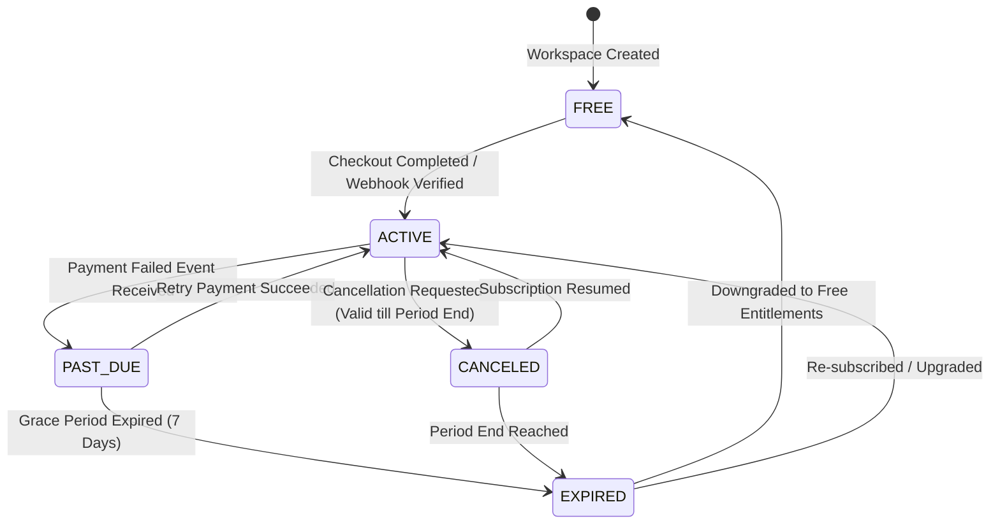

# Make My Marriage — Milestone 7: SaaS Commercialization & Entitlements

**Document Version:** 1.0  
**Last Updated:** 2026-09-26  
**Status:** Architecture, Plan Matrix, Billing Lifecycle & Integration Specification

---

## 1. Executive Summary

Milestone 7 establishes the commercial foundation for Make My Marriage, converting the core wedding workspace into a multi-tenant SaaS application operating on a freemium model.

The commercial system enforces:
1. **Server-side Authoritative Entitlements**: Limits and features are derived strictly on the server; client parameters, return URLs, or local states are never trusted.
2. **Quota & Limit Enforcement on Mutation Paths**: Every mutation (creating events, team members, guest households, tasks, uploads, and selecting premium website themes) evaluates the workspace's active subscription entitlements before executing.
3. **Atomic Usage Measurement & Reservation**: Cumulative storage is calculated and verified prior to generating S3/R2 presigned upload intents.
4. **Subscription Lifecycle & Webhook Idempotency**: Supports automatic subscription transitions (`FREE`, `ACTIVE`, `PAST_DUE`, `CANCELED`, `EXPIRED`), HMAC signature verification, and idempotent webhook event processing.
5. **Sandbox & Provider Integration**: Enables real payment gateway readiness (Razorpay / Stripe) alongside an instant `SANDBOX` simulation provider for offline/staging testing.
6. **Platform Administration Interface**: Separates internal Make My Marriage platform staff (`isPlatformAdmin`) from workspace-level wedding `ADMIN` roles, supporting audited subscription overrides and workspace storage analytics.

---

## 2. Plan Matrix & Feature Entitlements

Make My Marriage offers two primary subscription tiers:

| Resource / Feature | Free Tier (`FREE`) | Premium Tier (`PREMIUM`) |
|---|---|---|
| **Price** | ₹0 (Free Forever) | ₹2,999 / Wedding (or ₹499/mo) |
| **Max Ceremonies/Events** | 3 Events | Unlimited (100 hard cap) |
| **Max Team Members** | 3 Members (including Admin) | 50 Members |
| **Max Guest Households** | 50 Households | 1,000 Households |
| **Max Tasks** | 50 Tasks | 1,000 Tasks |
| **Media Storage Quota** | 500 MB (524,288,000 bytes) | 10 GB (10,737,418,240 bytes) |
| **Video & Audio Uploads** | Disabled (Image photos only) | Enabled (Photos, Videos, Audio) |
| **Website Themes** | Basic (`FLORAL_PASTEL`, `VINTAGE_SEPIA`, `MINIMAL_ELEGANCE`) | All (`ROYAL_GOLD`, `MIDNIGHT_ROMANCE`, etc.) |
| **Custom Website Sections** | Up to 4 sections | Unlimited sections |
| **Guest Photo Moderation** | Basic (20 pending uploads max) | Unlimited pending uploads |

---

## 3. Subscription Lifecycle & State Machine

Every wedding workspace (`weddingId`) has an associated `WeddingSubscription` record.

### 3.1 Status Transitions

### 3.2 Downgrade & Data Preservation Policy

When a subscription transitions to `EXPIRED` or is downgraded to `FREE`:
1. **Zero Data Loss**: Existing events, team members, guest households, tasks, media uploads, and website settings remain **100% intact and readable**.
2. **Mutation Blocking**: Further creations or uploads exceeding Free limits return `HTTP 402 Payment Required` or `HTTP 403 Forbidden` with error code `LIMIT_EXCEEDED` or `FEATURE_LOCKED`.
3. **Storage Soft Cap**: If existing media exceeds 500 MB, existing images remain viewable, but new upload intents are blocked until storage is reduced or subscription is renewed.

---

## 4. Architecture & Database Design

### 4.1 Data Models

1. **`WeddingSubscription` (`wedding_subscriptions` collection)**:
   - `weddingId`: ObjectId (Unique Index)
   - `billingOwnerId`: ObjectId (User who owns billing)
   - `planId`: `"FREE"` | `"PREMIUM"`
   - `billingCycle`: `"ONETIME"` | `"MONTHLY"` | `"ANNUAL"`
   - `status`: `"INACTIVE"` | `"ACTIVE"` | `"PAST_DUE"` | `"CANCELED"` | `"EXPIRED"`
   - `provider`: `"SANDBOX"` | `"RAZORPAY"` | `"STRIPE"`
   - `providerSubscriptionId`: string | null (Index)
   - `providerCustomerId`: string | null
   - `currentPeriodStart`: Date
   - `currentPeriodEnd`: Date | null
   - `gracePeriodEnd`: Date | null
   - `canceledAt`: Date | null

2. **`BillingEventLog` (`billing_event_logs` collection)**:
   - `providerEventId`: string (Unique Index)
   - `provider`: string
   - `eventType`: string
   - `payload`: Object
   - `processedAt`: Date
   - `status`: `"PROCESSED"` | `"FAILED"` | `"IGNORED"`

3. **`SubscriptionAuditLog` (`subscription_audit_logs` collection)**:
   - `subscriptionId`: ObjectId
   - `weddingId`: ObjectId
   - `performedBy`: ObjectId (Platform Admin User ID)
   - `previousPlan`: string
   - `newPlan`: string
   - `previousStatus`: string
   - `newStatus`: string
   - `reason`: string
   - `createdAt`: Date

4. **`User` model update (`src/lib/db/models/User.ts`)**:
   - `isPlatformAdmin`: boolean (default `false`)

---

## 5. Webhook Security & Idempotency

### 5.1 Signature Verification
- Razorpay: Verified using `crypto.createHmac("sha256", secret).update(rawBody).digest("hex")`.
- Stripe: Verified using `stripe.webhooks.constructEvent(rawBody, signature, secret)`.

### 5.2 Idempotent Event Dispatch
Every incoming webhook checks `BillingEventLog.findOne({ providerEventId })`. If the event ID has already been processed, the listener immediately returns `HTTP 200 OK` with `{ message: "Event already processed" }`.

---

## 6. Platform Administration Tools

Platform Admins (`user.isPlatformAdmin === true`) gain access to:
- `/admin`: Dashboard showing total registered users, active weddings, subscription breakdowns, and platform storage metrics.
- `/admin/weddings`: Searchable list of all wedding workspaces.
- Audited Subscription Overrides: Ability to grant trial Premium status or adjust subscription dates with mandatory audit reason logging.

---

## 7. Migration & Backward Compatibility

- **Default Plan**: All existing weddings created prior to Milestone 7 automatically receive an active `FREE` plan subscription record upon first entitlement check.
- **No Disruption**: Existing workspaces continue operating seamlessly under standard Free limits.
