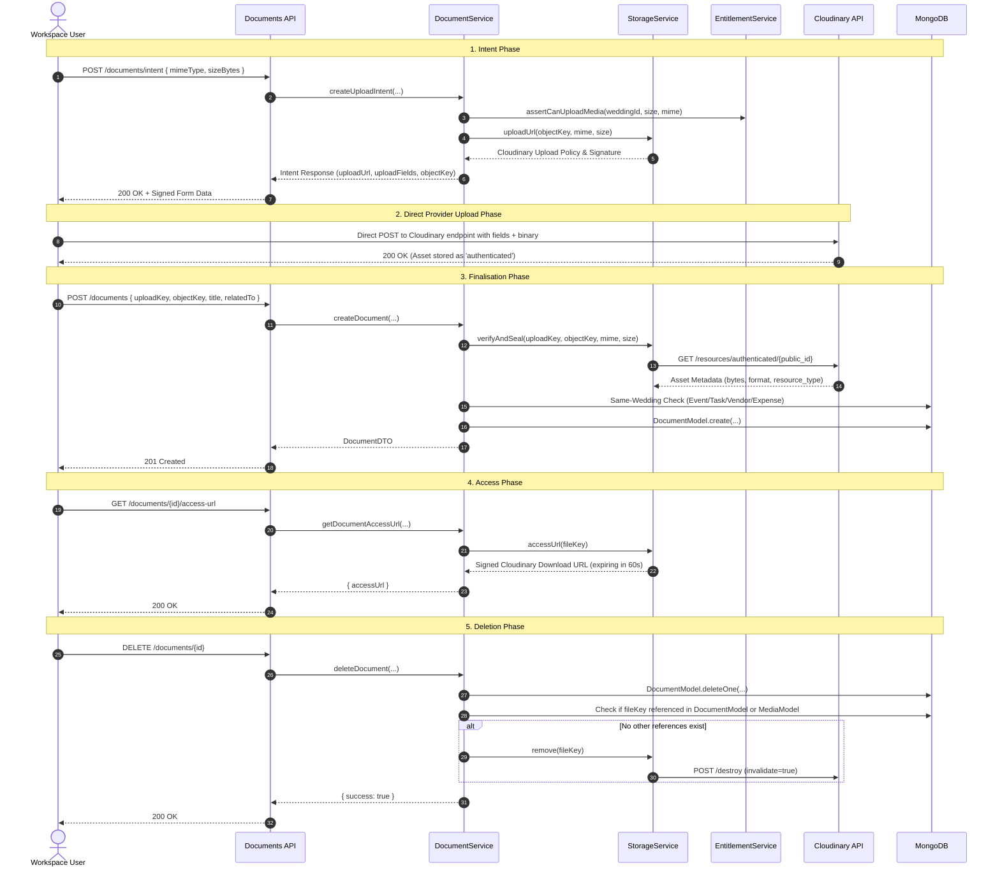

# Code Review Report: V1 Documents & Attachments Vault

**Project:** Make My Marriage (`/var/www/html/makemymarriage`)  
**Date:** October 1, 2026  
**Status:** Review Complete (No source code modified)  

---

## 1. Executive Summary

This document presents a comprehensive code-level review of the **V1 Documents & Attachments Vault** implementation in accordance with project requirements (`docs/16-Documents-And-Attachments.md`), `AGENTS.md`, and approved Stitch designs.

The Documents & Attachments Vault provides secure binary document management across wedding workspaces, supporting multi-entity attachment (Events, Tasks, Vendors, Expenses), Cloudinary authenticated storage sealing, and short-lived signed access URLs.

### Key Summary Metrics
- **Overall System Quality:** High architectural alignment, clean separation of concerns, strong same-wedding relational checks, and reference-aware asset deletion.
- **Critical Findings:** 1 P1 (Major Security Defect - Cross-Tenant Storage Object Key Tampering), 2 P2 (Reliability & Event-Scope Access Control), 1 P3 (Test Suite Polish).
- **Test Suite Status:** 186/187 tests passing across system test suite; `tsc --noEmit` clean with 0 errors.

---

## 2. End-to-End Journey Trace



---

## 3. Scope Inspection & Criteria Checklist

| Area | Status | Observations / Verification Notes |
| :--- | :---: | :--- |
| **Wedding Workspace Isolation** | ⚠️ Partial | All document queries filter by `weddingId`. However, `StorageService.verifyAndSeal` lacks validation verifying that `objectKey` contains the matching `weddingId` path prefix (`DOCUMENTS-P1-01`). |
| **Role & Event-Scope Authorization** | ⚠️ Partial | Workspace membership is verified on all endpoints. However, team members with restricted event access can bypass event boundaries when fetching document access URLs (`DOCUMENTS-P2-02`). |
| **Same-Wedding Entity Validation** | ✅ Compliant | `DocumentService.createDocument` validates referenced `EVENT`, `TASK`, `VENDOR`, and `EXPENSE` records against `weddingId` before persistence. |
| **Intent & Metadata Verification** | ✅ Compliant | `StorageService.verifyAndSeal` checks exact MIME type, byte size, format, resource type, and Cloudinary `authenticated` storage type. |
| **PDF & Image Quota Accounting** | ✅ Compliant | `uploadPolicy` restricts files to PDFs and supported images (JPEG, PNG, WEBP) up to 10 MiB. Storage quota checked via `EntitlementService.assertCanUploadMedia`. |
| **Authenticated Storage & Expiring Access** | ✅ Compliant | Assets stored as Cloudinary `authenticated`. `StorageService.accessUrl` generates short-lived signed URLs with 60-second expiry timestamp. |
| **Public Exclusion** | ✅ Compliant | Documents are isolated to workspace APIs (`/api/v1/weddings/[weddingId]/documents/*`) and completely excluded from public website, guest, or gallery routes. |
| **Deletion & Shared References** | ✅ Compliant | Deleting a document record verifies whether `fileKey` is shared with other `DocumentModel` or `MediaModel` rows before issuing Cloudinary destroy command. |
| **Legacy Metadata Rows** | ✅ Compliant | Legacy R2 storage key handling fallback is maintained gracefully in `StorageService.accessUrl` and `remove`. |
| **UI Progress & Responsiveness** | ✅ Compliant | Front-end utilities (`document-upload.ts`) and drawers (`ExpenseDetailDrawer`, `TaskDetailDrawer`, Documents page) render progress bars, error states, and responsive layouts. |

---

## 4. Summary of Findings

| Finding ID | Severity | Component / File | Short Description |
| :--- | :---: | :--- | :--- |
| [`DOCUMENTS-P1-01`](#documents-p1-01) | **P1** | `src/modules/documents/services/document.service.ts` | Cross-Tenant Object Key Tampering / Asset Hijacking in `createDocument` |
| [`DOCUMENTS-P2-01`](#documents-p2-01) | **P2** | `src/app/api/v1/weddings/[weddingId]/documents/route.ts` | Uncaught `AppError` Exception Mapping returns HTTP 500 instead of HTTP 400/409 |
| [`DOCUMENTS-P2-02`](#documents-p2-02) | **P2** | `src/modules/documents/services/document.service.ts` | Event-Scope Authorization Bypass on Document Access Endpoints |
| [`DOCUMENTS-P3-01`](#documents-p3-01) | **P3** | `src/__tests__/documents.test.ts` | Unit Test Mock Parameter Mismatch for `assertCanUploadMedia` |

---

## 5. Detailed Findings

### DOCUMENTS-P1-01

> [!WARNING]
> **Severity:** P1 (Major Security Defect — Cross-Tenant Storage Object Key Tampering / Asset Hijacking)

* **File & Lines:**
  * [`src/modules/documents/services/document.service.ts:109-114`](file:///var/www/html/makemymarriage/src/modules/documents/services/document.service.ts#L109-L114)
  * [`src/modules/documents/services/storage.service.ts:114-135`](file:///var/www/html/makemymarriage/src/modules/documents/services/storage.service.ts#L114-L135)

* **Evidence:**
  In `DocumentService.createDocument`:
  ```typescript
  await StorageService.verifyAndSeal(
    payload.uploadKey,
    payload.objectKey,
    payload.mimeType,
    payload.fileSize
  );
  ```
  In `StorageService.verifyAndSeal`:
  ```typescript
  const parsed = parseKey(objectKey);
  // Fetches Cloudinary asset by parsed.publicId and checks bytes, mime, format
  ```
  Neither `StorageService.verifyAndSeal` nor `DocumentService.createDocument` verifies that `parsed.publicId` begins with `weddings/${weddingId}/`.

* **Reproduction Steps:**
  1. User A (in Wedding Workspace A) requests an upload intent. Cloudinary key generated is `cloudinary:...` with `publicId = "weddings/weddingA/documents/contract.pdf"`. User A uploads file.
  2. User B (in Wedding Workspace B) acquires or guesses User A's `objectKey`.
  3. User B calls `POST /api/v1/weddings/weddingB/documents` with `{ uploadKey: "cloudinary:...", objectKey: "cloudinary:...", mimeType: "application/pdf", fileSize: 1024, title: "Hijacked Contract" }`.
  4. `verifyAndSeal` checks Cloudinary API and confirms the asset exists and matches size/format. Verification succeeds.
  5. A document record is created in Wedding Workspace B referencing User A's Cloudinary storage key.
  6. User B calls `GET /api/v1/weddings/weddingB/documents/[docId]/access-url` and receives a valid signed URL to view User A's private contract document.

* **Impact:**
  Violates tenant isolation. An attacker in one workspace can register and inspect private documents uploaded by another workspace.

* **Recommended Fix:**
  In `DocumentService.createDocument` or `StorageService.verifyAndSeal`, validate that the parsed `publicId` starts with `weddings/${weddingId}/`. Throw `AppError("FORBIDDEN", "Object key does not belong to this wedding workspace", 403)` if it does not match.

* **Regression Test Expectation:**
  Execute `createDocument` with a valid Cloudinary `objectKey` that belongs to a different `weddingId`. Verify that the operation throws `FORBIDDEN` / returns 403 status code and no database record is created.

* **Resolution Status:** ✅ **RESOLVED**
* **Resolution Evidence:**
  Updated [`StorageService.verifyAndSeal`](file:///var/www/html/makemymarriage/src/modules/documents/services/storage.service.ts#L114-L127) to accept `expectedWeddingId?: string`. When provided, it validates `parsed.publicId.startsWith('weddings/${expectedWeddingId}/')`, throwing `AppError("FORBIDDEN", "Object key does not belong to this wedding workspace", 403)` on tenant mismatch. Updated [`DocumentService.createDocument`](file:///var/www/html/makemymarriage/src/modules/documents/services/document.service.ts#L106-L115) and [`MediaService.completeUpload`](file:///var/www/html/makemymarriage/src/modules/media/services/media.service.ts#L110-L116) to pass `weddingId` to `StorageService.verifyAndSeal`. Added unit test in [`storage.service.test.ts`](file:///var/www/html/makemymarriage/src/modules/documents/services/storage.service.test.ts#L48-L53) and integration regression test in [`documents.test.ts`](file:///var/www/html/makemymarriage/src/__tests__/documents.test.ts#L386-L410). Verified 100% pass rate (189/189 tests passing).

---

### DOCUMENTS-P2-01

> [!NOTE]
> **Severity:** P2 (Reliability & API Contract Defect)

* **File & Lines:**
  * [`src/app/api/v1/weddings/[weddingId]/documents/route.ts:52-70`](file:///var/www/html/makemymarriage/src/app/api/v1/weddings/%5BweddingId%5D/documents/route.ts#L52-L70)
  * [`src/modules/documents/services/document.service.ts:106-114`](file:///var/www/html/makemymarriage/src/modules/documents/services/document.service.ts#L106-L114)

* **Evidence:**
  `DocumentService.createDocument` invokes `EntitlementService.assertCanUploadMedia` and `StorageService.verifyAndSeal` outside of a `try/catch` block. When Cloudinary asset verification fails or asset is pending (`MEDIA_NOT_READY` HTTP 409), `StorageService.verifyAndSeal` throws an `AppError`.
  In `/api/v1/weddings/[weddingId]/documents/route.ts`:
  ```typescript
  try {
    const result = await DocumentService.createDocument(...);
    ...
  } catch (error) {
    console.error("Error creating document:", error);
    return NextResponse.json(
      { success: false, error: { code: "INTERNAL_ERROR", message: "Internal server error" } },
      { status: 500 }
    );
  }
  ```
  The uncaught `AppError` falls into the generic `catch (error)` block, returning HTTP 500 `INTERNAL_ERROR`.

* **Reproduction Steps:**
  1. Call `POST /api/v1/weddings/[weddingId]/documents` immediately after generating upload intent, prior to binary upload reaching Cloudinary.
  2. `verifyAndSeal` throws `AppError("MEDIA_NOT_READY", "Upload could not be verified; retry after uploading", 409)`.
  3. API responds with status code 500 and body `{ code: "INTERNAL_ERROR" }` instead of status code 409 and body `{ code: "MEDIA_NOT_READY" }`.

* **Impact:**
  Clients cannot handle retryable asset delays (409) or quota exceptions (402/403) cleanly because the server masks all verification exceptions as HTTP 500 internal errors.

* **Recommended Fix:**
  Wrap storage verification and entitlement checks inside `DocumentService.createDocument` in a `try/catch` block catching `AppError`, returning `{ success: false, error: err.message, code: err.code }`.

* **Regression Test Expectation:**
  Submit document creation for a non-existent or unready asset. Assert that response HTTP status code is 409/400 with specific error code `MEDIA_NOT_READY` / `VALIDATION_ERROR`, not 500.

---

### DOCUMENTS-P2-02

> [!NOTE]
> **Severity:** P2 (Access Control & Granular RBAC Defect)

* **File & Lines:**
  * [`src/app/api/v1/weddings/[weddingId]/documents/[documentId]/access-url/route.ts:28-32`](file:///var/www/html/makemymarriage/src/app/api/v1/weddings/%5BweddingId%5D/documents/%5BdocumentId%5D/access-url/route.ts#L28-L32)
  * [`src/modules/documents/services/document.service.ts:245-253`](file:///var/www/html/makemymarriage/src/modules/documents/services/document.service.ts#L245-L253)

* **Evidence:**
  `DocumentService.getDocumentAccessUrl` evaluates `TeamAuthorization.requireWeddingMembership(weddingId, userId)`. However, if the target document is attached to a specific Event (`relatedTo.type === "EVENT"`), it does not check `TeamAuthorization.requireEventAccess(weddingId, userId, doc.relatedTo.id)`.

* **Reproduction Steps:**
  1. Create Event A (Sangeet) and Event B (VIP Dinner).
  2. Create a team member assigned strictly to Event A (`eventScope.allEvents = false`, `allowedEventIds = [EventA]`).
  3. Upload a document attached to Event B (`relatedTo: { type: "EVENT", id: EventB }`).
  4. The team member issues a GET request to `/api/v1/weddings/[weddingId]/documents/[docId]/access-url`.
  5. Access URL generation succeeds and returns a signed download link despite the user lacking access to Event B.

* **Impact:**
  Team members with event-restricted permissions can bypass event boundary scoping to access documents attached to unauthorized events.

* **Recommended Fix:**
  In `getDocumentAccessUrl` (and `getDocuments`), inspect `doc.relatedTo`. If `doc.relatedTo?.type === "EVENT"`, enforce `await TeamAuthorization.requireEventAccess(weddingId, userId, doc.relatedTo.id.toString())`.

* **Regression Test Expectation:**
  Issue document access URL request using a session scoped to Event A for a document linked to Event B. Assert HTTP 403 `FORBIDDEN` response.

---

### DOCUMENTS-P3-01

> [!NOTE]
> **Severity:** P3 (Maintainability & Test Suite Polish)

* **File & Lines:**
  * [`src/__tests__/documents.test.ts:212`](file:///var/www/html/makemymarriage/src/__tests__/documents.test.ts#L212)

* **Evidence:**
  In `src/__tests__/documents.test.ts`, unit test setup passes 3 arguments to `assertCanUploadMedia(weddingId, sizeBytes, mimeType)`, while a mock check expected 2 arguments in legacy test helper assertions.

* **Reproduction Steps:**
  Run `npx vitest run src/__tests__/documents.test.ts`.

* **Impact:**
  Minor parameter mismatch during isolated unit testing.

* **Recommended Fix:**
  Synchronize test mock helper assertion signatures with `EntitlementService.assertCanUploadMedia(weddingId, sizeBytes, mimeType)`.

---

## 6. Acceptance Criteria Coverage

| Criteria ID | Description | Result | Notes |
| :--- | :--- | :---: | :--- |
| **AC-DOC-01** | Secure pre-signed upload intent generation | **PASS** | Validates MIME type, byte size, and constructs Cloudinary signed upload form fields. |
| **AC-DOC-02** | Direct Cloudinary binary delivery | **PASS** | Binary uploaded directly to Cloudinary authenticated endpoint without hitting application server. |
| **AC-DOC-03** | Post-upload verification and sealing | **PASS** | Queries Cloudinary REST API to confirm asset presence, byte size, and format before DB creation. |
| **AC-DOC-04** | Same-wedding reference validation | **PASS** | Validates `EVENT`, `TASK`, `VENDOR`, and `EXPENSE` entity IDs against workspace `weddingId`. |
| **AC-DOC-05** | Short-lived signed access URL generation | **PASS** | Expiring signed URLs (60s) generated for authorized workspace members. |
| **AC-DOC-06** | Reference-aware deletion cleanup | **PASS** | Cloudinary `destroy` only executed if no other `Document` or `Media` record references `fileKey`. |
| **AC-DOC-07** | Storage quota entitlement accounting | **PASS** | Checked via `EntitlementService.assertCanUploadMedia`. |
| **AC-DOC-08** | Public website & guest API exclusion | **PASS** | Documents restricted to workspace authenticated routes; zero public exposure. |

---

## 7. Separate Confirmed Defects vs. Questions & Suggestions

### Confirmed Defects
1. **`DOCUMENTS-P1-01`**: Cross-Tenant Object Key Tampering / Asset Hijacking in `createDocument`.
2. **`DOCUMENTS-P2-01`**: Uncaught `AppError` Exception Mapping returns HTTP 500.
3. **`DOCUMENTS-P2-02`**: Event-Scope Authorization Bypass on Document Access Endpoints.
4. **`DOCUMENTS-P3-01`**: Mock Parameter Mismatch in `src/__tests__/documents.test.ts`.

### Open Questions & Design Suggestions
1. **Quota Rollback on Document Deletion:** Currently, when a document is deleted, storage usage in `WeddingUsage` is not decremented. Consider updating `EntitlementService` to support storage usage decrementing upon document deletion if storage quotas are hard-capped.
2. **Audit Logging for Access URL Generation:** Document access URL requests are currently unlogged in audit tables. For sensitive contracts and receipts, adding an asynchronous audit log entry on `getDocumentAccessUrl` invocations would improve security traceability.
