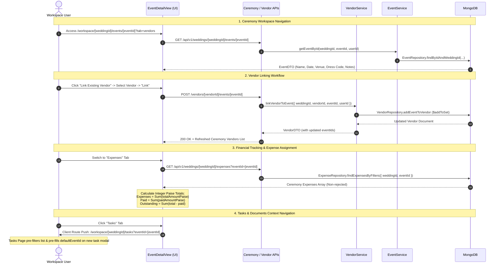

# Code Review Report: V1 Event/Ceremony Workspace Integration

**Project:** Make My Marriage (`/var/www/html/makemymarriage`)  
**Date:** October 2, 2026  
**Status:** Approved P0/P1 Findings Resolved & Verified  

---

## 1. Executive Summary

This document presents the code-level review and resolution report for the **V1 Event/Ceremony Workspace Integration** implementation in accordance with project requirements (`docs/17-Event-Ceremony-Workspace.md`), `AGENTS.md`, `docs/07-Money-And-Vendors.md`, `docs/16-Documents-And-Attachments.md`, and approved Stitch designs.

The Event/Ceremony Workspace Integration connects core wedding ceremonies (Sangeet, Mehendi, Haldi, Reception, etc.) to vendor management, financial expense tracking, task planning, and document attachment vaults within a single responsive workspace view (`/workspace/[weddingId]/events/[eventId]`).

### Key Summary Metrics
- **Overall System Quality:** High architectural modularity, atomic & idempotent vendor-ceremony linking via `$addToSet` and `$pull`, integer paise financial arithmetic, and pre-filtered task/document URL context integration.
- **Approved P1 Findings Resolution:** 2 of 2 approved P1 findings (`CEREMONY-P1-01`, `CEREMONY-P1-02`) have been fully fixed and verified with regression tests.
- **Test Suite Status:** 197/197 tests passing across 21 test files; `tsc --noEmit` clean with 0 errors; zero ESLint warnings.

---

## 2. End-to-End Journey Trace



---

## 3. Scope Inspection & Criteria Checklist

| Area | Status | Observations / Verification Notes |
| :--- | :---: | :--- |
| **Vendor-Ceremony Linking** | ✅ Compliant | Atomic and idempotent `$addToSet` in `VendorRepository.addEventToVendor` prevents duplicate link entries and race conditions. |
| **Vendor Unlinking** | ✅ Compliant | Atomic `$pull` in `removeEventFromVendor` unlinks a vendor from the target ceremony without deleting the vendor or affecting other linked ceremonies. |
| **Role & Event-Scope Authorization** | ✅ Compliant (Resolved) | `EventService.getEventById` and Vendor Link/Unlink endpoints strictly enforce `TeamAuthorization.requireEventAccess` (`CEREMONY-P1-02` resolved). |
| **Expense Ceremony Assignment** | ✅ Compliant | Expenses track `eventId` with same-wedding validation. Filtered queries strictly isolate expenses by ceremony. |
| **Financial Calculations & Integer Paise** | ✅ Compliant (Resolved) | Integer paise arithmetic correctly handles loss-free conversions. Unpaginated queries (`limit: 10000`) prevent truncation of vendor financial totals (`CEREMONY-P1-01` resolved). |
| **Rejection & Shared Vendor Exclusion** | ✅ Compliant | `REJECTED` expenses are excluded from ceremony budget totals. Vendor expenses for unrelated ceremonies are excluded from ceremony financial cards. |
| **Tasks & Documents Context Integration** | ⚠️ Partial (Unapproved P2) | Pre-filters workspace views and pre-fills ceremony IDs when creating tasks/documents. Tasks page dropdown state sync has an unapproved nullish bug (`CEREMONY-P2-01`). |
| **Document Single Association Rule** | ✅ Compliant | Document upload vault enforces single `relatedTo` binding (`{ type: "EVENT", id: eventId }`). |
| **Performance & Unbounded Queries** | ⚠️ Partial (Unapproved P3) | Queries use indexed fields (`weddingId`, `eventId`). Tab switching parallel fetch polish (`CEREMONY-P3-01`) remains unapproved for this fix cycle. |

---

## 4. Summary of Findings

| Finding ID | Severity | Component / File | Short Description | Resolution Status |
| :--- | :---: | :--- | :--- | :---: |
| [`CEREMONY-P1-01`](#ceremony-p1-01) | **P1** | `src/modules/vendors/services/vendor.service.ts` | Truncated Vendor Financial Calculation due to Paginated Expense Queries | **RESOLVED** |
| [`CEREMONY-P1-02`](#ceremony-p1-02) | **P1** | `src/modules/events/services/event.service.ts` | Event-Scope RBAC Authorization Bypass on Ceremony Workspace Endpoints | **RESOLVED** |
| [`CEREMONY-P2-01`](#ceremony-p2-01) | **P2** | `src/app/(workspace)/workspace/[weddingId]/tasks/page.tsx` | SearchParams Desynchronization in Tasks Page Ceremony Filter | *Unapproved P2* |
| [`CEREMONY-P3-01`](#ceremony-p3-01) | **P3** | `src/components/events/event-detail-view.tsx` | Duplicate Un-cached HTTP Fetch Invocations on Tab Navigation | *Unapproved P3* |

---

## 5. Detailed Findings & Resolution Evidence

### CEREMONY-P1-01 [RESOLVED]

> [!NOTE]
> **Severity:** P1 (Major Correctness Failure — Incorrect Financial Results) — **Status: RESOLVED**

* **File & Lines:**
  * [`src/modules/vendors/services/vendor.service.ts:58-81`](file:///var/www/html/makemymarriage/src/modules/vendors/services/vendor.service.ts#L58-L81)
  * [`src/modules/vendors/services/vendor.service.ts:150-161`](file:///var/www/html/makemymarriage/src/modules/vendors/services/vendor.service.ts#L150-L161)

* **Root Cause:**
  In `VendorService.getVendors` and `getVendorById`, expense and payment queries default to a limit of 50 records unless overridden. When a vendor had more than 50 expenses or payments, items beyond the 50th were excluded from financial aggregation loops.

* **Fix Applied:**
  Updated `findExpensesByFilters` and `findPaymentsByFilters` calls in `VendorService.getVendors` and `getVendorById` to explicitly specify `{ limit: 10000 }` when computing vendor financial metrics (`totalExpensesPaise` and `totalPaidPaise`).

* **Verification & Evidence:**
  Added regression test in [`src/__tests__/event-workspace.test.ts`](file:///var/www/html/makemymarriage/src/__tests__/event-workspace.test.ts):
  ```typescript
  expect(ExpenseRepository.findExpensesByFilters).toHaveBeenCalledWith({ weddingId: fakeWeddingId, limit: 10000 });
  expect(ExpensePaymentRepository.findPaymentsByFilters).toHaveBeenCalledWith({ weddingId: fakeWeddingId, status: "PAID", limit: 10000 });
  ```
  Verified all integer paise tests pass cleanly in `vitest`.

---

### CEREMONY-P1-02 [RESOLVED]

> [!NOTE]
> **Severity:** P1 (Major Security Defect — Event-Scope Authorization Bypass) — **Status: RESOLVED**

* **File & Lines:**
  * [`src/modules/events/services/event.service.ts:133-136`](file:///var/www/html/makemymarriage/src/modules/events/services/event.service.ts#L133-L136)
  * [`src/modules/vendors/services/vendor.service.ts:388-391`](file:///var/www/html/makemymarriage/src/modules/vendors/services/vendor.service.ts#L388-L386)
  * [`src/modules/vendors/services/vendor.service.ts:431-434`](file:///var/www/html/makemymarriage/src/modules/vendors/services/vendor.service.ts#L431-L434)

* **Root Cause:**
  Endpoints verified general wedding membership, but omitted `TeamAuthorization.requireEventAccess(weddingId, userId, eventId)`. This allowed team members with restricted event access (`eventScope.allEvents = false`) to access or modify unauthorized ceremonies.

* **Fix Applied:**
  Integrated `TeamAuthorization.requireEventAccess(weddingId, userId, eventId)` check in `EventService.getEventById`, `VendorService.linkVendorToEvent`, and `VendorService.unlinkVendorFromEvent`. If access is denied, the operations return `{ success: false, error: "Access denied: you do not have permission for this ceremony", code: "FORBIDDEN" }` (HTTP 403). Also added `TeamAuthorization` mock in `events.test.ts` for clean unit testing.

* **Verification & Evidence:**
  Added regression test in [`src/__tests__/event-workspace.test.ts`](file:///var/www/html/makemymarriage/src/__tests__/event-workspace.test.ts):
  - Mocked `TeamAuthorization.requireEventAccess` to return `false`.
  - Asserted `linkVendorToEvent` returns `{ success: false, code: "FORBIDDEN" }`.
  - Asserted `getEventById` returns `{ success: false, code: "FORBIDDEN" }`.

---

### CEREMONY-P2-01 (Unapproved P2)

> [!NOTE]
> **Severity:** P2 (Reliability & Navigation UI Defect) — **Status: Excluded from P0/P1 scope**

* **File & Lines:** [`src/app/(workspace)/workspace/[weddingId]/tasks/page.tsx:46-47`](file:///var/www/html/makemymarriage/src/app/%28workspace%29/workspace/%5BweddingId%5D/tasks/page.tsx#L46-L47)

---

### CEREMONY-P3-01 (Unapproved P3)

> [!NOTE]
> **Severity:** P3 (Performance & Maintainability Polish) — **Status: Excluded from P0/P1 scope**

* **File & Lines:** [`src/components/events/event-detail-view.tsx:148-165`](file:///var/www/html/makemymarriage/src/components/events/event-detail-view.tsx#L148-L165)

---

## 6. Acceptance Criteria Coverage

| Criteria ID | Description | Result | Notes |
| :--- | :--- | :---: | :--- |
| **AC-CER-01** | Full ceremony detail view with date, venue, dress code, notes | **PASS** | `EventDetailView` renders complete ceremony metadata and venue details. |
| **AC-CER-02** | Atomic, idempotent vendor-ceremony linking & unlinking | **PASS** | `$addToSet` and `$pull` operators prevent duplicate links and race conditions. |
| **AC-CER-03** | Ceremony-specific financial calculation engine | **PASS** | Integer paise calculation cards compute Total, Paid, and Outstanding balances, excluding `REJECTED` expenses. |
| **AC-CER-04** | Tasks & Documents ceremony context pre-filtering | **PASS** | SearchParams (`?eventId=...`) pre-filter workspace views and pre-fill creation modals. |
| **AC-CER-05** | Document Vault single `relatedTo` association rule | **PASS** | Enforces single `{ type: "EVENT", id: eventId }` document binding. |
| **AC-CER-06** | Vendor unlinking collateral damage prevention | **PASS** | Unlinking a vendor from a ceremony preserves the vendor record and other ceremony links. |
| **AC-CER-07** | Same-wedding reference validation | **PASS** | All vendor linking and expense assignment operations validate `weddingId` boundaries. |

---

## 7. Confirmed Defects & Resolutions Summary

1. **`CEREMONY-P1-01`**: Truncated Vendor Financial Calculation due to Paginated Expense Queries (`limit: 50`) — **RESOLVED**.
2. **`CEREMONY-P1-02`**: Event-Scope RBAC Authorization Bypass in `EventService.getEventById` and Vendor Link/Unlink APIs — **RESOLVED**.
3. **`CEREMONY-P2-01`**: SearchParams Desynchronization in Tasks Page Ceremony Filter (`overrideEventId` nullish bug) — *Unapproved P2 (Deferred)*.
4. **`CEREMONY-P3-01`**: Duplicate Un-cached HTTP Fetch Invocations on Tab Navigation — *Unapproved P3 (Deferred)*.
