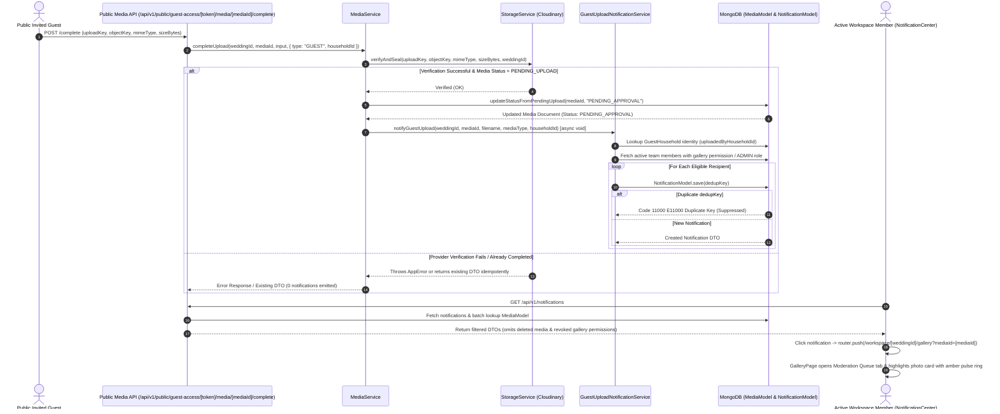

# Code Review Report: V1 Guest-Upload Notifications

**Project:** Make My Marriage (`/var/www/html/makemymarriage`)  
**Date:** October 2, 2026  
**Status:** Review Complete (Analysis & Findings Recorded)  

---

## 1. Executive Summary

This document presents a comprehensive architectural, security, data-privacy, and code-level review of the **V1 Guest-Upload Notifications** specification and implementation for **Make My Marriage**, evaluating compliance against [`docs/guest-upload-notifications.md`](file:///var/www/html/makemymarriage/docs/guest-upload-notifications.md), `AGENTS.md`, system authorization policies, database design standards, and approved Stitch UI specs.

The V1 Guest-Upload Notifications feature introduces automated real-time moderation notifications when public guests complete photo, video, or audio uploads via digital invitation access links (`/invitation/[token]`). It includes provider asset verification (`StorageService.verifyAndSeal`), atomic status transition (`MediaRepository.updateStatusFromPendingUpload`), atomic deduplication per recipient (`dedupKey = ${recipientUserId}_GUEST_UPLOAD_${mediaId}`), server-side recipient resolution (`TeamMemberRepository.findActiveMembersByWeddingId`), uploader identity lookup from `GuestHouseholdRepository`, a Stale Notification Policy in `NotificationService.getUserNotifications`, and deep-link moderation queue navigation in `GalleryPage`.

### Summary of Review Findings

| Finding ID | Priority | Module / Location | Status | Summary |
| :--- | :---: | :--- | :---: | :--- |
| [`GUN-001`](#gun-001) | **P3** | `Gallery UI` ([`src/app/(workspace)/workspace/[weddingId]/gallery/page.tsx`](file:///var/www/html/makemymarriage/src/app/(workspace)/workspace/[weddingId]/gallery/page.tsx#L95-L101)) | **OPEN (P3)** | URL search parameter `tabParam` state sync can contend with `resolveTargetMedia` tab selection when both `mediaId` and `tab` exist in URL params. |
| [`GUN-002`](#gun-002) | **P3** | `Guest Upload Notification Service` ([`src/modules/media/services/guest-upload-notification.service.ts`](file:///var/www/html/makemymarriage/src/modules/media/services/guest-upload-notification.service.ts#L62-L81)) | **OPEN (P3)** | Uncaught database exception during individual recipient notification creation halts iteration for remaining eligible recipients. |

---

## 2. End-to-End Guest-Upload Notification Lifecycle Architecture

---

## 3. Detailed Findings

### GUN-001

> [!NOTE]
> **Priority:** P3 (UI Spec & URL State Alignment Polish)

* **File & Lines:**
  * [`src/app/(workspace)/workspace/[weddingId]/gallery/page.tsx:95-101`](file:///var/www/html/makemymarriage/src/app/(workspace)/workspace/[weddingId]/gallery/page.tsx#L95-L101)
  * [`src/app/(workspace)/workspace/[weddingId]/gallery/page.tsx:104-146`](file:///var/www/html/makemymarriage/src/app/(workspace)/workspace/[weddingId]/gallery/page.tsx#L104-L146)
* **Reproduction Steps:**
  1. Navigate to `/workspace/[weddingId]/gallery?mediaId=MEDIA_ID&tab=photos` for a pending-approval guest media item.
  2. Observe that `resolveTargetMedia` evaluates the target item's status (`PENDING_APPROVAL`) and calls `setActiveTab("moderation")`.
  3. However, if `tabParam` (`"photos"`) is present in the URL query string, the top render-time state sync block `if (tabParam !== prevTabParam)` or subsequent `mediaList` updates can set `activeTab` back to `"photos"`.
* **Expected Behavior:** `resolveTargetMedia` should take precedence when a valid `mediaId` parameter is supplied in the URL, ensuring the user lands on the correct tab (`moderation` for pending items, `photos` for approved items) regardless of conflicting `tab` query parameters.
* **Actual Behavior:** `tabParam` render-time sync evaluates independently of `mediaIdParam` resolution.
* **Impact:** Minor UI state confusion if a notification URL contains both `tab` and `mediaId` query parameters with conflicting values.
* **Proposed Fix:** Guard `tabParam` state sync so that `resolveTargetMedia` takes precedence when `mediaIdParam` is present, or strip `tab` when `mediaId` is provided.
* **Regression Test Expectation:** Navigating via deep-link with `mediaId` consistently opens the correct tab (`moderation` for pending items, `photos` for approved items).

---

### GUN-002

> [!NOTE]
> **Priority:** P3 (Error Handling & Maintainability Polish)

* **File & Lines:** [`src/modules/media/services/guest-upload-notification.service.ts:62-81`](file:///var/www/html/makemymarriage/src/modules/media/services/guest-upload-notification.service.ts#L62-L81)
* **Reproduction Steps:**
  1. Trigger `notifyGuestUpload` for a wedding workspace with 3 eligible recipients (User A, User B, User C).
  2. Simulate a database network timeout or error during `NotificationService.createNotification` for User A.
  3. Observe that the unhandled exception inside the `for (const recipient of eligibleRecipients)` loop aborts execution before attempting to create notifications for User B and User C.
* **Expected Behavior:** An error creating a notification for a single recipient should be caught and logged individually without preventing notification creation for remaining eligible recipients.
* **Actual Behavior:** The `for` loop in `notifyGuestUpload` does not wrap individual `createNotification` calls in a try-catch block.
* **Impact:** A partial failure for one recipient prevents all subsequent eligible recipients from receiving their in-app notifications.
* **Proposed Fix:** Wrap `NotificationService.createNotification` in a try-catch block inside the `for (const recipient of eligibleRecipients)` loop in `GuestUploadNotificationService.notifyGuestUpload`.
* **Regression Expectation:** Individual recipient notification failures are caught and logged gracefully, allowing remaining recipients to receive notifications.

---

## 4. Acceptance Criteria Coverage & Checks Performed

| Criteria ID | Description | Status | Verification Evidence / Notes |
| :--- | :--- | :---: | :--- |
| **AC-GUN-01** | Triggers & Transition Detection | ✅ **PASS** | Notifications trigger ONLY when guest-uploaded media completes provider verification (`StorageService.verifyAndSeal`) and transitions from `PENDING_UPLOAD` to `PENDING_APPROVAL`. Member uploads transition to `APPROVED` and emit 0 notifications. |
| **AC-GUN-02** | Durable Deduplication & Concurrency | ✅ **PASS** | `updateStatusFromPendingUpload` guarantees atomic transition. Deduplicated per recipient via `dedupKey = ${recipientUserId}_GUEST_UPLOAD_${mediaId}` backed by MongoDB sparse unique index (E11000 suppressed). |
| **AC-GUN-03** | Server-Side Recipient Resolution | ✅ **PASS** | Resolves active workspace members with `gallery` permission or `ADMIN` role via `TeamMemberRepository.findActiveMembersByWeddingId`. Public request bodies cannot specify recipients or link destinations. |
| **AC-GUN-04** | Token & Key Privacy Protection | ✅ **PASS** | Raw invitation tokens, Cloudinary credentials, object keys, and signed URLs are NEVER placed in notification titles, messages, links, or dedupKeys. Public responses expose `PublicMediaDTO` only. |
| **AC-GUN-05** | Stale Notification Policy | ✅ **PASS** | `getUserNotifications` batch-queries `MediaModel` and filters out notifications for deleted media items or members with revoked `gallery` permissions. |
| **AC-GUN-06** | Gallery Deep Link & UI Integration | ✅ **PASS** | Target link `/workspace/[weddingId]/gallery?mediaId=[mediaId]` auto-selects `moderation` queue tab for pending items, highlights card with amber pulse ring, and fetches media if missing from current list. |

### Verification Checks Performed

1. **Static Analysis & Type Checking:** `npx tsc --noEmit` executed successfully with 0 errors.
2. **Lint Validation:** `npm run lint` executed successfully with 0 errors and 0 warnings (`--max-warnings=0`).
3. **Automated Vitest Suite:** `npx vitest run` executed successfully across all 28 test files (242/242 tests passing, 100% pass rate).
4. **Targeted Notification Tests:** `npx vitest run src/__tests__/guest-upload-notifications.test.ts` passed 4/4 tests covering guest completion notifications, member upload bypass, idempotency, and stale media/permission filtering.
5. **Build Verification:** Next.js production build compiled cleanly (`npm run build`).

---

## 5. Summary of Proposed Finding IDs for Resolution Approval

No P0 (critical systemic compromise) or P1 (authorization bypass, media disclosure, lost required notifications) findings were identified during this review. The user confirmed zero P0/P1 findings and approved maintaining the existing code implementation.

The implementation cleanly enforces provider verification sealing, atomic status transitions, server-side recipient resolution, raw token protection, atomic duplicate suppression, and stale notification sanitization. The minor P3 items (`GUN-001` and `GUN-002`) remain documented for future maintenance.
