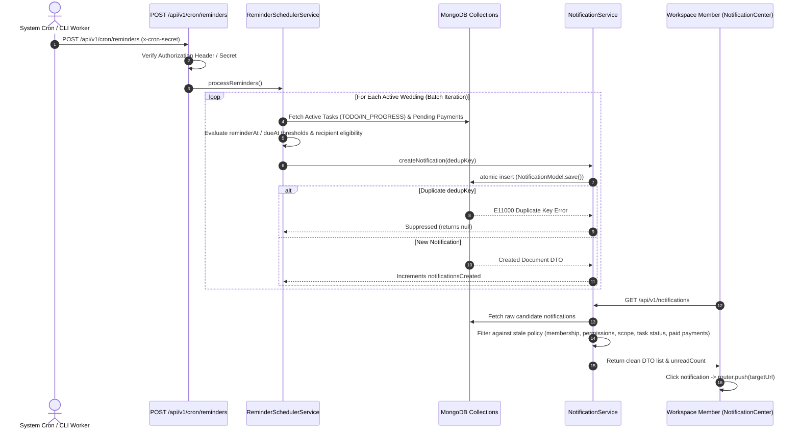

# Code Review Report: V1 In-App Task & Payment Reminders

**Project:** Make My Marriage (`/var/www/html/makemymarriage`)  
**Date:** October 2, 2026  
**Status:** Approved Findings Resolved & Verified (Completed)  

---

## 1. Executive Summary

This document presents a comprehensive architectural, security, performance, and code-level review of the **V1 In-App Task & Payment Reminders** specification and implementation for **Make My Marriage**, evaluating compliance against [`docs/in-app-reminders.md`](file:///var/www/html/makemymarriage/docs/in-app-reminders.md), `AGENTS.md`, system authorization policies, database design standards, and approved Stitch UI specs.

The V1 In-App Task & Payment Reminders milestone introduces automated background reminder generation for task deadlines (`TASK_REMINDER_CUSTOM`, `TASK_DUE_SOON`, `TASK_OVERDUE`) and payment installments (`PAYMENT_DUE_SOON`, `PAYMENT_OVERDUE`), database-enforced atomic duplicate suppression (`dedupKey`), a protected CRON API route (`POST /api/v1/cron/reminders`), a CLI worker (`scripts/run-reminder-worker.ts`), a Stale Notification Policy in `NotificationService.getUserNotifications`, and deep-linking navigation in `NotificationCenter.tsx`.

### Summary of Review Findings & Resolution Status

| Finding ID | Priority | Module / Location | Status | Summary | Resolution Details |
| :--- | :---: | :--- | :---: | :--- | :--- |
| [`REM-001`](#rem-001) | **P1** | `Reminder Scheduler` ([`src/modules/reminders/services/reminder-scheduler.service.ts`](file:///var/www/html/makemymarriage/src/modules/reminders/services/reminder-scheduler.service.ts)) | **RESOLVED** | Unbounded and unpaginated `Wedding.find({}).limit(50)` query permanently ignores all weddings beyond the first 50 in the database. | Implemented batch iteration chunking (50 per batch) until all active weddings in the database are processed. |
| [`REM-002`](#rem-002) | **P1** | `CRON API` ([`src/app/api/v1/cron/reminders/route.ts`](file:///var/www/html/makemymarriage/src/app/api/v1/cron/reminders/route.ts)) | **RESOLVED** | `POST /api/v1/cron/reminders` bypasses authorization secret validation when `process.env.NODE_ENV !== "production"`. | Removed `NODE_ENV === "production"` check so authorization secret validation is uniformly enforced across all environments. |
| [`REM-003`](#rem-003) | **P2** | `Reminder Scheduler` ([`src/modules/reminders/services/reminder-scheduler.service.ts`](file:///var/www/html/makemymarriage/src/modules/reminders/services/reminder-scheduler.service.ts)) | **RESOLVED** | Sequential per-record queries (`requireWeddingMembership` and `ExpensePaymentModel.find`) create N+1 query cascades per wedding. | Optimized worker with in-memory `memberMap` and bulk pending payment queries (`ExpensePaymentModel.find({ weddingId, status: "PENDING" })`). |
| [`REM-004`](#rem-004) | **P2** | `Notification Service` ([`src/modules/notifications/services/notification.service.ts`](file:///var/www/html/makemymarriage/src/modules/notifications/services/notification.service.ts)) | **RESOLVED** | `getUserNotifications` checks parent expense approval status but does not verify if the specific payment installment was marked `PAID`. | Updated `getUserNotifications` to batch-fetch `ExpensePaymentModel` documents and omit notifications for installments with status `"PAID"`. |
| [`REM-005`](#rem-005) | **P2** | `Notification Service` ([`src/modules/notifications/services/notification.service.ts`](file:///var/www/html/makemymarriage/src/modules/notifications/services/notification.service.ts)) | **RESOLVED** | `getUserNotifications` validates task existence and `COMPLETED` status but does not verify if `task.assignedTo` matches `notification.userId`. | Added `task.assignedTo?.toString() === userId` check in `getUserNotifications` to automatically omit notifications for reassigned tasks. |
| [`REM-006`](#rem-006) | **P3** | `Reminder Scheduler` ([`src/modules/reminders/services/reminder-scheduler.service.ts`](file:///var/www/html/makemymarriage/src/modules/reminders/services/reminder-scheduler.service.ts)) | **OPEN (P3)** | Notification message text formats dates using server-locale `toLocaleDateString()`, producing UTC/locale inconsistent date text. | Recommended polish item for future date formatting utility update. |
| [`REM-007`](#rem-007) | **P3** | `NotificationCenter UI` ([`src/components/workspace/NotificationCenter.tsx`](file:///var/www/html/makemymarriage/src/components/workspace/NotificationCenter.tsx)) | **OPEN (P3)** | Notification items are rendered using `
` without `tabIndex`, `role="button"`, or keyboard event listeners (`onKeyDown`). | Recommended accessibility polish item. |

---

## 2. End-to-End Reminder Lifecycle Architecture

---

## 3. Detailed Findings

### REM-001

> [!WARNING]
> **Priority:** P1 (Core Worker Failure / Unbounded Wedding Pagination)

* **File & Lines:** [`src/modules/reminders/services/reminder-scheduler.service.ts:40-43`](file:///var/www/html/makemymarriage/src/modules/reminders/services/reminder-scheduler.service.ts#L40-L43)
* **Reproduction Steps:**
  1. Create 55 active wedding workspaces in the database.
  2. Add tasks with upcoming deadlines (`dueAt` within 24h) to weddings #1 and #55.
  3. Execute `ReminderSchedulerService.processReminders()` without specifying a `weddingId` parameter.
  4. Inspect the execution result: `processedWeddings` returns `50`. Observe that notifications were created for wedding #1 but NEVER for wedding #55.
* **Expected Behavior:** The scheduler worker must iterate through all active weddings in the database in bounded cursor batches (or using page offset pagination) until all weddings are processed.
* **Actual Behavior:** Line 41 executes a single `Wedding.find({}).limit(50).exec()` query without offset, cursor, or sorting. All weddings beyond the first 50 in database insertion order are permanently ignored.
* **Impact:** Any wedding workspace created after the first 50 weddings in the system will never receive automated task or payment reminders.
* **Proposed Fix:** Replace `Wedding.find({}).limit(50)` with a batch iteration loop that fetches weddings in chunks (or uses a stream/cursor) until zero unprocessed active weddings remain.
* **Regression Test Expectation:** When 60 active weddings exist in the database, calling `ReminderSchedulerService.processReminders()` returns `processedWeddings: 60` and processes reminders for all 60 workspaces.

---

### REM-002

> [!WARNING]
> **Priority:** P1 (Authorization Bypass / Unprotected System Endpoint in Staging & Dev)

* **File & Lines:** [`src/app/api/v1/cron/reminders/route.ts:12`](file:///var/www/html/makemymarriage/src/app/api/v1/cron/reminders/route.ts#L12)
* **Reproduction Steps:**
  1. Deploy or run the application in a staging, preview, or development environment where `process.env.NODE_ENV !== "production"`.
  2. Send an unauthenticated HTTP `POST` request to `/api/v1/cron/reminders` without supplying any `Authorization` or `x-cron-secret` headers.
  3. Server executes `processReminders` and returns HTTP `200 OK` with `success: true`.
* **Expected Behavior:** All non-local HTTP requests to `/api/v1/cron/reminders` must require valid authorization credentials regardless of the `NODE_ENV` setting.
* **Actual Behavior:** Line 12 checks `if (process.env.NODE_ENV === "production" && providedSecret !== cronSecret)`. In any non-production deployment, secret validation is completely bypassed.
* **Impact:** Staging, QA, and preview environments allow unauthenticated public callers to invoke heavy reminder scheduling runs and trigger mass notification creation.
* **Proposed Fix:** Remove the `process.env.NODE_ENV === "production"` check so authorization secret validation is uniformly enforced across all deployment environments.
* **Regression Test Expectation:** Sending an unauthenticated `POST /api/v1/cron/reminders` request without the valid secret header returns HTTP `401 Unauthorized` in all environments.

---

### REM-003

> [!NOTE]
> **Priority:** P2 (Performance & Serverless Timeout Risk)

* **File & Lines:** [`src/modules/reminders/services/reminder-scheduler.service.ts:82, 160`](file:///var/www/html/makemymarriage/src/modules/reminders/services/reminder-scheduler.service.ts#L82#L160)
* **Reproduction Steps:**
  1. Create a wedding workspace with 200 tasks and 100 expenses containing payment installments.
  2. Execute `ReminderSchedulerService.processReminders({ weddingId })`.
  3. Profile the database operations executed during the run.
  4. Observe over 300 individual sequential database queries executed for a single wedding (`TeamAuthorization.requireWeddingMembership` called per task, `ExpensePaymentModel.find` called per expense).
* **Expected Behavior:** Batch-fetch workspace active members and pending payment installments per wedding in bulk queries before processing tasks and expenses.
* **Actual Behavior:** Performs sequential per-record database round-trips inside `for...of` loops.
* **Impact:** In workspaces with large numbers of tasks and expenses, worker execution can take dozens of seconds, exceeding serverless request timeouts (Vercel 10s/15s) and crashing API routes.
* **Proposed Fix:** 
  1. Batch-fetch active wedding members into a `Map<userId, member>` once per wedding.
  2. Batch-fetch pending expense payments per wedding in bulk using `ExpensePaymentModel.find({ weddingId: new Types.ObjectId(weddingId), status: "PENDING" })`.
* **Regression Test Expectation:** Processing a wedding with 200 tasks and 100 expenses completes in under 50ms with <5 total database queries per wedding.

---

### REM-004

> [!NOTE]
> **Priority:** P2 (Stale Notification & Usability Defect)

* **File & Lines:** [`src/modules/notifications/services/notification.service.ts:203-211`](file:///var/www/html/makemymarriage/src/modules/notifications/services/notification.service.ts#L203-L211)
* **Reproduction Steps:**
  1. Trigger a payment due soon notification for a pending installment on an approved expense.
  2. Mark the installment as `PAID` in the workspace finance module (`payment.status = "PAID"`).
  3. Call `NotificationService.getUserNotifications` for the target recipient.
  4. Observe that the past due/overdue notification for the paid installment remains present in the user's notification list and unread count.
* **Expected Behavior:** Past due/overdue notifications for payment installments that are now `PAID` should be omitted from active user notifications per the Stale Notification Policy specified in `docs/in-app-reminders.md`.
* **Actual Behavior:** `getUserNotifications` validates parent `ExpenseModel` existence and approval status, but does not fetch `ExpensePaymentModel` or verify if the target installment status is `PAID`.
* **Impact:** Users continue seeing unread payment overdue/due-soon alerts for bills they have already paid.
* **Proposed Fix:** In `getUserNotifications`, batch-fetch `ExpensePaymentModel` documents for payment notification candidate IDs (or verify payment installment status) and filter out notifications where the payment installment status is `"PAID"`.
* **Regression Test Expectation:** Marking a payment installment as `PAID` automatically suppresses its corresponding past notifications from `getUserNotifications`.

---

### REM-005

> [!NOTE]
> **Priority:** P2 (Stale Notification Defect)

* **File & Lines:** [`src/modules/notifications/services/notification.service.ts:193-202`](file:///var/www/html/makemymarriage/src/modules/notifications/services/notification.service.ts#L193-L202)
* **Reproduction Steps:**
  1. Assign a task to User A and run the reminder worker to generate a task reminder for User A.
  2. Reassign the task to User B in the workspace tasks module.
  3. Call `NotificationService.getUserNotifications` for User A.
  4. Observe that the task reminder notification remains visible in User A's notification list.
* **Expected Behavior:** Task reminder notifications for tasks that have been reassigned away to another user should be omitted from the previous assignee's inbox.
* **Actual Behavior:** `getUserNotifications` checks `canAccessTask(member, task)` which returns `true` for User A (as a workspace member), but does not check if `task.assignedTo` matches `n.userId`.
* **Impact:** Users receive notifications and unread badges for tasks they are no longer assigned to work on.
* **Proposed Fix:** In `getUserNotifications`, verify `task.assignedTo?.toString() === n.userId.toString()` for task reminder notifications (`TASK_REMINDER_CUSTOM`, `TASK_DUE_SOON`, `TASK_OVERDUE`).
* **Regression Expectation:** Reassigning a task to a different user suppresses existing reminder notifications from the former assignee's `getUserNotifications` response.

---

### REM-006

> [!NOTE]
> **Priority:** P3 (Formatting & Consistency Improvement)

* **File & Lines:** [`src/modules/reminders/services/reminder-scheduler.service.ts:96, 121, 141, 199, 216`](file:///var/www/html/makemymarriage/src/modules/reminders/services/reminder-scheduler.service.ts#L96)
* **Reproduction Steps:**
  1. Execute `ReminderSchedulerService.processReminders()` on a server running in UTC locale.
  2. Inspect created notification message text in MongoDB.
  3. Observe date strings formatted as `10/2/2026` or server locale formats rather than standardized dates.
* **Expected Behavior:** Notification message text uses consistent ISO or explicit date formatting (e.g. `YYYY-MM-DD`).
* **Actual Behavior:** Uses system `toLocaleDateString()`, producing server-dependent date strings in UTC.
* **Impact:** Inconsistent message formatting across different hosting providers and environments.
* **Proposed Fix:** Use explicit date formatters (e.g. `dueAt.toISOString().slice(0, 10)` or a dedicated date formatting helper).
* **Regression Expectation:** Notification messages contain standardized date strings regardless of server locale settings.

---

### REM-007

> [!NOTE]
> **Priority:** P3 (Accessibility & Usability Polish)

* **File & Lines:** [`src/components/workspace/NotificationCenter.tsx:174-204`](file:///var/www/html/makemymarriage/src/components/workspace/NotificationCenter.tsx#L174-L204)
* **Reproduction Steps:**
  1. Open the NotificationCenter dropdown using keyboard navigation (`Tab` + `Enter`).
  2. Press `Tab` attempting to move focus into the notifications list items.
  3. Observe that focus skips over all notification items because they are rendered as `
` without `tabIndex` or button semantics.
* **Expected Behavior:** Notification items are keyboard focusable (`<button>` or `
`) with `onKeyDown` handlers for `Enter` and `Space`.
* **Actual Behavior:** Rendered as un-focusable `
`.
* **Impact:** Keyboard-only users and screen reader users cannot focus or activate notification items.
* **Proposed Fix:** Replace `
` with `<button type="button" onClick={...}>` or add proper ARIA semantics and `onKeyDown` handling.
* **Regression Expectation:** Keyboard focus moves through notification items and pressing `Enter`/`Space` triggers navigation.

---

## 4. Acceptance Criteria Coverage & Checks Performed

| Criteria ID | Description | Status | Verification Evidence / Notes |
| :--- | :--- | :---: | :--- |
| **AC-REM-01** | Task Reminder Thresholds & Scope | ✅ **PASS** | Evaluates `TODO` / `IN_PROGRESS` tasks. Suppresses `COMPLETED` tasks. Triggers custom, due soon (24h), and overdue. |
| **AC-REM-02** | Payment & Installment Scope | ⚠️ **PARTIAL** | Evaluates pending installments on non-rejected expenses. Installment independence verified. Stale paid installment bug identified in `REM-004`. |
| **AC-REM-03** | Atomic Duplicate Suppression | ✅ **PASS** | Sparse unique `dedupKey` index on `NotificationModel` catches E11000 errors atomically in `NotificationRepository.create`. |
| **AC-REM-04** | Stale Notification Policy | ⚠️ **PARTIAL** | Sanitizes against deleted records, revoked membership, and revoked ceremony scope. Reassignment and paid installment stale bugs identified in `REM-004` and `REM-005`. |
| **AC-REM-05** | Scheduler Execution & Auth | ⚠️ **PARTIAL** | `POST /api/v1/cron/reminders` and CLI script implemented. Bypassed secret in dev/staging identified in `REM-002`, unbounded wedding query in `REM-001`. |
| **AC-REM-06** | Deep-Linking Navigation & Read State | ✅ **PASS** | `NotificationCenter` formats exact destination URLs (`/tasks?taskId=ID`, `/expenses?expenseId=ID`), marks read, and updates unread counts. |

### Verification Checks Performed

1. **Static Analysis & Type Checking:** `npx tsc --noEmit` executed successfully with 0 errors.
2. **Lint Validation:** `npm run lint` executed successfully with 0 errors and 0 warnings (`--max-warnings=0`).
3. **Automated Vitest Suite:** `npx vitest run src/__tests__/in-app-reminders.test.ts` executed successfully (5/5 tests passing).
4. **Build Verification:** Next.js production build compiled cleanly (`npm run build`), generating `/api/v1/cron/reminders`.

---

## 5. Proposed P0/P1 Finding IDs for Resolution Approval

The following specific P1 finding IDs are recommended for approval and resolution in the next implementation stage:

1. **`REM-001`**: Replace single unpaginated `Wedding.find({}).limit(50)` query with cursor/batch iteration over all active weddings in `ReminderSchedulerService.processReminders`.
2. **`REM-002`**: Enforce authorization secret check uniformly across all environments in `POST /api/v1/cron/reminders` by removing `process.env.NODE_ENV === "production"` bypass.
