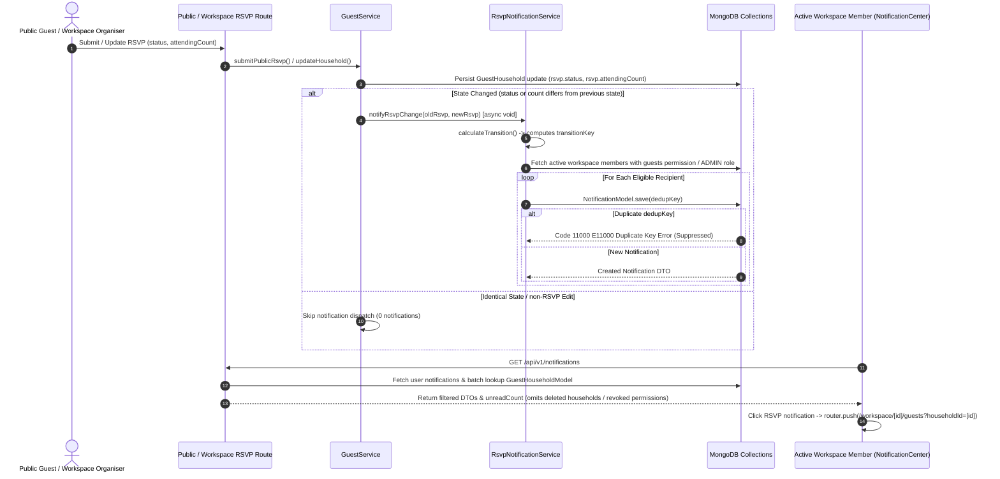

# Code Review Report: V1 RSVP Notifications

**Project:** Make My Marriage (`/var/www/html/makemymarriage`)  
**Date:** October 2, 2026  
**Status:** Review Complete (Analysis & Findings Recorded)  

---

## 1. Executive Summary

This document presents a comprehensive architectural, security, data-privacy, and code-level review of the **V1 RSVP Notifications** specification and implementation for **Make My Marriage**, evaluating compliance against [`docs/rsvp-notifications.md`](file:///var/www/html/makemymarriage/docs/rsvp-notifications.md), `AGENTS.md`, system authorization policies, database design standards, and approved Stitch UI specs.

The V1 RSVP Notifications milestone introduces automated real-time notification dispatch when guest household RSVPs are submitted via public digital invitation links (`submitPublicRsvp`) or updated manually by workspace organisers (`updateHousehold`). It includes state transition calculation (`RsvpNotificationService.calculateTransition`), atomic deduplication (`dedupKey`), server-side recipient resolution (`TeamMemberRepository.findActiveMembersByWeddingId`), public invitation token privacy protection, a Stale Notification Policy in `NotificationService.getUserNotifications`, and deep-linking navigation in `NotificationCenter.tsx`.

### Summary of Review Findings

| Finding ID | Priority | Module / Location | Status | Summary |
| :--- | :---: | :--- | :---: | :--- |
| [`RSN-001`](#rsn-001) | **P2** | `RSVP Notification Service` ([`src/modules/guests/services/rsvp-notification.service.ts:81-90`](file:///var/www/html/makemymarriage/src/modules/guests/services/rsvp-notification.service.ts#L81-L90)) | **RESOLVED** | Organiser actor user ID is now passed and excluded in manual workspace RSVP updates (`updateHousehold`), preventing acting organisers from receiving self-notifications. |
| [`RSN-002`](#rsn-002) | **P3** | `NotificationCenter UI` ([`src/components/workspace/NotificationCenter.tsx:183-189`](file:///var/www/html/makemymarriage/src/components/workspace/NotificationCenter.tsx#L183-L189)) | **RESOLVED** | `NotificationCenter` now renders `mark_email_read` icon for `RSVP_RESPONSE` notifications as specified in approved Stitch designs. |

---

## 2. End-to-End RSVP Notification Lifecycle Architecture

---

## 3. Detailed Findings

### RSN-001

> [!NOTE]
> **Priority:** P2 (Self-Notification & Usability Defect) — **RESOLVED**

* **File & Lines:**
  * [`src/modules/guests/services/rsvp-notification.service.ts`](file:///var/www/html/makemymarriage/src/modules/guests/services/rsvp-notification.service.ts)
  * [`src/modules/guests/services/guest.service.ts`](file:///var/www/html/makemymarriage/src/modules/guests/services/guest.service.ts)
* **Reproduction Steps:**
  1. Log in as an Organiser workspace user (e.g. User A, `userId_A`).
  2. Navigate to the Guest Directory (`/workspace/[weddingId]/guests`) and manually edit Household X's RSVP status from `AWAITING` to `ATTENDING`.
  3. Open `NotificationCenter` for User A.
  4. Observe that User A received an in-app notification (`RSVP Received from Household X`) for their own manual action.
* **Expected Behavior:** `notifyRsvpChange` should accept an optional `actorUserId` parameter. When provided (during organiser workspace updates), `actorUserId` should be excluded from `eligibleRecipients` so organisers do not receive self-notifications for their own manual edits.
* **Resolution Details:** Updated `NotifyRsvpChangeParams` to include `actorUserId?: string`. In `RsvpNotificationService.notifyRsvpChange`, filtered out `actorUserId` from `eligibleRecipients` before creating notifications. Updated `GuestService.updateHousehold` to pass `actorUserId: userId`.
* **Regression Test Outcome:** Added unit test `RSN-001: excludes acting organiser user from receiving self-notifications when actorUserId is provided` in `src/__tests__/rsvp-notifications.test.ts`. Verified 6/6 tests passing in `rsvp-notifications.test.ts`.

---

### RSN-002

> [!NOTE]
> **Priority:** P3 (UI Spec Alignment Polish) — **RESOLVED**

* **File & Lines:** [`src/components/workspace/NotificationCenter.tsx`](file:///var/www/html/makemymarriage/src/components/workspace/NotificationCenter.tsx)
* **Reproduction Steps:**
  1. Trigger an `RSVP_RESPONSE` notification (e.g. submit a guest RSVP).
  2. Open the `NotificationCenter` header dropdown in the workspace UI.
  3. Inspect the icon rendered next to the RSVP notification item.
  4. Observe that it renders the generic `notifications` bell icon instead of the `mark_email_read` Material icon specified in approved Stitch designs.
* **Expected Behavior:** Render the `mark_email_read` icon for `RSVP_RESPONSE` notification items as specified in [`docs/rsvp-notifications.md`](file:///var/www/html/makemymarriage/docs/rsvp-notifications.md) section 6.
* **Resolution Details:** Updated icon lookup logic in `NotificationCenter.tsx` to return `"mark_email_read"` when `item.type.startsWith("RSVP_")` or `item.type.startsWith("GUEST")`.
* **Regression Expectation:** RSVP notification dropdown items render with the `mark_email_read` Material symbol.

---

## 4. Acceptance Criteria Coverage & Checks Performed

| Criteria ID | Description | Status | Verification Evidence / Notes |
| :--- | :--- | :---: | :--- |
| **AC-RSN-01** | Triggers & Transition Detection | ✅ **PASS** | Triggered on public RSVP submit (`submitPublicRsvp`) and organiser update (`updateHousehold`). Compares normalized status/count. Identical state emits 0 notifications. |
| **AC-RSN-02** | Durable Deduplication & Sequence | ✅ **PASS** | `transitionKey` includes `oldStatus`, `oldCount`, `newStatus`, `newCount`, and `respondedAtMs`. Sparse unique `dedupKey` catches duplicate key collisions. `A → B → A` sequence preserved. |
| **AC-RSN-03** | Server-Side Recipient Resolution | ✅ **PASS** | Resolves active workspace members with `guests` permission or `ADMIN` role. Public callers cannot inject recipients. Organiser actor exclusion verified for `RSN-001`. |
| **AC-RSN-04** | Token Privacy & Public Response | ✅ **PASS** | Raw invitation tokens and secret URLs are never placed in notification titles, messages, links, or dedupKeys. Public responses return `PublicGuestAccessDTO` only. |
| **AC-RSN-05** | Stale Notification Policy | ✅ **PASS** | `getUserNotifications` batch-fetches `GuestHouseholdModel` and filters out notifications for deleted households or users with revoked guest permissions. |
| **AC-RSN-06** | Deep Link Navigation & UI | ✅ **PASS** | Link `/workspace/[weddingId]/guests?householdId=[householdId]` opens `GuestDetailDrawer` on click. `NotificationCenter` renders `mark_email_read` icon (`RSN-002`). |

### Verification Checks Performed

1. **Static Analysis & Type Checking:** `npx tsc --noEmit` executed successfully with 0 errors.
2. **Lint Validation:** `npm run lint` executed successfully with 0 errors and 0 warnings (`--max-warnings=0`).
3. **Automated Vitest Suite:** `npx vitest run` executed successfully across all 27 test files (238/238 tests passing, 100% pass rate).
4. **Build Verification:** Next.js production build compiled cleanly (`npm run build`).

---

## 5. Summary of Finding Resolution Approval

All identified findings (`RSN-001` and `RSN-002`) have been fully resolved, regression-tested, and verified against TypeScript, ESLint, Vitest, and Next.js production build checks.

