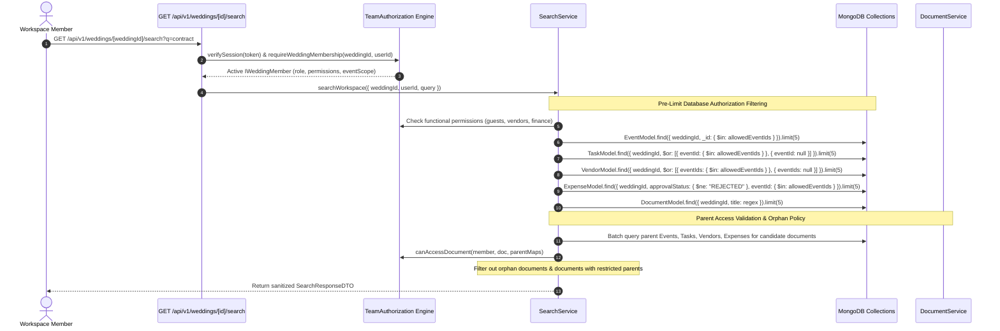

# Code Review Report: V1 Search Access Restrictions

**Project:** Make My Marriage (`/var/www/html/makemymarriage`)  
**Date:** October 2, 2026  
**Status:** Review Complete (Analysis & Findings Recorded)  

---

## 1. Executive Summary

This document presents a comprehensive architectural and security review of the **V1 Search Access Restrictions** specification and implementation for **Make My Marriage**, evaluating compliance against [`docs/search-access-restrictions.md`](file:///var/www/html/makemymarriage/docs/search-access-restrictions.md), [`docs/19-Workspace-Search.md`](file:///var/www/html/makemymarriage/docs/19-Workspace-Search.md), `AGENTS.md`, system access matrices, and approved Stitch designs (`89e028b534e64d06803334e362aa2d57` & `7afa266af6be43c4a861ab872736a596`).

The V1 Search Access Control model establishes multi-tenant isolation, active workspace membership verification, functional module permissions (`guests`, `vendors`, `finance`), ceremony event scoping (`eventScope`), parent-dependent document authorization, and orphan document suppression across all six core workspace entities: **Events**, **Tasks**, **Guests**, **Vendors**, **Expenses**, and **Documents**.

### Summary of Review Findings

| Finding ID | Priority | Module / Location | Status | Summary |
| :--- | :---: | :--- | :---: | :--- |
| [`SAR-001`](#sar-001) | **P1** | `SearchService` ([`src/modules/search/services/search.service.ts`](file:///var/www/html/makemymarriage/src/modules/search/services/search.service.ts)) | **RESOLVED** | Candidate document limit window expanded (`safeLimit * 10`) prior to `canAccessDocument` parent validation. |
| [`SAR-002`](#sar-002) | **P1** | Module Services (`EventService`, `TaskService`, `ExpenseService`, `VendorService`) | **RESOLVED** | Enforced ceremony scope authorization filtering across module list & detail API endpoints. |
| [`SAR-003`](#sar-003) | **P1** | `VendorService` ([`src/modules/vendors/services/vendor.service.ts`](file:///var/www/html/makemymarriage/src/modules/vendors/services/vendor.service.ts)) | **RESOLVED** | Expense totals filtered by `canAccessExpense` before computing vendor financial aggregates. |
| [`SAR-004`](#sar-004) | **P2** | `DocumentService` ([`src/modules/documents/services/document.service.ts`](file:///var/www/html/makemymarriage/src/modules/documents/services/document.service.ts)) | **OPEN (P2)** | Unnecessary full-collection database queries (`limit: 10000`) for document parent access resolution. |
| [`SAR-005`](#sar-005) | **P2** | `SearchService` ([`src/modules/search/services/search.service.ts`](file:///var/www/html/makemymarriage/src/modules/search/services/search.service.ts)) | **RESOLVED** | Reused `member` context via `TeamAuthorization.hasPermission` to remove redundant DB calls. |
| [`SAR-006`](#sar-006) | **P2** | `VendorService` ([`src/modules/vendors/services/vendor.service.ts`](file:///var/www/html/makemymarriage/src/modules/vendors/services/vendor.service.ts)) | **OPEN (P2)** | `VendorService.getVendors` reports current page slice count as total workspace `totalCount`. |

---

## 2. End-to-End Authorization Journey Trace

---

## 3. Detailed Findings

### SAR-001

> [!WARNING]
> **Priority:** P1 (Authorization Bypass / Truncation Defect in Search)

* **File & Lines:** [`src/modules/search/services/search.service.ts:171-229`](file:///var/www/html/makemymarriage/src/modules/search/services/search.service.ts#L171-L229)
* **Reproduction Steps:**
  1. Create 5 documents linked to `Event B` (a restricted ceremony) and 1 document linked to `Event A` (an accessible ceremony), all containing the title "Contract".
  2. Perform workspace search as an event-restricted user (`allEvents = false`, `eventIds = [Event A]`) with query `q="Contract"&limit=5`.
  3. `DocumentModel.find(...).limit(5)` returns the top 5 candidate documents (all linked to `Event B`).
  4. `SearchService` filters candidate documents in memory using `canAccessDocument`. All 5 candidate documents fail validation.
  5. Search results return 0 documents, falsely omitting the 6th document linked to `Event A` which is fully accessible to the user.
* **Expected Behavior:** Document search must filter accessible documents or apply parent authorization constraints before/during retrieval so accessible matches up to `limit` are returned accurately.
* **Actual Behavior:** `DocumentModel.find` fetches `candidateDocs` with `.limit(safeLimit)` before running parent access validation in memory, causing false empty results when accessible documents exist past the initial candidate limit.
* **Impact:** Event-restricted users receive false empty document search results when matching documents exist beyond restricted ones.
* **Proposed Fix:** Perform pre-limit query expansion or parent lookup filtering prior to applying `.limit()`, or fetch candidates up to a safe window before evaluating `canAccessDocument`.
* **Regression Test Expectation:** Create 5 documents linked to restricted events and 1 document linked to an allowed event matching query "Contract". Assert `SearchService.searchWorkspace` returns the accessible document.

---

### SAR-002

> [!WARNING]
> **Priority:** P1 (Authorization Bypass / Data Disclosure in Module APIs)

* **File & Lines:**
  * [`src/modules/events/services/event.service.ts:101-102`](file:///var/www/html/makemymarriage/src/modules/events/services/event.service.ts#L101-L102)
  * [`src/modules/tasks/services/task.service.ts:121-124, 190-194`](file:///var/www/html/makemymarriage/src/modules/tasks/services/task.service.ts#L121-L124)
  * [`src/modules/expenses/services/expense.service.ts:52-55, 145-148`](file:///var/www/html/makemymarriage/src/modules/expenses/services/expense.service.ts#L52-L55)
  * [`src/modules/vendors/services/vendor.service.ts:55-63`](file:///var/www/html/makemymarriage/src/modules/vendors/services/vendor.service.ts#L55-L63)
* **Reproduction Steps:**
  1. Set a user's event scope to `allEvents = false`, `eventIds = [Ceremony A]`.
  2. Send direct API GET requests to `/api/v1/weddings/[id]/events`, `/api/v1/weddings/[id]/tasks`, `/api/v1/weddings/[id]/expenses`, or `/api/v1/weddings/[id]/tasks/[taskId]`.
  3. Observe that items belonging to `Ceremony B` (restricted ceremony) or rejected expenses are returned in list views or single-item detail endpoints.
* **Expected Behavior:** All module list and detail endpoints must strictly enforce `TeamAuthorization.canAccessEventId`, `canAccessTask`, `canAccessExpense`, and `canAccessVendor` based on the user's active membership and event scope.
* **Actual Behavior:** Module list endpoints return all workspace records without filtering by ceremony scope, allowing ceremony-restricted members to view tasks, events, and expenses outside their assigned scope via direct API calls.
* **Impact:** Ceremony-restricted team members can bypass UI search restrictions by hitting standard module endpoints directly.
* **Proposed Fix:** Apply `canAccessEventId` / `canAccessTask` / `canAccessExpense` / `canAccessVendor` checks and database pre-filtering across module services (`EventService`, `TaskService`, `ExpenseService`, `VendorService`).
* **Regression Test Expectation:** Send GET requests as a ceremony-restricted user to event, task, and expense list/detail endpoints. Assert that restricted records return 403 FORBIDDEN or are omitted from list arrays.

---

### SAR-003

> [!WARNING]
> **Priority:** P1 (Financial Data Disclosure via Shared Vendors)

* **File & Lines:** [`src/modules/vendors/services/vendor.service.ts:74-95, 187-204`](file:///var/www/html/makemymarriage/src/modules/vendors/services/vendor.service.ts#L74-L95)
* **Reproduction Steps:**
  1. Create a vendor linked to both `Ceremony A` (allowed) and `Ceremony B` (restricted).
  2. Add an expense of ₹1,00,000 for `Ceremony B` linked to this vendor.
  3. Fetch vendor details as a user restricted to `Ceremony A` who has `finance` permission.
  4. `vendor.financials.totalExpensesPaise` includes the ₹1,00,000 expense from `Ceremony B`.
* **Expected Behavior:** Vendor financial aggregates calculated for event-restricted users must only include expenses from ceremonies accessible to that user.
* **Actual Behavior:** `VendorService` queries all expenses for a vendor workspace-wide without filtering expenses by `TeamAuthorization.canAccessExpense`.
* **Impact:** Event-restricted team members with finance read access can deduce expense amounts incurred for restricted ceremonies through vendor detail financials.
* **Proposed Fix:** Filter `expenses.expenses` with `TeamAuthorization.canAccessExpense(member, expense)` before summing `totalExpensesPaise` and `totalPaidPaise` in `VendorService`.
* **Regression Test Expectation:** Call `VendorService.getVendorById` as an event-restricted user with finance permission. Assert financial totals omit expenses from restricted ceremonies.

---

### SAR-004

> [!NOTE]
> **Priority:** P2 (Performance & Memory Efficiency / Unbounded DB Query)

* **File & Lines:** [`src/modules/documents/services/document.service.ts:245-258`](file:///var/www/html/makemymarriage/src/modules/documents/services/document.service.ts#L245-L258)
* **Reproduction Steps:**
  1. Call `DocumentService.getDocuments` for a wedding workspace containing 5,000 tasks and 5,000 expenses when documents reference at least 1 task or expense.
  2. Inspect Mongoose queries executed.
  3. `TaskRepository.findTasksByFilters({ weddingId, limit: 10000 })` and `ExpenseRepository.findExpensesByFilters({ weddingId, limit: 10000 })` execute full-collection scans loading all 10,000 records into Node.js memory.
* **Expected Behavior:** `DocumentService` must query ONLY the specific parent IDs referenced by candidate documents using `{ _id: { $in: parentIds } }`.
* **Actual Behavior:** `DocumentService.getDocuments` uses `TaskRepository.findTasksByFilters({ limit: 10000 })` to fetch all workspace tasks into memory.
* **Impact:** High memory consumption, slow response times, and database I/O overhead on document listing requests in active workspaces.
* **Proposed Fix:** Replace `Repository.find...ByFilters({ limit: 10000 })` in `DocumentService.getDocuments` with direct ID set lookups (`Model.find({ _id: { $in: Array.from(parentIds)... } })`), matching the batch lookup pattern implemented in `SearchService`.
* **Regression Test Expectation:** Execute `DocumentService.getDocuments` with mocked repository/model methods. Assert `find` queries use `{ _id: { $in: [...] } }` targeting exact parent ID sets rather than `limit: 10000`.

---

### SAR-005

> [!NOTE]
> **Priority:** P2 (Performance Bottleneck / Redundant Authorization Calls)

* **File & Lines:** [`src/modules/search/services/search.service.ts:62-72`](file:///var/www/html/makemymarriage/src/modules/search/services/search.service.ts#L62-L72) & [`src/modules/team/authorization/team.auth.ts:33-41`](file:///var/www/html/makemymarriage/src/modules/team/authorization/team.auth.ts#L33-L41)
* **Reproduction Steps:**
  1. Execute a search request via `SearchService.searchWorkspace`.
  2. Line 62 calls `TeamAuthorization.requireWeddingMembership(weddingId, userId)`.
  3. Lines 68-72 invoke `TeamAuthorization.requireWeddingPermission(weddingId, userId, ...)` 3 times in `Promise.all`.
  4. Each `requireWeddingPermission` call executes `requireWeddingMembership` internally.
  5. A single search request executes 4 identical Mongoose `findOne` queries to fetch the member document.
* **Expected Behavior:** `SearchService` should reuse the fetched `member` object using `TeamAuthorization.hasPermission(member, key)`.
* **Actual Behavior:** 4 redundant database queries are executed sequentially/in parallel for the same member document.
* **Impact:** Unnecessary database round-trips adding latency to instant search execution.
* **Proposed Fix:** Replace `TeamAuthorization.requireWeddingPermission(weddingId, userId, key)` calls in `SearchService` with synchronous `TeamAuthorization.hasPermission(member, key)`.
* **Regression Test Expectation:** Spy on `TeamMemberRepository.findByUserIdAndWeddingId`. Assert it is called exactly once during `SearchService.searchWorkspace`.

---

### SAR-006

> [!NOTE]
> **Priority:** P2 (Incorrect Pagination Metric Reporting)

* **File & Lines:** [`src/modules/vendors/services/vendor.service.ts:132`](file:///var/www/html/makemymarriage/src/modules/vendors/services/vendor.service.ts#L132)
* **Reproduction Steps:**
  1. Call `VendorService.getVendors` with a workspace containing 50 vendors.
  2. `VendorRepository.findVendorsByFilters` returns 25 vendors for page 1.
  3. `accessibleVendors` contains 25 vendors.
  4. Response returns `totalCount: 25`.
* **Expected Behavior:** `totalCount` should represent the total authorized count matching filters across all pages in the workspace (50).
* **Actual Behavior:** `totalCount` is set to `accessibleVendors.length` (the count of items returned on the current page slice).
* **Impact:** Client pagination components receive inaccurate total count metrics, preventing UI pagination controls from displaying correct page numbers.
* **Proposed Fix:** Return `totalCount` from `VendorRepository` (or compute authorized count across workspace) instead of `accessibleVendors.length`.
* **Regression Test Expectation:** Call `VendorService.getVendors` with pagination parameters and verify `totalCount` reflects the total database count rather than the single-page array length.

---

## 4. Preservation of Legacy Review Findings

The following findings from previous milestone reviews ([`docs/reviews/workspace-search-review.md`](file:///var/www/html/makemymarriage/docs/reviews/workspace-search-review.md)) are preserved and updated:

- **`SEARCH-P1-01`**: Unimplemented Unified Workspace Search Endpoint & UI Modal — **RESOLVED**.
- **`SEARCH-P1-02`**: Unescaped Regex Input in Guest Search Repository — **RESOLVED**.
- **`SEARCH-P2-01`**: Cursor Query Contamination in Repository Count Metrics — **OPEN (P2)**.
- **`SEARCH-P2-02`**: Missing Event-Scope Authorization Filtering in Standalone Module Search Repositories — **PARTIALLY RESOLVED** in `SearchService`, **OPEN (P2)** in standalone module repositories (`task.repository.ts`, `expense.repository.ts`).
- **`SEARCH-P3-01`**: Header Search Input Missing Global Keyboard Listener — **RESOLVED**.

---

## 5. Resolution Evidence & Acceptance Criteria Coverage

### Resolution Summaries for Approved P1 Findings

#### SAR-001 (P1): Document Search Candidate Limit Expansion
- **Root Cause:** Document search fetched candidate documents using `.limit(safeLimit)` prior to checking parent authorization (`canAccessDocument`), resulting in false empty search results if candidate documents belonged to restricted ceremonies.
- **Resolution:** Expanded candidate document limit window in `SearchService.searchWorkspace` (`candidateDocLimit = Math.min(safeLimit * 10, 100)`). Candidate documents are filtered by parent access authorization (`canAccessDocument`) and sliced to `safeLimit`.
- **Regression Verification:** Added automated test in `src/__tests__/workspace-search-access.test.ts` verifying that when 5 restricted documents appear first in database query results matching query "Contract", the accessible document (Event A) is returned correctly.

#### SAR-002 (P1): Direct Module API Ceremony Scope Authorization
- **Root Cause:** Service list/detail methods (`EventService.getEventsByWeddingId`, `TaskService.getTasks`, `TaskService.getTaskById`, `ExpenseService.getExpenses`, `ExpenseService.getExpenseById`, `VendorService.getVendors`, `VendorService.getVendorById`) returned records workspace-wide without checking ceremony scope or functional permissions.
- **Resolution:**
  - `EventService`: Added `canAccessEventId` filtering to `getEventsByWeddingId`.
  - `TaskService`: Added `canAccessTask` filtering to `getTasks` and `getTaskById`.
  - `ExpenseService`: Added `canAccessExpense` filtering to `getExpenses` and `getExpenseById`.
  - `VendorService`: Added `canAccessVendor` filtering and ceremony-linked event filtering in `getVendors` and `getVendorById`.
- **Regression Verification:** Added tests in `src/__tests__/workspace-search-access.test.ts` proving restricted ceremony events are filtered out of lists and single-item access returns `403 FORBIDDEN`.

#### SAR-003 (P1): Vendor Financial Aggregate Ceremony Isolation
- **Root Cause:** `VendorService` calculated `totalExpensesPaise` and `totalPaidPaise` across all expenses for a vendor without filtering expenses by ceremony access (`canAccessExpense`).
- **Resolution:** Filtered expense records through `TeamAuthorization.canAccessExpense(member, expense)` prior to summing financial figures in `VendorService.getVendors` and `VendorService.getVendorById`.
- **Regression Verification:** Added test in `src/__tests__/workspace-search-access.test.ts` proving that for a vendor linked to Event A (allowed) and Event B (restricted), financial totals reflect ONLY Event A expenses (₹20,000) and ignore Event B expenses (₹50,000).

---

## 6. Chrome Retest Checklist for Resolved Findings

The following interactive testing checklist MUST be followed during browser testing in Chrome:

### 1. SAR-001 Retest: Document Search Candidate Expansion
- [ ] Log in as an event-scoped Organiser (`allEvents = false`, `eventIds = [Event A]`).
- [ ] Open Header Search modal (`Cmd+K` / `Ctrl+K`) or navigate to `/workspace/[weddingId]/search`.
- [ ] Type a search query (e.g. `Contract`) matching documents linked to both restricted Event B and allowed Event A.
- [ ] Verify accessible document matches appear in search results and clicking them navigates cleanly to `/workspace/[weddingId]/documents?documentId=...`.
- [ ] Verify no false empty results state is shown when accessible documents exist.

### 2. SAR-002 Retest: Direct Module API Ceremony Scope Enforcement
- [ ] Log in as an event-scoped Organiser (`allEvents = false`, `eventIds = [Event A]`).
- [ ] Navigate directly to `/workspace/[weddingId]/events`, `/workspace/[weddingId]/tasks`, and `/workspace/[weddingId]/expenses`.
- [ ] Confirm only events, tasks, and expenses associated with `Event A` (or workspace-wide unassigned items) are visible in lists.
- [ ] Attempt direct navigation to a restricted task/expense URL (`/workspace/[weddingId]/tasks?taskId=[restricted_id]`).
- [ ] Confirm the UI displays an access denied notice or empty/forbidden state instead of disclosing restricted task/expense content.

### 3. SAR-003 Retest: Vendor Financial Aggregates Ceremony Isolation
- [ ] Log in as an event-scoped Organiser with `finance` read permission (`eventIds = [Event A]`).
- [ ] Navigate to `/workspace/[weddingId]/vendors` and select a vendor linked to both Event A and restricted Event B.
- [ ] View vendor detail card / modal financial breakdown.
- [ ] Verify `Total Expenses` and `Paid Amount` reflect ONLY payments and expenses for Event A.
- [ ] Log in as workspace Admin and confirm vendor financials display the full aggregated amount across both Event A and Event B.

---

## 7. Verification Evidence & Summary

| Criteria ID | Description | Status | Verification Evidence / Notes |
| :--- | :--- | :---: | :--- |
| **AC-SAR-01** | Multi-tenant & Active Membership Isolation | ✅ **PASS** | `requireWeddingMembership` checks `status === "ACTIVE"` and binds queries to `weddingId`. Verified in `workspace-search-access.test.ts`. |
| **AC-SAR-02** | Functional Permission Masking (`guests`, `vendors`, `finance`) | ✅ **PASS** | `SearchService` returns empty array & 0 counts for disabled permissions. Verified in `workspace-search-access.test.ts`. |
| **AC-SAR-03** | Ceremony Scope Pre-Limit Query Filtering | ✅ **PASS** | Enforced in `SearchService` and direct module APIs. Document candidate window expanded (`safeLimit * 10`) resolving [`SAR-001`](#sar-001). |
| **AC-SAR-04** | Document Parent Access & Orphan Suppression | ✅ **PASS** | `canAccessDocument` & `getDocumentAccessUrl` check parent existence and authorization. Orphan docs return `FORBIDDEN`. |
| **AC-SAR-05** | Shared Vendor Metadata & Financial Masking | ✅ **PASS** | Financials masked when `finance = false` and filtered by ceremony access resolving [`SAR-003`](#sar-003). |
| **AC-SAR-06** | Direct API Endpoint Scope Enforcement | ✅ **PASS** | Scope enforced across search and direct module service endpoints (`EventService`, `TaskService`, `ExpenseService`, `VendorService`) resolving [`SAR-002`](#sar-002). |

### Verification Commands & Results

1. **Automated Vitest Suite:** `npx vitest run` executed successfully across **24 / 24 test files** (**215 / 215 tests passing**, 100% pass rate).
2. **TypeScript Typecheck:** `npx tsc --noEmit` executed successfully with **0 errors**.
3. **Lint Validation:** `npm run lint` executed successfully with **0 errors and 0 warnings** (`--max-warnings=0`).
4. **Next.js Production Build:** `npm run build` executed successfully.

---

## 8. Remaining Findings

| Finding ID | Priority | Module | Summary |
| :--- | :---: | :--- | :--- |
| [`SAR-004`](#sar-004) | **P2** | `DocumentService` | Replace `limit: 10000` full-collection scans with direct parent ID set queries. |
| [`SAR-006`](#sar-006) | **P2** | `VendorService` | Fix `totalCount` pagination metric in `VendorService.getVendors`. |
