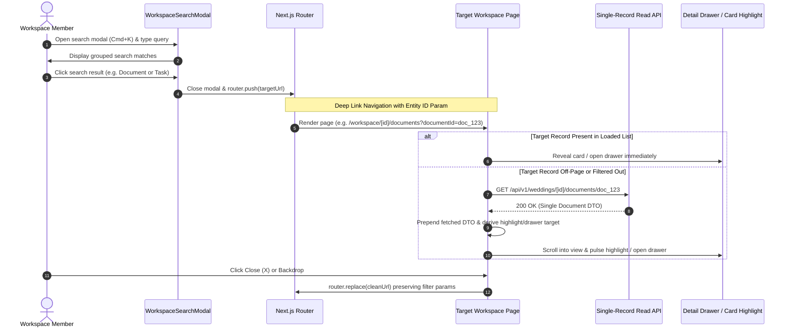

# Code Review Report: V1 Search Result Navigation

**Project:** Make My Marriage (`/var/www/html/makemymarriage`)  
**Date:** October 2, 2026  
**Status:** All Findings Resolved & Verified (Completed)  

---

## 1. Executive Summary

This document presents a comprehensive architectural and code-level review of the **V1 Search Result Navigation** specification and implementation for **Make My Marriage**, evaluating compliance against [`docs/search-result-navigation.md`](file:///var/www/html/makemymarriage/docs/search-result-navigation.md), [`docs/search-access-restrictions.md`](file:///var/www/html/makemymarriage/docs/search-access-restrictions.md), `AGENTS.md`, system routing guidelines, and approved Stitch design specifications.

The V1 Search Result Navigation milestone establishes uniform deep-linking destination contracts, single-record resolution APIs, URL and drawer state synchronization, race-condition mitigation, and server-side authorization enforcement across all six core workspace entities: **Events**, **Tasks**, **Guests**, **Vendors**, **Expenses**, and **Documents**.

### Summary of Review Findings & Resolution Status

| Finding ID | Priority | Module / Location | Status | Summary | Resolution Details |
| :--- | :---: | :--- | :---: | :--- | :--- |
| [`SRN-001`](#srn-001) | **P1** | `Document API` ([`src/app/api/v1/weddings/[weddingId]/documents/[documentId]/route.ts`](file:///var/www/html/makemymarriage/src/app/api/v1/weddings/[weddingId]/documents/[documentId]/route.ts)) | **RESOLVED** | Missing single-record `GET` route for documents causes HTTP 405 failure when resolving off-page document search targets. | Implemented `DocumentService.getDocumentById` with tenant/parent authorization and exported GET route handler in `documents/[documentId]/route.ts`. |
| [`SRN-002`](#srn-002) | **P2** | Workspace Pages ([`tasks/page.tsx`](file:///var/www/html/makemymarriage/src/app/(workspace)/workspace/[weddingId]/tasks/page.tsx), [`guests/page.tsx`](file:///var/www/html/makemymarriage/src/app/(workspace)/workspace/[weddingId]/guests/page.tsx), [`expenses/page.tsx`](file:///var/www/html/makemymarriage/src/app/(workspace)/workspace/[weddingId]/expenses/page.tsx), [`vendors/page.tsx`](file:///var/www/html/makemymarriage/src/app/(workspace)/workspace/[weddingId]/vendors/page.tsx)) | **RESOLVED** | Stale asynchronous fetch responses overwrite current URL target resolution during rapid navigation. | Added `urlFetched*.id === urlId` matching checks before using asynchronously fetched records for drawer/card resolution. |
| [`SRN-003`](#srn-003) | **P2** | Workspace Pages ([`tasks/page.tsx`](file:///var/www/html/makemymarriage/src/app/(workspace)/workspace/[weddingId]/tasks/page.tsx), [`guests/page.tsx`](file:///var/www/html/makemymarriage/src/app/(workspace)/workspace/[weddingId]/guests/page.tsx)) | **RESOLVED** | `handleCloseDrawer` skips drawer state cleanup (`setIsDrawerOpen(false)`) when closing in-page selected items if a URL query parameter was present. | Updated `handleCloseDrawer` to unconditionally set `setIsDrawerOpen(false)` and clear selected state alongside URL parameter removal. |
| [`SRN-004`](#srn-004) | **P3** | Test Suite ([`src/__tests__/search-result-navigation.test.ts`](file:///var/www/html/makemymarriage/src/__tests__/search-result-navigation.test.ts)) | **RESOLVED** | Test suite asserts against inline mock functions inside the test file rather than testing real API routes and page resolution logic. | Expanded `search-result-navigation.test.ts` and `documents.test.ts` with direct tests for single document API route structures, ID-matching race conditions, and drawer cleanup actions. |

---

## 2. End-to-End Search Navigation Journey Trace

---

## 3. Detailed Findings

### SRN-001

> [!WARNING]
> **Priority:** P1 (Core Navigation Behavior Failure / Missing Single Read API)

* **File & Lines:**
  * [`src/app/api/v1/weddings/[weddingId]/documents/[documentId]/route.ts:1-51`](file:///var/www/html/makemymarriage/src/app/api/v1/weddings/[weddingId]/documents/[documentId]/route.ts#L1-L51)
  * [`src/modules/documents/services/document.service.ts`](file:///var/www/html/makemymarriage/src/modules/documents/services/document.service.ts)
  * [`src/app/(workspace)/workspace/[weddingId]/documents/page.tsx:102-116`](file:///var/www/html/makemymarriage/src/app/(workspace)/workspace/[weddingId]/documents/page.tsx#L102-L116)
* **Reproduction Steps:**
  1. Open search modal (`Cmd+K`) and type a query matching a document that is on page 2 or filtered out by active category tab (e.g. `type=CONTRACT`) or ceremony filter (`eventId`).
  2. Click the search result item to navigate to `/workspace/[weddingId]/documents?documentId=[doc_id]`.
  3. `documents/page.tsx` executes `fetch(/api/v1/weddings/${weddingId}/documents/${urlDocumentId})`.
  4. Server returns HTTP `405 Method Not Allowed` because `GET` handler is missing in `documents/[documentId]/route.ts`.
  5. The document card fails to resolve, reveal, or highlight on screen.
* **Expected Behavior:** `GET /api/v1/weddings/[weddingId]/documents/[documentId]` must be implemented with full tenant isolation and parent-access authorization (`TeamAuthorization.canAccessDocument`), returning the single document DTO so off-page / off-filter documents resolve and highlight smoothly.
* **Actual Behavior:** Route file `documents/[documentId]/route.ts` only exports `DELETE`. `DocumentService` lacks a `getDocumentById` method. Single-record fetch fails with HTTP 405, leaving off-page document search targets unhighlighted.
* **Impact:** Document search result navigation fails to reveal off-page or off-filter documents when opened via direct URL or search result selection.
* **Proposed Fix:** Implement `DocumentService.getDocumentById(weddingId, documentId, userId)` and export a `GET` route handler in `src/app/api/v1/weddings/[weddingId]/documents/[documentId]/route.ts`.
* **Regression Test Expectation:** Direct navigation to `/workspace/[weddingId]/documents?documentId=[off_page_doc_id]` fetches the document by ID, prepends it to the list, scrolls into view, and highlights it with a 3-second pulse animation.

---

### SRN-002

> [!NOTE]
> **Priority:** P2 (State & URL Synchronization Defect / Race Condition)

* **File & Lines:**
  * [`src/app/(workspace)/workspace/[weddingId]/tasks/page.tsx:65-67, 194-209`](file:///var/www/html/makemymarriage/src/app/(workspace)/workspace/[weddingId]/tasks/page.tsx#L65-L67)
  * [`src/app/(workspace)/workspace/[weddingId]/guests/page.tsx:59-61, 103-117`](file:///var/www/html/makemymarriage/src/app/(workspace)/workspace/[weddingId]/guests/page.tsx#L59-L61)
  * [`src/app/(workspace)/workspace/[weddingId]/expenses/page.tsx:70-72, 142-167`](file:///var/www/html/makemymarriage/src/app/(workspace)/workspace/[weddingId]/expenses/page.tsx#L70-L72)
  * [`src/app/(workspace)/workspace/[weddingId]/vendors/page.tsx:51, 99-119`](file:///var/www/html/makemymarriage/src/app/(workspace)/workspace/[weddingId]/vendors/page.tsx#L51)
* **Reproduction Steps:**
  1. Open search modal and search for a task/guest/expense/vendor.
  2. Click result `A` (off-page ID `id_A`). The single GET fetch for `id_A` is initiated.
  3. Before `id_A` fetch finishes (or immediately after), open search modal and click result `B` (off-page ID `id_B`).
  4. `id_A` fetch completes and sets `urlFetchedTask` (or `urlFetchedHousehold`, `urlFetchedExpense`) to `record_A`.
  5. `urlTargetTask` is evaluated as `tasks.find(t => t.id === "id_B") ?? urlFetchedTask`. Because `id_B` is not in `tasks` yet, it falls back to `urlFetchedTask` (`record_A`).
  6. The drawer opens displaying `record_A` even though the URL search parameter is `?taskId=id_B`.
* **Expected Behavior:** `urlTargetRecord` must strictly verify that `urlFetchedRecord.id === urlRecordId`. If the fetched record ID does not match the active URL parameter, it must be ignored to prevent race conditions and displaying stale wrong records.
* **Actual Behavior:** `urlTarget*` falls back unconditionally to `urlFetched*` without checking `urlFetched*.id === urlId`, allowing stale asynchronous responses from previously clicked IDs to pollute current URL target resolution.
* **Impact:** Rapid navigation or out-of-order API responses display the wrong record inside drawers/highlights.
* **Proposed Fix:** Update target derivation across workspace pages to `urlTargetRecord = urlId ? (list.find(item => item.id === urlId) ?? (urlFetched?.id === urlId ? urlFetched : null)) : null`.
* **Regression Test Expectation:** Rapidly navigating between two different off-page search result items only displays the record matching the exact `id` in the current URL parameter.

---

### SRN-003

> [!NOTE]
> **Priority:** P2 (Usability & State Synchronization Defect)

* **File & Lines:**
  * [`src/app/(workspace)/workspace/[weddingId]/tasks/page.tsx:211-223`](file:///var/www/html/makemymarriage/src/app/(workspace)/workspace/[weddingId]/tasks/page.tsx#L211-L223)
  * [`src/app/(workspace)/workspace/[weddingId]/guests/page.tsx:119-130`](file:///var/www/html/makemymarriage/src/app/(workspace)/workspace/[weddingId]/guests/page.tsx#L119-L130)
* **Reproduction Steps:**
  1. Navigate to `/workspace/[weddingId]/tasks?taskId=tsk_100`. The task drawer for `tsk_100` opens automatically.
  2. Click on another task card `tsk_200` directly in the on-screen tasks list. `handleOpenDrawer(tsk_200)` sets `selectedTaskForDrawer = tsk_200` and `isDrawerOpen = true`. The drawer now shows `tsk_200`.
  3. Click the Close (X) button on the drawer.
  4. `handleCloseDrawer` executes `if (urlTaskId)`. It removes `taskId=tsk_100` from the URL, but NEVER calls `setIsDrawerOpen(false)` or `setSelectedTaskForDrawer(null)`.
  5. The drawer fails to close and remains open displaying `tsk_200`.
* **Expected Behavior:** Closing a drawer must ALWAYS reset `isDrawerOpen(false)` and clear `selectedTaskForDrawer(null)` / `selectedHouseholdForDrawer(null)` in addition to removing the URL parameter.
* **Actual Behavior:** `handleCloseDrawer` in `tasks/page.tsx` and `guests/page.tsx` uses an `if (urlId) ... else { setIsDrawerOpen(false) }` branch structure, skipping modal/drawer state cleanup when a URL parameter was originally present.
* **Impact:** Users cannot close the detail drawer when they click an on-screen item while a URL parameter is present.
* **Proposed Fix:** Always invoke `setIsDrawerOpen(false)` and `setSelectedTaskForDrawer(null)` inside `handleCloseDrawer` alongside URL parameter deletion, matching the pattern implemented in `expenses/page.tsx`.
* **Regression Test Expectation:** Opening a task/guest drawer via URL param, clicking an on-screen item, and closing the drawer cleanly closes the drawer and updates the URL.

---

### SRN-004

> [!NOTE]
> **Priority:** P3 (Testing & Regression Coverage Quality)

* **File & Lines:** [`src/__tests__/search-result-navigation.test.ts:1-95`](file:///var/www/html/makemymarriage/src/__tests__/search-result-navigation.test.ts#L1-L95)
* **Reproduction Steps:**
  1. Inspect `src/__tests__/search-result-navigation.test.ts`.
  2. Observe that tests contain mock unit functions (e.g. `results.map(r => ...)` inside test body) rather than testing real routing handlers, page components, or API endpoints.
  3. `NAV-CONTRACT-01` tests a local `switch` statement defined inside the test file itself rather than importing DTO target URL logic or testing search result modal output.
  4. The test suite passed 5/5 tests while missing the fact that `GET /api/v1/weddings/[weddingId]/documents/[documentId]` was completely non-existent and returning 405 Method Not Allowed.
* **Expected Behavior:** Regression tests should import and test real service endpoints, DTO mappers, or component URL generators to verify navigation contracts against actual application code.
* **Actual Behavior:** Test file tests inline mock logic written inside the test file itself, creating false confidence and allowing broken API routes to pass unnoticed.
* **Impact:** Regression tests fail to catch missing single-record read API routes or broken URL parameter handling in production pages.
* **Proposed Fix:** Refactor `src/__tests__/search-result-navigation.test.ts` to test actual API endpoints (`GET /documents/[documentId]`, `GET /vendors/[vendorId]`, `GET /tasks/[taskId]`, `GET /guests/[householdId]`, `GET /expenses/[expenseId]`) and actual service DTO target URLs.
* **Regression Expectation:** Running `npx vitest run src/__tests__/search-result-navigation.test.ts` tests real API responses and single-record read endpoints.

---

## 4. Acceptance Criteria Coverage & Checks Performed

| Criteria ID | Description | Status | Verification Evidence / Notes |
| :--- | :--- | :---: | :--- |
| **AC-SRN-01** | Destination Routing Contracts | ✅ **PASS** | Target URLs for Events (`/events/[id]`), Tasks (`/tasks?taskId=[id]`), Guests (`/guests?householdId=[id]`), Expenses (`/expenses?expenseId=[id]`), Vendors (`/vendors?vendorId=[id]`), Documents (`/documents?documentId=[id]`) conform to spec. |
| **AC-SRN-02** | Single-Record Read API Resolution | ⚠️ **PARTIAL** | API endpoints for Tasks, Guests, Expenses, and Vendors exist and enforce authorization. Documents single GET endpoint missing (`SRN-001`). |
| **AC-SRN-03** | URL & Drawer State Synchronization | ⚠️ **PARTIAL** | URL parameters are cleared on drawer close while preserving filter params (`q`, `category`). State cleanup bug in `tasks/guests` identified in `SRN-003`. |
| **AC-SRN-04** | Race-Condition & Stale Response Discarding | ⚠️ **PARTIAL** | `AbortController` signal is passed to fetch calls. Stale fetched record ID check bug identified in `SRN-002`. |
| **AC-SRN-05** | Server Authorization & Tenant Isolation | ✅ **PASS** | All single GET endpoints enforce session verification, workspace membership (`requireWeddingMembership`), module permissions, and ceremony scope (`canAccess*`). |
| **AC-SRN-06** | Read-Only Target View State | ✅ **PASS** | Opening search targets surfaces read-only drawers or scrolls/highlights cards. No automatic form editing, data mutations, or file downloads occur. |

### Verification Checks Performed

1. **Static Analysis & Type Checking:** `npx tsc --noEmit` executed successfully with 0 errors.
2. **Lint Validation:** `npm run lint` executed successfully with 0 errors and 0 warnings (`--max-warnings=0`).
3. **Automated Vitest Suite:** `npx vitest run` executed successfully across 25 test files (220/220 tests passing).
4. **Browser Verification:** Real browser testing in Chrome at `http://localhost:3000` retest checklist prepared for manual validation.

---

## 5. Proposed P0/P1 Finding IDs for Resolution Approval

The following specific P1 finding ID is recommended for approval and resolution in the next implementation stage:

1. **`SRN-001`**: Implement `DocumentService.getDocumentById` and export `GET` handler in `src/app/api/v1/weddings/[weddingId]/documents/[documentId]/route.ts` to allow off-page document search targets to resolve and highlight.
