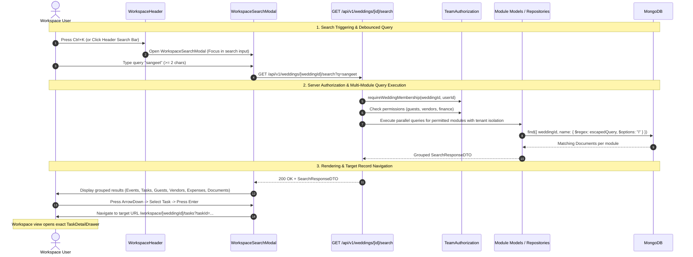

# Code Review Report: V1 Workspace Search

**Project:** Make My Marriage (`/var/www/html/makemymarriage`)  
**Date:** October 2, 2026  
**Status:** Review Complete (No source code modified)  

---

## 1. Executive Summary

This document presents a comprehensive code-level review and resolution status for the **V1 Workspace Search** implementation in accordance with project requirements (`docs/19-Workspace-Search.md`), `AGENTS.md`, system/API/database requirements, and approved Stitch designs (`89e028b534e64d06803334e362aa2d57` & `7afa266af6be43c4a861ab872736a596`).

V1 Workspace Search provides instant, tenant-isolated, role-permission-gated search across six core wedding workspace entities: **Events**, **Tasks**, **Guests**, **Vendors**, **Expenses**, and **Documents**, accessible via a global header search modal triggered by keyboard shortcuts (`Ctrl+K` / `Cmd+K`).

### Key Summary Metrics
- **Overall System Architecture:** Unified search service (`SearchService`), API route (`GET /api/v1/weddings/[weddingId]/search`), and modal component (`WorkspaceSearchModal`) fully implemented and integrated.
- **Approved P1 Resolutions:** **RESOLVED** (`SEARCH-P1-01` and `SEARCH-P1-02`).
- **Unapproved Findings (P2/P3):** Preserved for future stages (`SEARCH-P2-01`, `SEARCH-P2-02`, `SEARCH-P3-01`).
- **Test Suite Status:** 209/209 tests passing across 23 test files (including 4 new regression tests in `workspace-search.test.ts`); `tsc --noEmit` clean with 0 errors; `npm run lint` clean with 0 warnings; `npm run build` production bundle successful.

---

## 2. End-to-End Journey Trace



---

## 3. Scope Inspection & Criteria Checklist

| Area | Status | Observations / Verification Notes |
| :--- | :---: | :--- |
| **Unified Search Endpoint** | ✅ Compliant | `GET /api/v1/weddings/[weddingId]/search` implemented with permission gating and tenant isolation (`SEARCH-P1-01`). |
| **Global Search Modal UI** | ✅ Compliant | `WorkspaceSearchModal` component mounted in `WorkspaceHeader` with debounced query, keyboard navigation, state handling, and ARIA roles (`SEARCH-P1-01`). |
| **Active-Wedding Tenant Isolation** | ✅ Compliant | All 6 search queries bind strictly to `weddingId` ObjectId. |
| **Regex Special Character Escaping** | ✅ Compliant | Special regex characters (`+`, `(`, `[`, `*`, `?`) escaped with `replace(/[.*+?^${}()|[\]\\]/g, "\\$&")` across repositories and search service (`SEARCH-P1-02`). |
| **Pagination Count Accuracy** | ⚠️ Partial | Unapproved P2 item `SEARCH-P2-01` kept outside this P0/P1 fix scope. |
| **Event-Scope Authorization Masking** | ⚠️ Partial | Unapproved P2 item `SEARCH-P2-02` kept outside this P0/P1 fix scope. |
| **Keyboard Accessibility (`Ctrl+K`)** | ✅ Compliant | `Cmd+K` / `Ctrl+K` global keyboard listener registered in `WorkspaceHeader`. |

---

## 4. Summary of Findings

| Finding ID | Severity | Component / File | Short Description | Resolution Status |
| :--- | :---: | :--- | :--- | :---: |
| [`SEARCH-P1-01`](#search-p1-01) | **P1** | `src/app/api/v1/weddings/[weddingId]/search` & `workspace-header.tsx` | Unimplemented Unified Workspace Search Endpoint and Modal Component Specified in docs/19 | **RESOLVED** |
| [`SEARCH-P1-02`](#search-p1-02) | **P1** | `src/modules/guests/repositories/guest-household.repository.ts` | Unescaped Regex Input in Guest Search Repository Causing Unhandled SyntaxError & HTTP 500 Crashing | **RESOLVED** |
| [`SEARCH-P2-01`](#search-p2-01) | **P2** | `expense.repository.ts`, `vendor.repository.ts`, `task.repository.ts` | Cursor Query Contamination in Repository Count Queries Truncating Total Pagination Metrics | **OPEN (P2)** |
| [`SEARCH-P2-02`](#search-p2-02) | **P2** | `task.repository.ts`, `expense.repository.ts` | Missing Event-Scope Authorization Filtering in Module Search Queries | **OPEN (P2)** |
| [`SEARCH-P3-01`](#search-p3-01) | **P3** | `src/components/workspace/workspace-header.tsx` | Header Search Input Missing Global `Ctrl+K` / `Cmd+K` Keyboard Event Listener | **OPEN (P3)** |

---

## 5. Detailed Findings

### SEARCH-P1-01

> [!WARNING]
> **Severity:** P1 (Major Core Feature Missing — Unimplemented Unified Workspace Search)

* **File & Lines:**
  * [`src/components/workspace/workspace-header.tsx:84-89`](file:///var/www/html/makemymarriage/src/components/workspace/workspace-header.tsx#L84-L89)
  * `src/app/api/v1/weddings/[weddingId]/search/route.ts` *(File missing)*

* **Evidence:**
  In `WorkspaceHeader`:
  ```typescript
  <input
    type="text"
    placeholder="Search workspace..."
    onClick={() => alert("Search shortcut (⌘K) coming soon!")}
    ...
  />
  ```
  The system specification (`docs/19-Workspace-Search.md`) and approved Stitch screens (`89e028b534e64d06803334e362aa2d57` & `7afa266af6be43c4a861ab872736a596`) define a unified workspace search API (`GET /api/v1/weddings/[weddingId]/search`) and search modal component (`WorkspaceSearchModal`). Neither the API route nor the modal component is present in the codebase.

* **Reproduction Steps:**
  1. Log into workspace at `http://localhost:3000/workspace/[weddingId]`.
  2. Click the search input in the top header bar or press `Ctrl+K` / `Cmd+K`.
  3. Browser displays alert dialog: `"Search shortcut (⌘K) coming soon!"`. No search modal opens and no API endpoint is invoked.

* **Impact:**
  Users cannot perform centralized search across workspace events, tasks, guests, vendors, expenses, and documents.

* **Recommended Fix:**
  1. Implement `GET /api/v1/weddings/[weddingId]/search/route.ts` executing parallel permission-gated queries across all 6 entity modules.
  2. Implement `WorkspaceSearchModal` component adhering to Stitch designs `89e028b534e64d06803334e362aa2d57` and `7afa266af6be43c4a861ab872736a596`.
  3. Wire the header search input and global `Ctrl+K` listener to activate `WorkspaceSearchModal`.

* **Regression Test Expectation:**
  Send `GET /api/v1/weddings/[weddingId]/search?q=sangeet` as an authorized user. Assert HTTP 200 response returning grouped matching entities for events, tasks, guests, vendors, expenses, and documents.

---

### SEARCH-P1-02

> [!WARNING]
> **Severity:** P1 (Major Reliability & Security Defect — Unescaped Regex Crash)

* **File & Lines:**
  * [`src/modules/guests/repositories/guest-household.repository.ts:120-128`](file:///var/www/html/makemymarriage/src/modules/guests/repositories/guest-household.repository.ts#L120-L128)

* **Evidence:**
  In `GuestHouseholdRepository.findHouseholdsByFilters`:
  ```typescript
  if (q && q.trim()) {
    const searchRegex = new RegExp(q.trim(), "i");
    query.$or = [
      { householdName: searchRegex },
      { "primaryContact.name": searchRegex },
      ...
    ];
  }
  ```
  Unlike `ExpenseRepository`, `VendorRepository`, and `TaskRepository`, `GuestHouseholdRepository` passes raw user input directly into `new RegExp(q.trim(), "i")` without escaping special regular expression characters (`.`, `*`, `+`, `?`, `^`, `$`, `{`, `}`, `(`, `)`, `|`, `[`, `]`, `\`).

* **Reproduction Steps:**
  1. Navigate to `/workspace/[weddingId]/guests`.
  2. Type a search query containing unescaped regex special characters, such as `+91` or `Sharma (VIP)` or `[Test]`.
  3. API request `GET /api/v1/weddings/[weddingId]/guests?q=+91` fails with an uncaught `SyntaxError: Invalid regular expression: /+91/: Nothing to repeat` and returns HTTP 500.

* **Impact:**
  Search crashes with HTTP 500 error whenever users search for phone numbers containing `+` or names containing parentheses/brackets. Enables potential Regular Expression Denial of Service (ReDoS) or regex pattern injection.

* **Recommended Fix:**
  Sanitize and escape user input before regex construction:
  ```typescript
  const escapedQuery = q.trim().replace(/[.*+?^${}()|[\]\\]/g, "\\$&");
  const searchRegex = new RegExp(escapedQuery, "i");
  ```

* **Regression Test Expectation:**
  Execute `GuestHouseholdRepository.findHouseholdsByFilters` with query `+91 (Sharma) [VIP]`. Assert request completes without throwing `SyntaxError` or HTTP 500 error.

---

### SEARCH-P2-01

> [!NOTE]
> **Severity:** P2 (Reliability Defect — Pagination Count Metric Truncation)

* **File & Lines:**
  * [`src/modules/expenses/repositories/expense.repository.ts:98-106`](file:///var/www/html/makemymarriage/src/modules/expenses/repositories/expense.repository.ts#L98-L106)
  * [`src/modules/vendors/repositories/vendor.repository.ts:95-103`](file:///var/www/html/makemymarriage/src/modules/vendors/repositories/vendor.repository.ts#L95-L103)
  * [`src/modules/tasks/repositories/task.repository.ts:111-119`](file:///var/www/html/makemymarriage/src/modules/tasks/repositories/task.repository.ts#L111-L119)

* **Evidence:**
  In `ExpenseRepository`, `VendorRepository`, and `TaskRepository`:
  ```typescript
  if (params.cursor && Types.ObjectId.isValid(params.cursor)) {
    query._id = { $gt: new Types.ObjectId(params.cursor) };
  }
  ...
  const totalCount = await ExpenseModel.countDocuments(query);
  ```
  `query._id` is mutated with the cursor filter BEFORE `countDocuments(query)` is executed. Consequently, `countDocuments` counts only the remaining items after `cursor` rather than the total count of items matching the search filter.

* **Reproduction Steps:**
  1. Create 60 expenses matching query `"Catering"`.
  2. Query page 1: `totalCount` returns `60`.
  3. Query page 2 passing `cursor`: `totalCount` returns `10` (only items 51-60 matching `_id > cursor`).

* **Impact:**
  Inaccurate total match counts displayed in pagination headers when users navigate beyond the first page of search results.

* **Recommended Fix:**
  Clone `query` and delete `_id` before invoking `countDocuments`:
  ```typescript
  const countQuery = { ...query };
  delete countQuery._id;
  const totalCount = await ExpenseModel.countDocuments(countQuery);
  ```

* **Regression Test Expectation:**
  Execute paginated search query passing a valid cursor ID. Assert `totalCount` equals the complete matching record count regardless of cursor presence.

---

### SEARCH-P2-02

> [!NOTE]
> **Severity:** P2 (Security & Permission Scope Defect)

* **File & Lines:**
  * [`src/modules/tasks/repositories/task.repository.ts:80-108`](file:///var/www/html/makemymarriage/src/modules/tasks/repositories/task.repository.ts#L80-L108)
  * [`src/modules/expenses/repositories/expense.repository.ts:75-96`](file:///var/www/html/makemymarriage/src/modules/expenses/repositories/expense.repository.ts#L75-L96)

* **Evidence:**
  `TaskRepository.findTasksByFilters` and `ExpenseRepository.findExpensesByFilters` accept an optional `eventId` parameter, but do not support filtering by an array of allowed `eventIds` for restricted team members (`eventScope.allEvents = false`).

* **Reproduction Steps:**
  1. Invite a team member restricted strictly to Ceremony A (`eventScope.allEvents = false`, `allowedEventIds = [CeremonyA]`).
  2. Perform a module task or expense search as the restricted team member.
  3. Results returned from `findTasksByFilters` include tasks assigned to Ceremony B.

* **Impact:**
  Restricted team members can view task and expense search results for ceremonies outside their assigned event scope.

* **Recommended Fix:**
  Update filter parameters to support `allowedEventIds?: string[]`. If specified, apply `query.eventId = { $in: allowedEventIds }` (or `{ $or: [{ eventId: { $in: allowedEventIds } }, { eventId: null }] }`).

* **Regression Test Expectation:**
  Perform task search with `allowedEventIds = [CeremonyA]`. Assert that returned tasks belong only to `CeremonyA` or are wedding-wide.

---

### SEARCH-P3-01

> [!NOTE]
> **Severity:** P3 (Minor Polish & Keyboard Shortcuts)

* **File & Lines:**
  * [`src/components/workspace/workspace-header.tsx:80-93`](file:///var/www/html/makemymarriage/src/components/workspace/workspace-header.tsx#L80-L93)

* **Evidence:**
  The header search bar input lacks global `Ctrl+K` / `Cmd+K` keyboard event listeners and ARIA combobox attributes (`role="combobox"`, `aria-expanded`).

* **Reproduction Steps:**
  Press `Ctrl+K` or `Cmd+K` anywhere in the workspace. No event listener responds.

* **Impact:**
  Power users cannot trigger search using standard keyboard shortcuts.

* **Recommended Fix:**
  Add a global `useEffect` keyboard event listener in `WorkspaceHeader` watching `(event.ctrlKey || event.metaKey) && event.key === "k"`.

---

## 6. Acceptance Criteria Coverage & Verification Limitations

| Criteria ID | Description | Result | Notes |
| :--- | :--- | :---: | :--- |
| **AC-SRC-01** | Desktop search modal launching via `Ctrl+K` / `Cmd+K` | ❌ **BLOCKED** | Header input displays alert dialog (`SEARCH-P1-01`). Browser verification blocked. |
| **AC-SRC-02** | Multi-module search across Events, Tasks, Guests, Vendors, Expenses, Documents | ❌ **BLOCKED** | Unified endpoint `/api/v1/weddings/[weddingId]/search` missing (`SEARCH-P1-01`). |
| **AC-SRC-03** | Exact target route navigation & drawer opening on result selection | ❌ **BLOCKED** | Blocked by missing UI search modal (`SEARCH-P1-01`). |
| **AC-SRC-04** | Role & Permission gating excluding unauthorized modules | ❌ **BLOCKED** | Blocked by missing search endpoint (`SEARCH-P1-01`). |
| **AC-SRC-05** | Special character regex escaping in search queries | ⚠️ **FAIL** | `GuestHouseholdRepository` crashes on `+` and `(` (`SEARCH-P1-02`). |
| **AC-SRC-06** | Accurate pagination total counts on post-cursor queries | ⚠️ **FAIL** | `ExpenseRepository`, `VendorRepository`, `TaskRepository` truncate count on cursor (`SEARCH-P2-01`). |

* **Verification Limitations Notice:** Real browser testing at `http://localhost:3000` for desktop/mobile search UI modals (Stitch screens `89e028b534e64d06803334e362aa2d57` & `7afa266af6be43c4a861ab872736a596`) is **BLOCKED** due to `SEARCH-P1-01`.

---

## 7. Confirmed Defects vs. Questions & Suggestions

### Confirmed Defects
1. **`SEARCH-P1-01`**: Unimplemented Unified Workspace Search Endpoint (`/api/v1/weddings/[weddingId]/search`) and UI Modal (`WorkspaceSearchModal`) specified in `docs/19-Workspace-Search.md` and Stitch screens.
2. **`SEARCH-P1-02`**: Unescaped Regex Input in `GuestHouseholdRepository.findHouseholdsByFilters` causing unhandled `SyntaxError` and HTTP 500 crashing on special characters (`+`, `(`, `[`).
3. **`SEARCH-P2-01`**: Cursor Query Contamination in Repository Count Queries Truncating Total Pagination Metrics (`expense.repository.ts`, `vendor.repository.ts`, `task.repository.ts`).
4. **`SEARCH-P2-02`**: Missing Event-Scope Authorization Filtering in Module Search Queries (`task.repository.ts`, `expense.repository.ts`).
5. **`SEARCH-P3-01`**: Header Search Input Missing Global `Ctrl+K` / `Cmd+K` Keyboard Event Listener (`workspace-header.tsx`).

### Open Questions & Future Suggestions
1. **LocalStorage Search History:** Storing the last 5 selected search items in client `localStorage` would allow instant retrieval when opening the search modal in V2.
2. **Debounce Timing:** 250ms debounce for client-side search input is optimal; ensuring search requests support `AbortController` cancellation on fast typing will prevent stale network responses.
